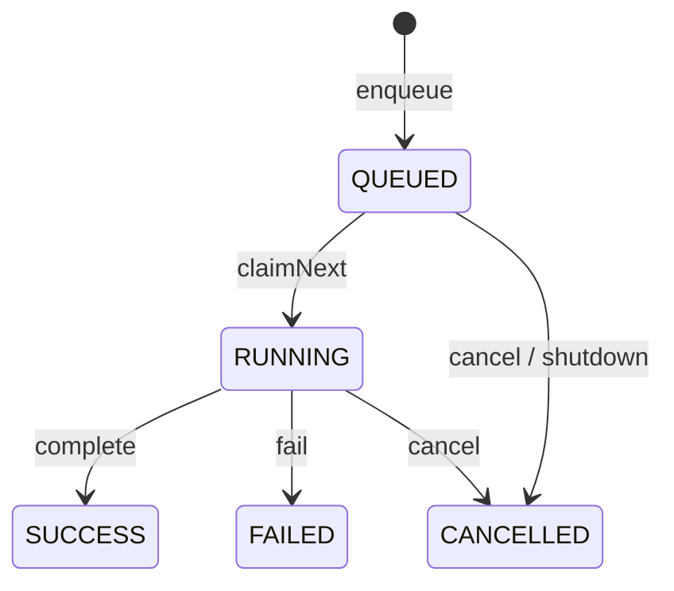

# Job Queue

`@brq/job-queue` defines the replaceable queue boundary introduced by Sprint 18. Its in-memory adapter owns only local FIFO dispatch metadata and the `ExecutionRequest` required by the Execution Worker.

## Public boundary

- `JobQueue` is the technology-neutral port.
- `JobRecord` is the metadata-only read model for API projections.
- `ClaimedJob` is the worker-only envelope containing the immutable `ExecutionRequest`.
- `InMemoryJobQueue` implements FIFO consumption, cancellation, shutdown, metrics and typed queue events.

The caller supplies stable `jobId` and `executionId` values. The queue never derives execution identity, calls the Execution Engine or accesses agents.

The application host uses one consumer, so jobs are claimed sequentially in enqueue order. The
port is replaceable, but Sprint 18 provides no external, distributed or durable queue adapter.

## Lifecycle

Every job has `attempt: 1`. The public port intentionally has no retry, requeue, backoff or scheduling operation. Duplicate `jobId`, `workflowId` or `executionId` values are rejected for the lifetime of an adapter instance.

The immutable event union contains `job.created`, `job.started`, `job.finished`, `job.failed` and
`job.cancelled`. Timestamps, durations, events and queue polling are observational and never
participate in execution hashes.

## Shutdown and cancellation

`shutdown()` stops new enqueues and cancels jobs that are still queued. A running job is not forcefully interrupted by this adapter because cancellation propagation belongs to the Execution Worker and its `AbortController`. The running job may still reach a terminal state.

## Security

`JobRecord`, queue events, metrics and logs contain metadata only. The request payload is returned exclusively by `claimNext()` for worker dispatch and must never be serialized by the HTTP adapter. Prompts, model responses, knowledge context, artifacts, secrets and results are never stored by this module.

The in-memory adapter retains the private request only while a job is `QUEUED` or `RUNNING` and purges it immediately on every terminal transition. `QueueMetrics.retainedPayloads` exposes only the aggregate count so this minimization remains testable without exposing payloads.

The adapter is process-local and intentionally non-durable. Durable job metadata belongs to the
Execution Repository and not to this workspace. A restart loses active payloads, multiple
instances have independent queues, and a serverless host may suspend after HTTP acceptance.
Recovery and replacement by an external adapter remain future scope. Terminal records and events
remain in memory for the lifetime of this adapter instance; retention, eviction and a bounded
capacity policy require a future queue adapter decision.
