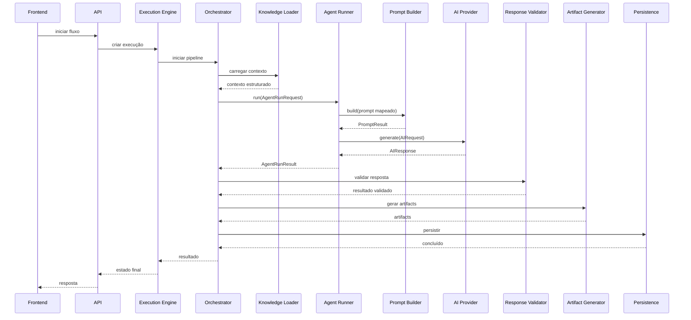

# System Design

## Objetivo

Este documento descreve a arquitetura completa do BRQ AI Factory.

Ele representa a principal referência técnica para implementação da plataforma.

Toda implementação deve respeitar os princípios definidos neste documento.

Quando houver conflito entre código e este documento, este documento deverá ser considerado a fonte de verdade até que uma decisão arquitetural (ADR) seja registrada.

---

# Visão Geral

O BRQ AI Factory é uma plataforma AI First baseada em agentes especializados.

Cada agente representa uma função tradicional de uma Software Factory.

A plataforma recebe uma demanda e a transforma em um conjunto de artefatos de software através de um pipeline controlado.

Fluxo macro:

```
Usuário
    │
    ▼
Frontend
    │
    ▼
Execution Engine
    │
    ▼
Orchestrator
    │
    ▼
Knowledge Loader
    │
    ▼
Prompt Builder
    │
    ▼
Agent Runner
    │
    ▼
AI Provider
    │
    ▼
Response Validator
    │
    ▼
Artifact Generator
    │
    ▼
Persistence
```

Esse fluxo representa a ordem das transformações de dados. Na chamada concreta, o Orchestrator fornece contexto e configuração ao Agent Runner, que invoca internamente o Prompt Builder injetado antes de chamar o AI Provider.

---

# Princípios Arquiteturais

A arquitetura segue os seguintes princípios:

- AI First
- Clean Architecture
- Modularidade
- Baixo Acoplamento
- Alta Coesão
- Single Responsibility
- Open/Closed
- Documentação como Fonte de Verdade
- Human in the Loop

---

# Componentes

## Frontend

Responsável apenas pela experiência do usuário.

Funções:

- criar projetos
- criar demandas
- acompanhar execuções
- visualizar artefatos
- visualizar logs
- acompanhar progresso

Nunca deve conter regras de negócio.

---

## API

Responsável por expor funcionalidades.

Não contém lógica complexa.

Responsabilidades:

- validar entrada
- autenticação
- autorização
- chamar Execution Engine
- retornar resposta

---

## Execution Engine

É a porta de entrada do sistema.

Responsável por iniciar uma execução completa.

Funções:

- criar Execution
- iniciar pipeline
- acompanhar estados
- encerrar execução
- cancelar execução

Nunca conversa diretamente com a IA.

---

## Orchestrator

É o coordenador da plataforma.

Funções:

- controlar ordem dos agentes
- persistir estados
- controlar retries
- definir políticas e limites de timeout
- controlar logs
- decidir próximo passo

O Orchestrator nunca gera prompts.

O Orchestrator nunca chama diretamente a OpenAI.

---

## Knowledge Loader

Responsável por autorizar, indexar, selecionar e carregar apenas o conhecimento documental necessário.

O contrato `KnowledgeSource` abstrai a origem. O MVP utiliza filesystem, enquanto consumidores operam somente com IDs lógicos e metadados. Um manifesto JSON versionado e validado por Zod define os documentos permitidos, com IDs explícitos e independentes de filenames.

Cada instância mantém um índice imutável com hashes SHA-256. A seleção por contexto é determinística e versionada. Durante o carregamento, apenas documentos selecionados são relidos e comparados ao índice; mudanças não são incorporadas silenciosamente.

O orçamento de documentos e bytes é configurado por instância. Documentos obrigatórios não são removidos nem truncados; opcionais que não couberem são omitidos de forma rastreável.

Exemplo:

```
knowledge/

↓

Architecture

↓

Workflow

↓

Coding Standards

↓

Security

↓

Agent Docs

↓

Prompt Context
```

O objetivo é reduzir consumo de contexto.

O Context Composer preserva cada documento sem resumo ou transformação e inclui delimitadores, ID, categoria e hash. O Knowledge Loader não monta prompts, executa agentes, coordena o pipeline, persiste dados ou utiliza IA, embeddings, RAG e busca semântica.

---

## Prompt Builder

Recebe:

- contexto estruturado do Knowledge Loader
- definição versionada
- regras globais e específicas do agente
- constraints
- variáveis
- entrada do usuário
- output contract provider-neutral

Contextos usam contrato local com os tipos `KNOWLEDGE`, `EXECUTION`, `USER_INPUT` ou `ARTIFACT`, serialização `TEXT` ou `JSON` e `contentHash` verificado. O documento resolvido preserva proveniência completa de contextos e de rule sets em `sources`, espelhada nos metadados. Output contracts suportam `TEXT` e `JSON_SCHEMA`.

Gera:

`PromptResult`

O prompt permanece estruturado até o último passo em uma hierarquia conceitual imutável de quatro níveis:

```text
PromptDocument
└── PromptSection
    └── PromptBlock
        └── PromptFragment
```

Essa hierarquia é representada por `PromptTemplate` antes da resolução e por `ResolvedPromptDocument` depois dela. A posição nos arrays define a ordem canônica; não existe campo `order`.

Cada seção pertence ao canal semântico `INSTRUCTIONS` ou `INPUT`: identidade, regras e output contract são confiáveis; constraints, contextos e entrada são não confiáveis. A montagem e a renderização seguem ordem canônica, templates resolvem slots tipados em uma única passagem e valores inseridos permanecem dados opacos. O renderer produz textos separados para `instructions` e `input`; o `PromptResult` contém ainda documento resolvido, metadados, orçamento e output contract.

O orçamento padrão é de 128 KiB, pode ser configurado por instância e apenas reduzido pela chamada. Um preflight de limite inferior antecede clone, canonicalização e renderização; a medição final exata soma os bytes UTF-8 de `instructions`, `input` e do output contract em JSON canônico. Excesso gera erro; o Builder não resume, trunca ou omite silenciosamente conteúdo. Hashes canônicos identificam o template, os canais renderizados, o output contract e o resultado final. Proveniência não integra o `promptHash` do payload efetivo. A comparação estrutural desta Sprint reporta seções adicionadas, removidas, alteradas ou reordenadas e a mudança de `promptHash`, com `nodeType` e `path` imutável nas referências públicas. Mudanças exclusivas de proveniência podem manter `PromptComparison.equal`.

A transformação é pura e não realiza I/O de domínio nem acessa recursos externos; o logger estruturado injetável é sua única saída lateral. O componente não carrega assets, seleciona versões, persiste dados ou conhece AI Provider, OpenAI, Responses API, Agent Runner, Orchestrator, Knowledge Source, Prisma ou frontend.

Exemplo:

```
Prompt Base

+

Security Rules

+

Architecture

+

Workflow

+

Agent Prompt

+

Execution Context

↓

PromptResult
```

Prompt Manifest, assets, loader, selector, registry e consumers de produção permanecem adiados até existir uso concreto.

---

## Agent Runner

Fronteira genérica e único componente de produção autorizado a conversar com o AI Provider.

Responsabilidades:

- validar tecnicamente `AgentRunRequest` e `AgentRunOptions`;
- mapear seu `PromptRequest` próprio para o Prompt Builder injetado, sem expor `PromptBuildInput`;
- preservar os canais renderizados e transformar `PromptResult` em `AIRequest` provider-neutral;
- executar exatamente uma chamada a `AIProvider.generate`;
- encaminhar correlação, `AbortSignal` e `timeoutMs`;
- validar tecnicamente a resposta normalizada;
- manter o `AIResponse` em um `ResponseEnvelope` interno;
- retornar `AgentRunResult` sem expor a resposta bruta;
- separar métricas observadas pelo Runner das reportadas pelo provider;
- registrar eventos e erros com metadados sanitizados.

O `agentExecutionId` é obrigatório e identifica a invocação. O Runner não cria ou persiste `AgentExecution`, não altera estados, não seleciona agente, prompt, contexto ou modelo e não conhece provider concreto.

O Runner não implementa retry, backoff ou timer. O timeout técnico é aplicado exclusivamente pelo AI Provider; cancelamento é propagado pelo signal recebido. Retentar funcionalmente permanece decisão do Orchestrator e exige uma nova `AgentExecution`.

Suas validações são estruturais. Aderência ao output contract, regras de negócio, segurança semântica e contratos específicos de agentes pertencem ao Response Validator.

---

## AI Provider

Camada de abstração.

Recebe uma solicitação já montada, chama uma implementação concreta e normaliza conteúdo, modelo, uso de tokens e metadados técnicos. Não monta prompts, não carrega conhecimento, não valida contratos funcionais, não cria artefatos e não persiste dados.

Implementações futuras:

- OpenAI
- Claude
- Gemini
- Azure OpenAI

Nenhum outro componente conhece a implementação concreta.

---

## Response Validator

Responsável por validar toda resposta da IA.

Valida:

- JSON
- Schema
- Campos obrigatórios
- Regras de negócio
- Segurança

Respostas inválidas são rejeitadas ou classificadas. O Validator não executa retry; o Orchestrator decide se deve criar uma nova `AgentExecution`.

---

## Artifact Generator

Transforma respostas estruturadas em artefatos.

Exemplo:

```
JSON

↓

story.md

↓

acceptance.md

↓

implementation.md

↓

playwright.spec.ts
```

---

## Persistence

Responsável por armazenar:

- Projects
- Executions
- Agent Executions
- Artifacts
- Logs
- Prompt Versions

Os ports de persistência pertencem a `shared/`. Implementações, mapeadores, migrations e Prisma Client pertencem a `prisma/`. Regras de negócio e transições de estado permanecem fora dos repositories.

---

# Fluxo Completo

```
Criar Projeto

↓

Criar Demanda

↓

Criar Execution

↓

Executar Product Owner

↓

Persistir

↓

Executar Developer

↓

Persistir

↓

Executar QA

↓

Persistir

↓

Finalizar
```

---

# Fluxo Interno do Product Owner

```
Execution

↓

Knowledge Loader

↓

Contexto estruturado

↓

Agent Runner

↓

Prompt Builder injetado

↓

Agent Runner

↓

AI Provider abstrato

↓

Agent Runner

↓

Response Validator

↓

Artifact Generator

↓

Persistência
```

Os demais agentes seguem exatamente o mesmo fluxo.

---

# Estados

Estados de `Execution`:

```text
CREATED
RUNNING
REQUIRES_REVIEW
SUCCESS
FAILED
CANCELLED
```

`FAILED → RUNNING` representa somente uma retomada explícita e nunca ocorre automaticamente. `REQUIRES_REVIEW → RUNNING` deverá depender de uma resolução humana auditável.

Estados de `AgentExecution`:

```text
CREATED
RUNNING
SUCCESS
PARTIAL_SUCCESS
REQUIRES_REVIEW
FAILED
CANCELLED
```

Os resultados de uma `AgentExecution` são terminais para aquela tentativa.

---

# Retry

Quando permitido:

- timeout
- erro temporário
- JSON inválido
- schema inválido

Nunca realizar retry infinito.

Retry automático cria uma nova `AgentExecution`, com novo identificador e `attempt` incrementado, dentro da mesma `Execution`. `RETRY` é um evento, não um estado persistido.

Retries internos do `AIProvider` são tentativas técnicas distintas: somente falhas de conexão sem resposta HTTP válida podem ser repetidas e todas permanecem na mesma chamada. Respostas HTTP, recusas e conteúdo inválido nunca disparam retry técnico. O Orchestrator continua responsável por qualquer nova `AgentExecution`.

```
Tentativa 1

↓

Falhou

↓

Retry

↓

Sucesso
```

---

# Human Review

O sistema deve interromper automaticamente quando:

- requisito ambíguo
- segurança
- conflito documental
- baixa confiança
- mudança arquitetural

Status:

```
REQUIRES_REVIEW
```

---

# Observabilidade

Cada execução registra:

- duração
- tokens
- agente
- modelo
- ID e versão do prompt
- `templateHash` e `promptHash`
- artifacts
- logs
- retries
- erros

No Agent Runner, durações e bytes observados localmente permanecem separados de duração, tentativas e uso reportados pelo provider. O Runner nunca recalcula tokens.

---

# Segurança

Todos os componentes devem tratar entradas como não confiáveis.

Validação obrigatória:

- API
- IA
- Banco
- Exportação

Nunca confiar diretamente na resposta da IA.

O Agent Runner valida somente a estrutura técnica, mantém a resposta bruta em envelope interno e não registra prompt, resposta, structured data, segredos ou JSON Schemas completos. Seu resultado continua não confiável até passar pelo Response Validator.

O Knowledge Loader opera com manifesto allowlist, raiz server-side, contenção por caminho real e rejeição de traversal, symlinks, arquivos não regulares e conteúdo alterado após a indexação.

---

# Estrutura Física

```
apps/
    web/

knowledge/

core/

    execution-engine/

    orchestrator/

    knowledge-loader/

    prompt-builder/

    agent-runner/

    response-validator/

    artifact-generator/

    ai-provider/

agents/

prompts/

shared/
```

---

# Sequência de Chamadas



---

# Escalabilidade

A arquitetura permite:

- múltiplos modelos
- novos agentes
- execução paralela
- filas
- workers
- RAG
- memória persistente
- plugins

Sem alteração estrutural.

---

# Roadmap Arquitetural

MVP

↓

SQLite

↓

PostgreSQL

↓

Redis

↓

Workers

↓

Filas

↓

Múltiplos Providers

↓

Memory Layer

↓

RAG

↓

Marketplace de Agentes

---

# Regras para Implementação

Todo módulo implementado deve:

- possuir testes
- possuir documentação
- possuir logs
- validar entrada
- validar saída
- tratar erros
- respeitar arquitetura

Nenhuma implementação deve alterar esta arquitetura sem criação de um novo ADR.

---

# Critérios de Qualidade

A arquitetura será considerada adequada quando:

- novos agentes puderem ser adicionados sem alterar os existentes;
- novos modelos de IA puderem ser adicionados sem alterar o Orchestrator;
- novos prompts puderem ser versionados sem quebrar execuções anteriores;
- toda execução puder ser reproduzida;
- qualquer falha puder ser rastreada por logs e artefatos;
- o sistema puder evoluir do MVP para uma plataforma enterprise preservando os mesmos princípios arquiteturais.
