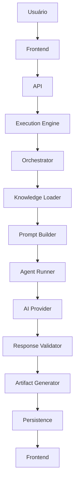
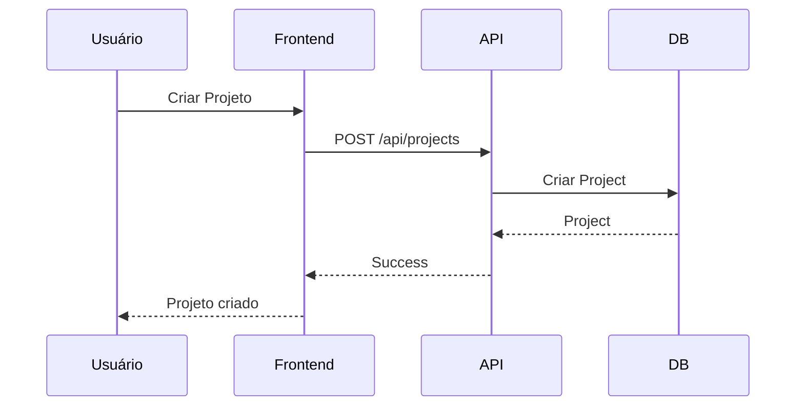
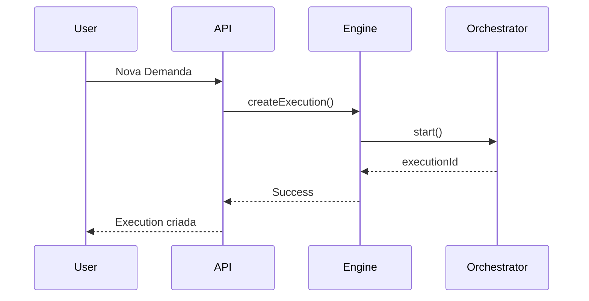
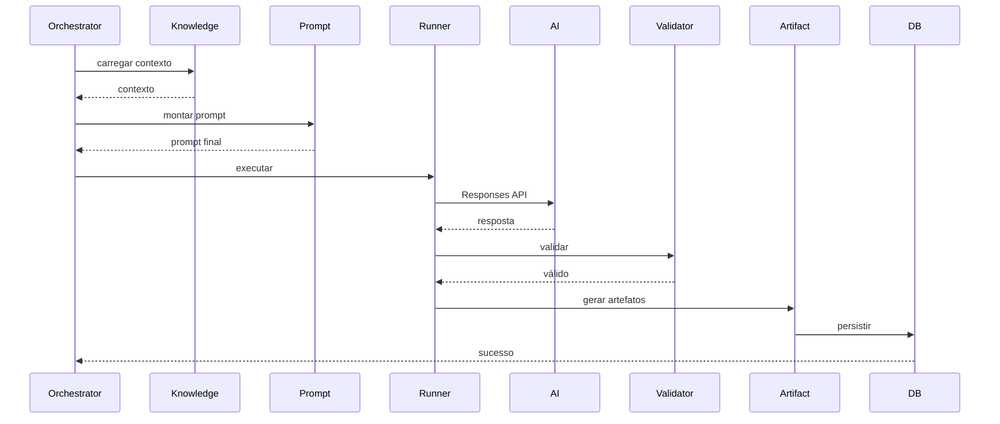
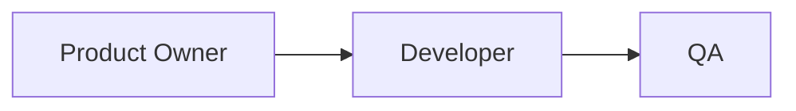
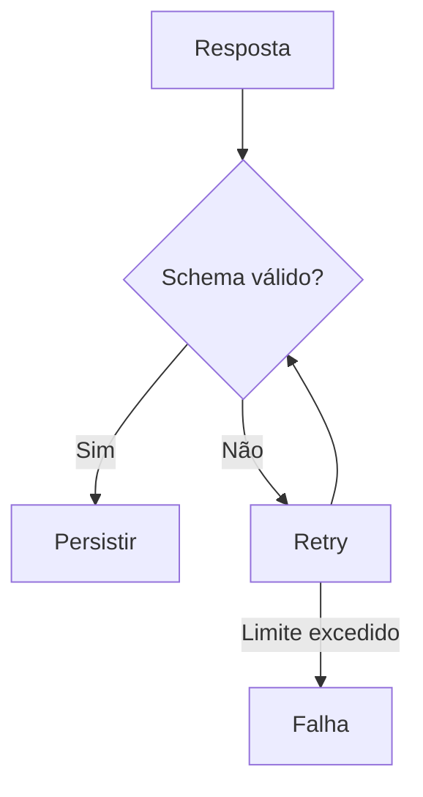
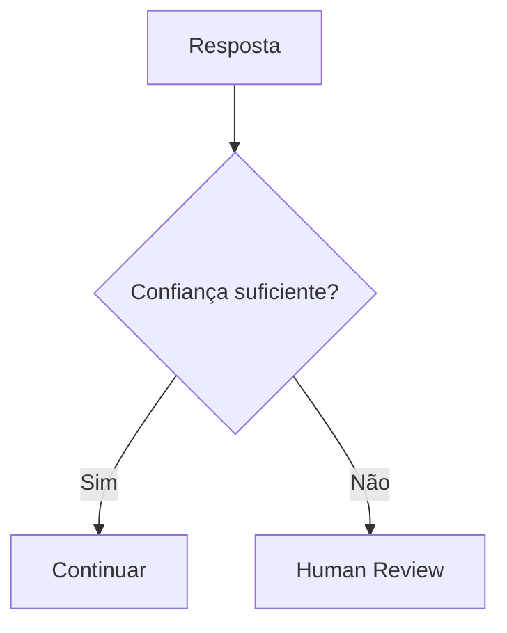
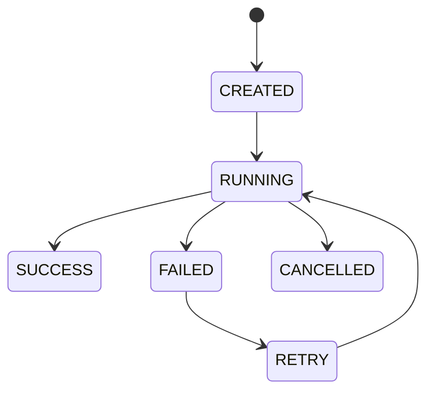

# Sequence Diagrams

## Objetivo

Este documento descreve os principais fluxos de execução do BRQ AI Factory utilizando diagramas Mermaid.

Os diagramas representam o comportamento esperado do sistema.

Toda implementação deve respeitar estes fluxos.

---

# Fluxo Geral



---

# Criação de Projeto



---

# Nova Execução



---

# Product Owner



---

# Developer

Mesmo fluxo do Product Owner.

A única diferença é o Prompt.

---

# QA

Mesmo fluxo do Product Owner.

A única diferença é o Prompt.

---

# Pipeline Completo



---

# Retry



---

# Human Review



---

# Persistência

```mermaid
flowchart TD

Execution

↓

AgentExecution

↓

Artifacts

↓

Logs

↓

PromptVersion
```

---

# Cancelamento

```mermaid
sequenceDiagram

User->>Frontend: Cancelar

Frontend->>API: Cancel

API->>Execution Engine

Execution Engine->>Orchestrator

Orchestrator->>Runner: Abort

Runner-->>Orchestrator

Orchestrator-->>API

API-->>Frontend
```

---

# Erro

```mermaid
flowchart TD

Erro

↓

Log

↓

Retry

↓

Retry Funcionou?

↓

Sim

↓

Continuar

↓

Não

↓

FAILED
```

---

# Estados


