# Sequence Diagrams

O fluxo multiagente está em [36-ORCHESTRATOR_FLOW.md](36-ORCHESTRATOR_FLOW.md), o ciclo do Engine
em [37-EXECUTION_ENGINE_FLOW.md](37-EXECUTION_ENGINE_FLOW.md) e o adapter HTTP em
[38-HTTP_API_FLOW.md](38-HTTP_API_FLOW.md). O Frontend MVP está em
[39-FRONTEND_FLOW.md](39-FRONTEND_FLOW.md). Persistência, review e retry permanecem futuros.

## Objetivo

Este documento descreve os principais fluxos de execução do BRQ AI Factory utilizando diagramas Mermaid.

Os diagramas representam o comportamento esperado do sistema.

Toda implementação deve respeitar estes fluxos.

---

# Fluxo Geral

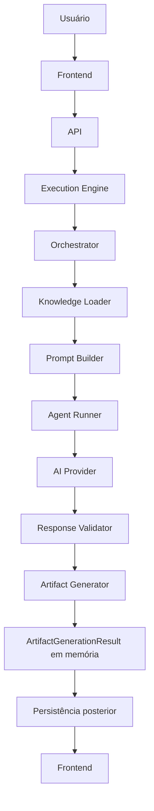

---

# Criação de Projeto

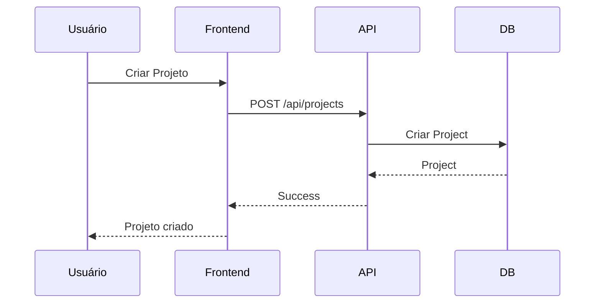

---

# Nova Execução

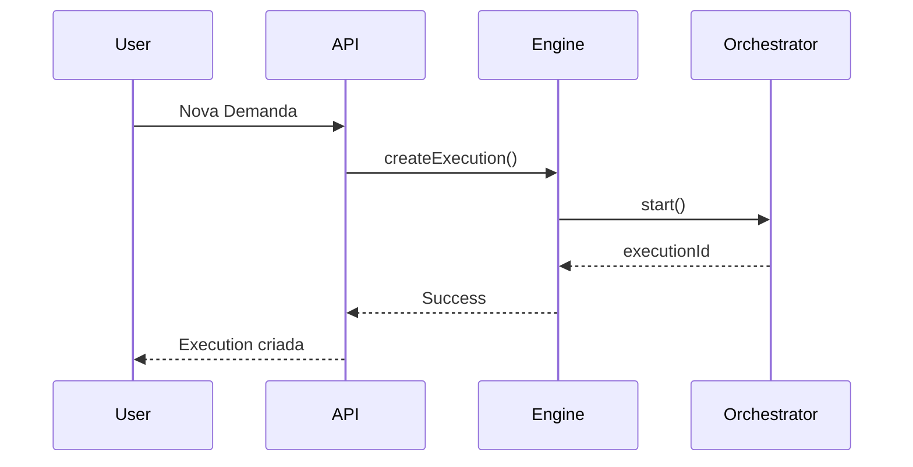

---

# Product Owner

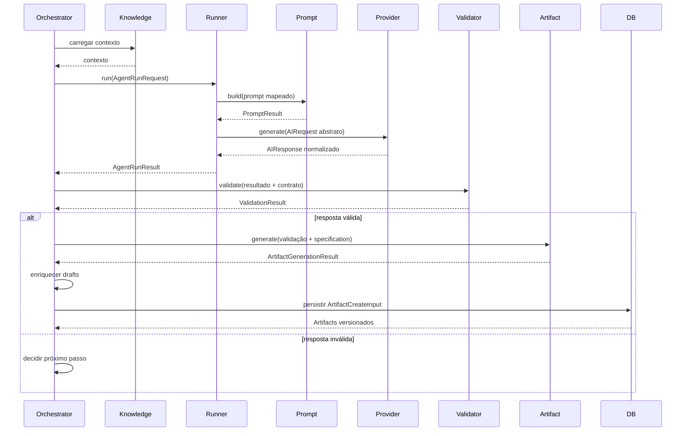

---

# Developer

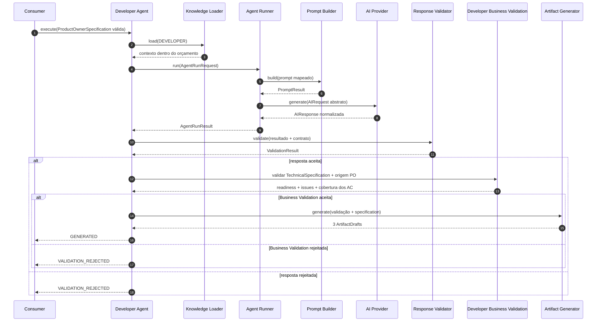

A fachada atua como arquiteto e encerra a tentativa em memória. Não gera código ou testes, não executa comandos, não persiste artifacts, não altera estados, não retenta e não chama Product Owner, QA ou Orchestrator.

---

# QA

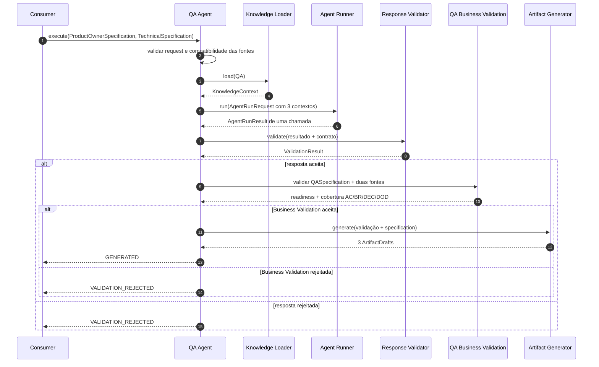

A fachada encerra a tentativa em memória. Não executa testes, não gera código ou Playwright, não persiste artifacts, não retenta e não chama outros agentes ou Orchestrator.

---

# Pipeline Completo

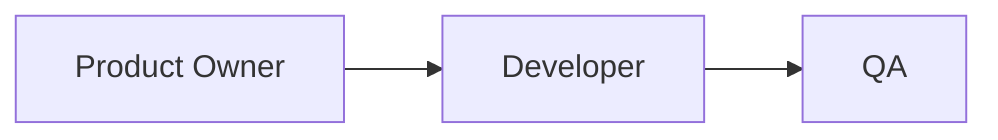

---

# Retry

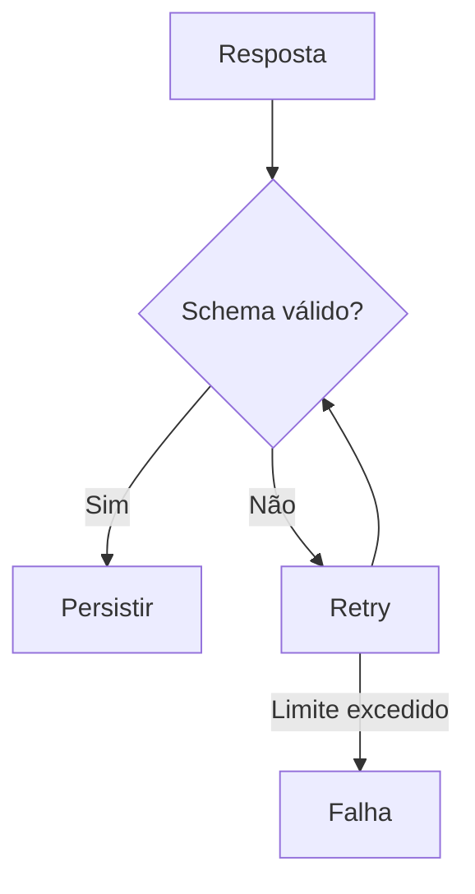

---

# Human Review

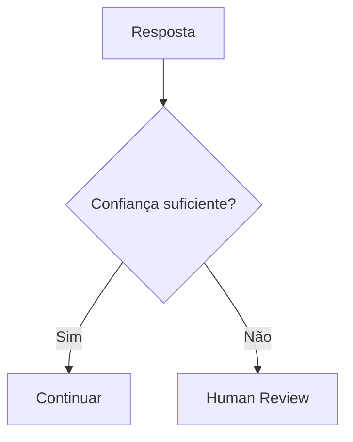

---

# Persistência

```mermaid
flowchart TD

Execution

↓

AgentExecution

↓

Artifacts

↓

Logs

↓

PromptVersion
```

---

# Cancelamento

```mermaid
sequenceDiagram

User->>Frontend: Cancelar

Frontend->>API: Cancel

API->>Execution Engine

Execution Engine->>Orchestrator

Orchestrator->>Runner: Abort

Runner-->>Orchestrator

Orchestrator-->>API

API-->>Frontend
```

---

# Erro

```mermaid
flowchart TD

Erro

↓

Log

↓

Retry

↓

Retry Funcionou?

↓

Sim

↓

Continuar

↓

Não

↓

FAILED
```

---

# Estados

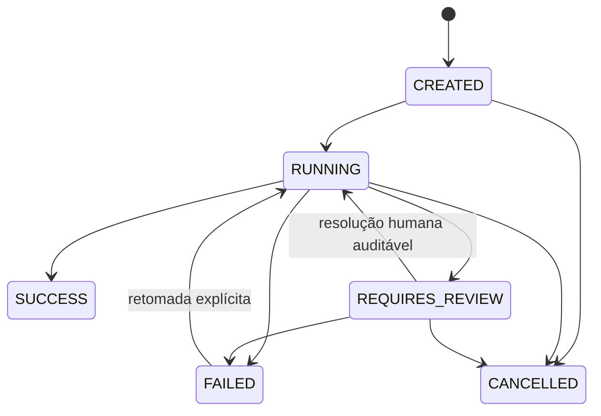

Retries automáticos de agentes não usam `FAILED --> RUNNING` nesta máquina. Cada retry cria uma nova `AgentExecution` em `CREATED`, dentro da mesma `Execution`.

## Sequência implementada na Sprint 13

O fluxo atual do Execution Engine, incluindo identidade determinística, estados, integração
pública, falhas e cancelamento, está documentado em
[37-EXECUTION_ENGINE_FLOW.md](37-EXECUTION_ENGINE_FLOW.md). Os diagramas persistentes e de retry
acima permanecem visão futura.

## Sequência implementada na Sprint 14

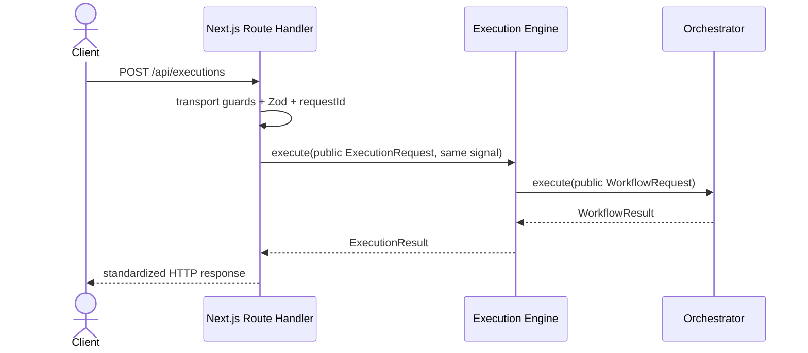

A sequência completa, incluindo health, lookup 501, status e trust boundaries, está em
[38-HTTP_API_FLOW.md](38-HTTP_API_FLOW.md).

## Sequência implementada na Sprint 15

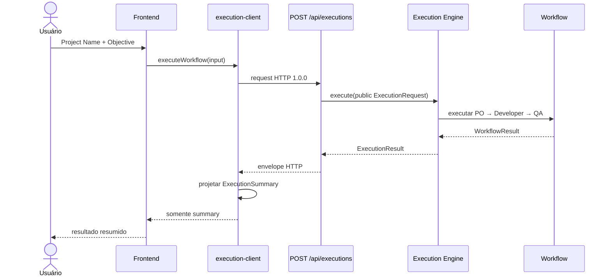

O resultado bruto não atravessa o client HTTP. A sequência completa e os estados locais estão em
[39-FRONTEND_FLOW.md](39-FRONTEND_FLOW.md).
