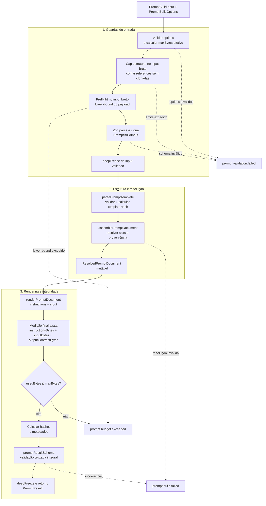
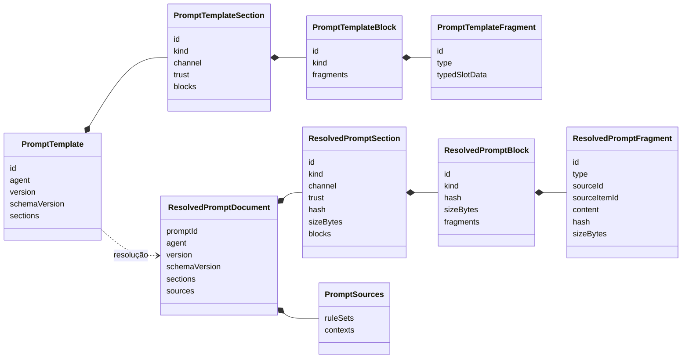
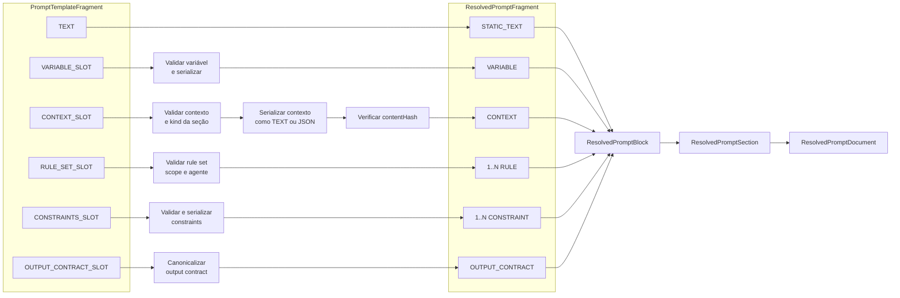
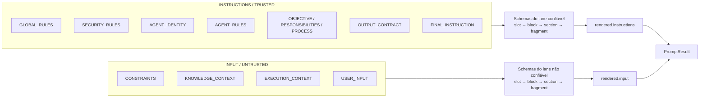
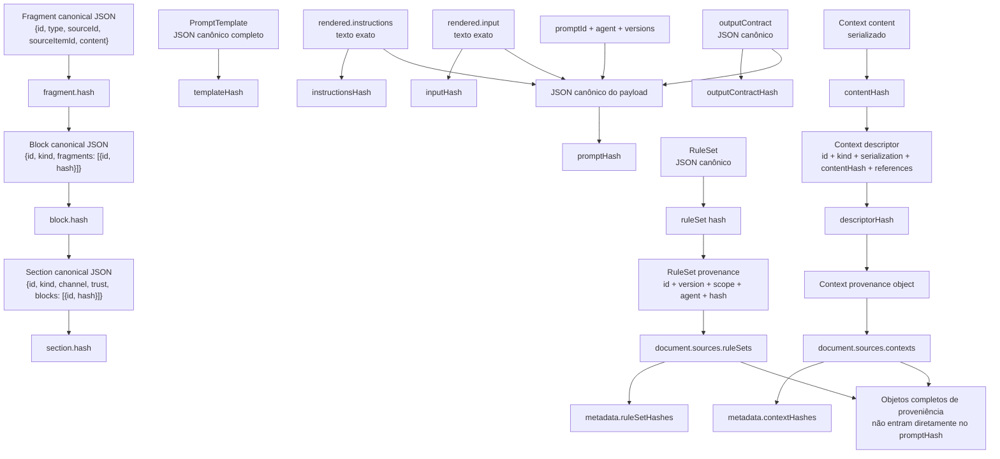
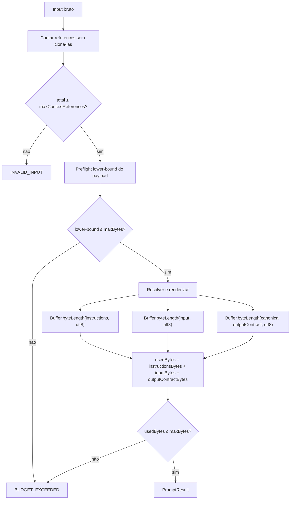
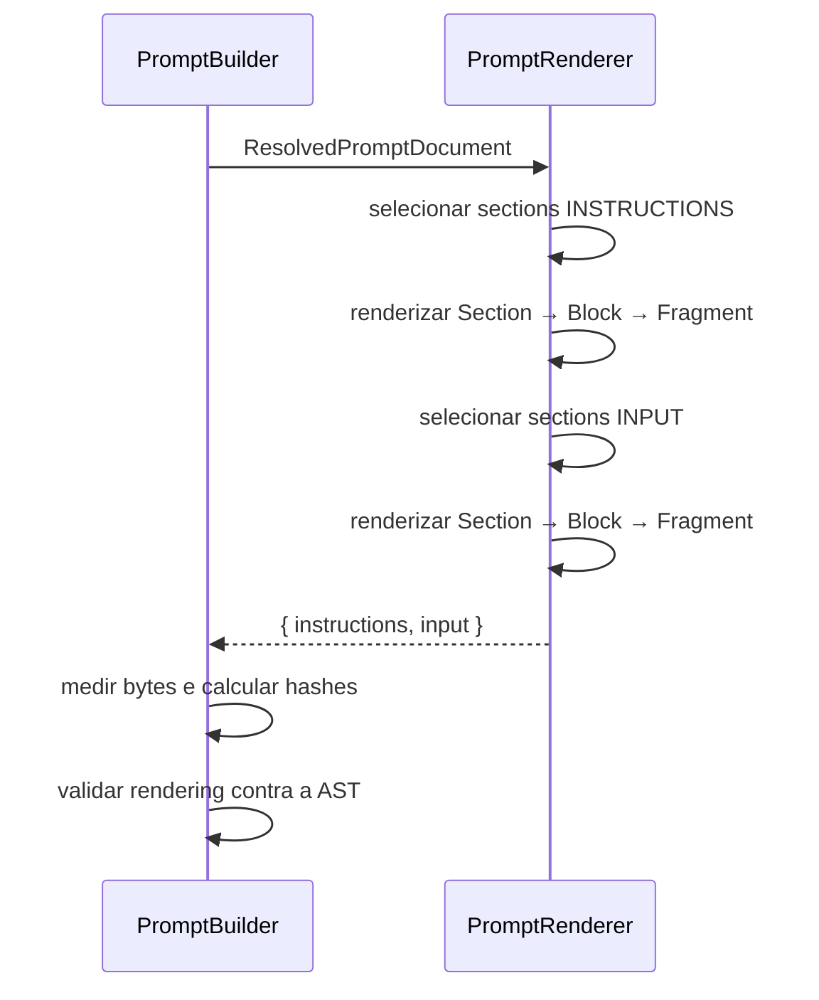
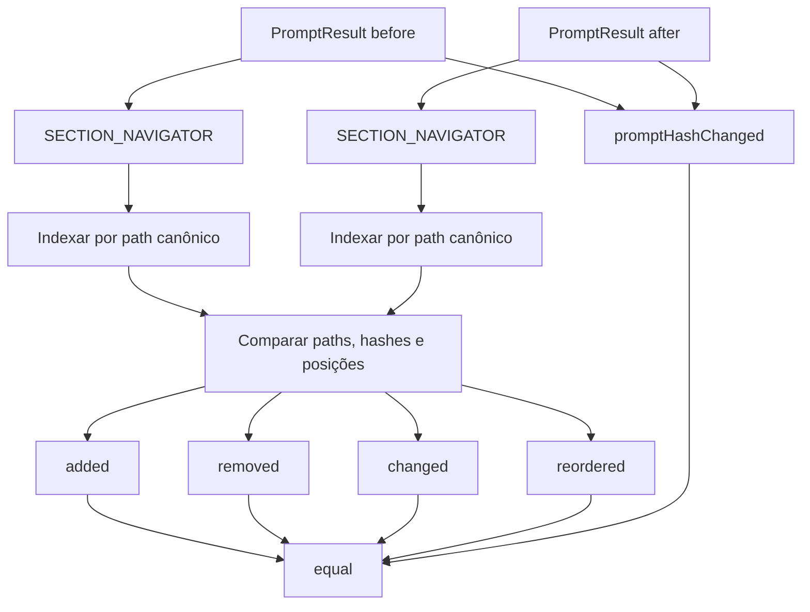
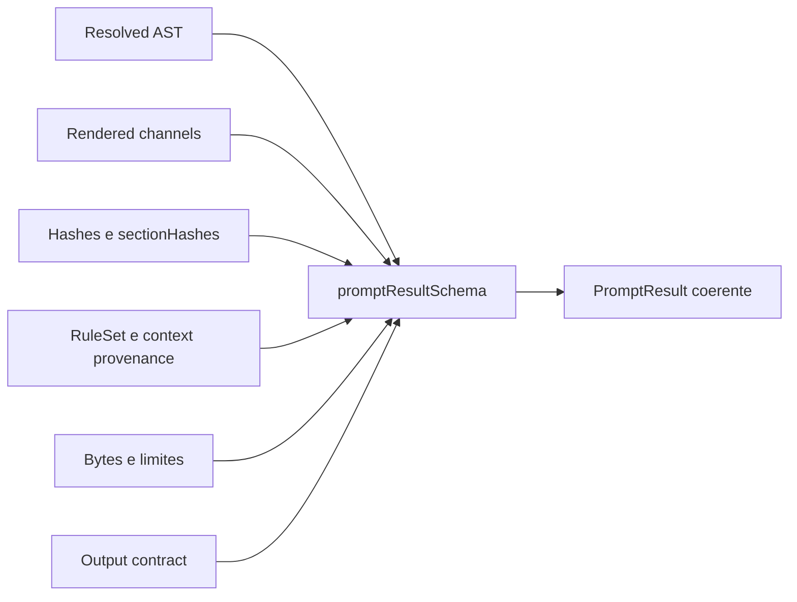
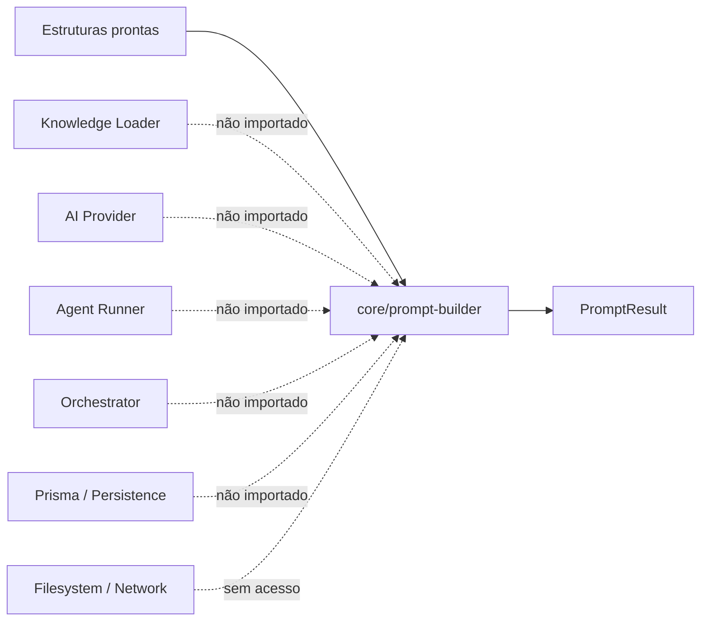

# Prompt Builder Flow

## Objetivo

Este documento apresenta visualmente o fluxo determinístico do Prompt Builder implementado na Sprint 5.

Ele serve como material de onboarding. O [ADR-015](ADR/ADR-015-PROMPT-BUILDER-BOUNDARY.md) continua sendo a decisão arquitetural normativa, enquanto este documento explica como contratos, resolução, AST, hashes, orçamento, rendering, comparação e trust boundaries trabalham em conjunto.

---

# Visão Geral

O Prompt Builder recebe estruturas prontas, resolve uma AST tipada e produz um `PromptResult` imutável. Ele não carrega documentos, não monta contexto a partir do filesystem, não chama IA e não persiste dados.



Ordem importante:

1. o preflight opera sobre o input bruto antes do clone do Zod;
2. a validação completa produz uma cópia tipada e congelada;
3. a AST é resolvida antes do rendering;
4. o orçamento final é medido sobre os outputs exatos;
5. o `PromptResult` inteiro é revalidado antes do retorno.

---

# Contratos de Entrada e Saída

## PromptBuildInput

```text
PromptBuildInput
├── template: PromptTemplate
├── ruleSets: PromptRuleSet[]
├── contexts: PromptContextInput[]
├── variables: PromptVariable[]
├── constraints: PromptConstraint[]
└── outputContract: PromptOutputContract
```

As estruturas já devem estar selecionadas, autorizadas e prontas. O Prompt Builder não conhece a origem física delas.

## PromptResult

| Campo            | Responsabilidade                                                          |
| ---------------- | ------------------------------------------------------------------------- |
| `document`       | AST resolvida, seções ordenadas e proveniência                            |
| `rendered`       | Strings finais e separadas `instructions` e `input`                       |
| `metadata`       | Identidade, versões, hashes de payload, seções e fontes                   |
| `budget`         | Limite efetivo e bytes exatos por canal e output contract                 |
| `outputContract` | Contrato provider-neutral, coerente com o fragmento correspondente da AST |

O resultado não contém timestamps. O mesmo input válido produz a mesma estrutura, os mesmos textos e os mesmos hashes.

---

# AST do Prompt

A hierarquia conceitual possui quatro níveis. Concretamente, `PromptTemplate` representa o estado anterior à resolução e `ResolvedPromptDocument` representa o documento posterior à resolução.



## Invariantes estruturais

- A posição nos arrays define a ordem canônica; não existe campo `order`.
- IDs são únicos no escopo correspondente.
- Section kind, block kind e fragment type precisam ser semanticamente compatíveis.
- Hashes e `sizeBytes` são recalculáveis a partir dos filhos.
- A AST resolvida reaplica as regras de canal e confiança; não confia apenas no template original.
- `ResolvedPromptDocument.sources` possui ordenação canônica independente da ordem de entrada.

---

# Fluxo de Resolução

Não existe interpolação textual por `{{placeholder}}`. Slots são nós tipados e cada valor é resolvido uma única vez.



## Mapeamento de slots

| Slot                   | Fragmento resolvido | Origem                                            |
| ---------------------- | ------------------- | ------------------------------------------------- |
| `TEXT`                 | `STATIC_TEXT`       | Sem origem dinâmica                               |
| `VARIABLE_SLOT`        | `VARIABLE`          | `sourceId = variable.name`                        |
| `CONTEXT_SLOT`         | `CONTEXT`           | `sourceId = context.id`                           |
| `RULE_SET_SLOT`        | `RULE`              | `sourceId = ruleSet.id`, `sourceItemId = rule.id` |
| `CONSTRAINTS_SLOT`     | `CONSTRAINT`        | Um fragmento por constraint                       |
| `OUTPUT_CONTRACT_SLOT` | `OUTPUT_CONTRACT`   | `sourceId = outputContract.id`                    |

Para itens expandidos, como rules e constraints, o ID derivado usa hash canônico de `slotId` e `itemId`. Isso evita identidades ambíguas por concatenação de strings.

## Falhas de resolução

A montagem falha quando:

- um slot obrigatório não possui valor;
- um valor foi fornecido, mas não é referenciado pelo template;
- um rule set não corresponde ao scope da seção ou ao agente;
- um contexto não corresponde ao kind da seção;
- o `contentHash` não corresponde ao conteúdo serializado;
- constraints foram fornecidas sem um slot correspondente;
- existe `CONSTRAINTS_SLOT`, mas nenhuma constraint foi fornecida;
- o template não possui exatamente um `OUTPUT_CONTRACT_SLOT`.

Nenhum valor resolvido é reinterpretado como template.

---

# Trust Boundaries

O limite de confiança é expresso na própria AST e revalidado depois da resolução.



| Canal          | Tipos dinâmicos permitidos                            |
| -------------- | ----------------------------------------------------- |
| `INSTRUCTIONS` | `RULE`, `OUTPUT_CONTRACT` e texto estático compatível |
| `INPUT`        | `VARIABLE`, `CONTEXT`, `CONSTRAINT` e texto estático  |

Regras importantes:

- Knowledge context continua sendo dado não confiável, mesmo quando veio de documentação interna.
- Conteúdo dinâmico não pode ser promovido para `INSTRUCTIONS` alterando apenas a AST resolvida.
- Regras e output contracts não podem ser movidos para `INPUT`.
- Delimitadores tornam limites explícitos, mas não substituem a preservação dos canais pelo consumer futuro.
- Logs nunca registram conteúdo de fragmentos, variáveis, contexto, entrada do usuário ou JSON Schema completo.

---

# Cálculo de Hashes

O módulo usa SHA-256. Hashes internos são 64 caracteres hexadecimais; `contentHash` de contexto usa o prefixo `sha256:`.



## Fórmulas canônicas

| Hash                 | Entrada                                                        |
| -------------------- | -------------------------------------------------------------- |
| `fragment.hash`      | `{ id, type, sourceId, sourceItemId, content }`                |
| `block.hash`         | `{ id, kind, fragments: [{ id, hash }] }`                      |
| `section.hash`       | `{ id, kind, channel, trust, blocks: [{ id, hash }] }`         |
| `templateHash`       | `PromptTemplate` completo em JSON canônico                     |
| `instructionsHash`   | String exata de `rendered.instructions`                        |
| `inputHash`          | String exata de `rendered.input`                               |
| `outputContractHash` | Output contract em JSON canônico                               |
| `promptHash`         | Identidade, versões, canais renderizados e output contract     |
| `ruleSet.hash`       | Rule set completo em JSON canônico                             |
| `contentHash`        | Conteúdo do contexto após serialização                         |
| `descriptorHash`     | ID, kind, serialização, `contentHash` e references do contexto |

`promptHash` não inclui diretamente os objetos completos de proveniência de `document.sources` e dos metadados. Entretanto, ID, type, `sourceId`, `sourceItemId` e hash dos fragments aparecem no rendering; mudanças que alterem a AST resolvida podem, portanto, alterar o `promptHash`. Somente mudanças restritas a metadados de fonte não renderizados — por exemplo `ruleSet.version` ou references de contexto sem mudança de conteúdo — podem preservar o payload e manter o mesmo `promptHash`. A auditoria deve consultar também `ruleSetHashes` e `contextHashes`.

---

# Orçamento

Existem duas proteções independentes: orçamento do payload e limite estrutural da proveniência.



## Regras do orçamento

- `DEFAULT_PROMPT_MAX_BYTES = 128 KiB`.
- `maxBytes` é configurado na instância.
- Uma chamada pode apenas reduzir o limite da instância.
- O preflight é um lower-bound barato; passar nele não garante aprovação da medição final.
- A medição final inclui delimitadores e metadados textuais renderizados.
- O output contract é contado separadamente porque permanece um campo próprio do `PromptResult`.
- Não existe truncamento, resumo ou omissão silenciosa.
- References não consomem o orçamento do payload.
- `maxContextReferences` possui default 256 por instância.
- O schema impõe teto absoluto total de 4096 references.

`fragment.sizeBytes`, `block.sizeBytes` e `section.sizeBytes` medem apenas conteúdo estrutural. Eles não substituem o orçamento final, que mede as strings efetivamente renderizadas.

---

# Rendering

O renderer é a única etapa que converte a AST em texto. Ele não altera nem resume o conteúdo dos fragments.



Cada nível recebe delimitadores que carregam ID e hash. Exemplo simplificado:

```text
<<<BEGIN_PROMPT_SECTION:section-id:section-hash>>>
id: section-id
kind: USER_INPUT
channel: INPUT
trust: UNTRUSTED

<<<BEGIN_PROMPT_BLOCK:block-id:block-hash>>>
<<<BEGIN_PROMPT_FRAGMENT:fragment-id:fragment-hash>>>
sourceId: USER_INPUT
sourceItemId: NONE
<<<BEGIN_PROMPT_FRAGMENT_CONTENT:fragment-id:fragment-hash>>>
conteúdo preservado exatamente
<<<END_PROMPT_FRAGMENT_CONTENT:fragment-id:fragment-hash>>>
<<<END_PROMPT_FRAGMENT:fragment-id:fragment-hash>>>
<<<END_PROMPT_BLOCK:block-id:block-hash>>>

<<<END_PROMPT_SECTION:section-id:section-hash>>>
```

O schema final chama o renderer novamente e exige igualdade exata entre o texto derivado da AST e `PromptResult.rendered`.

---

# Prompt Comparator

O comparator atual é estrutural e opera em sections. A infraestrutura interna permite adicionar navigators de blocks e fragments futuramente.



`PromptNodeReference` expõe:

- `id`;
- `hash`;
- `index`;
- `nodeType`;
- `path` imutável.

`equal` é verdadeiro somente quando não há adição, remoção, alteração, reordenação ou mudança de `promptHash`.

O comparator não:

- compara significado;
- usa IA;
- classifica qualidade;
- detecta equivalência semântica;
- compara recursivamente blocks e fragments nesta Sprint.

Uma mudança exclusiva de proveniência não renderizada pode manter `PromptComparison.equal`, pois esses metadados não pertencem ao payload efetivo.

---

# Validação Integral do PromptResult

Antes do retorno, o schema verifica de forma cruzada:



As principais garantias são:

- hashes e tamanhos da AST resolvida, do payload e da proveniência podem ser recalculados a partir do resultado;
- `templateHash` é produzido durante o parsing do template e não é recalculável somente a partir do `PromptResult`, que não carrega o template original;
- o rendering deriva exatamente da AST;
- o output contract externo corresponde ao único fragmento de contrato;
- rule sets correspondem aos fragments de regra, incluindo scope e agente;
- contextos correspondem aos fragments e ao kind da seção;
- proveniência em `document.sources` e `metadata` é idêntica;
- bytes declarados correspondem aos textos exatos;
- `usedBytes` não excede `maxBytes`;
- trust boundaries continuam válidas após a resolução.

---

# Observabilidade e Erros

Eventos emitidos:

- `prompt.build.started`;
- `prompt.build.completed`;
- `prompt.build.failed`;
- `prompt.validation.failed`;
- `prompt.budget.exceeded`.

Os logs podem conter IDs, agente, versões, hashes, contagens, limites, bytes, duração e IDs de correlação. Eles nunca contêm prompts, respostas, conteúdo de contexto, variáveis, entrada do usuário, segredos ou JSON Schemas completos.

Erros são traduzidos para `PromptBuilderError` com códigos canônicos. O módulo não executa retries.

---

# Fronteiras Arquiteturais



O Prompt Builder não:

- seleciona ou carrega conhecimento;
- lê `knowledge/`, `agents/` ou `prompts/`;
- conhece OpenAI, Responses API ou `AIProvider`;
- chama modelos;
- valida respostas de IA;
- cria ou persiste artifacts;
- controla agentes, retries ou execução;
- seleciona versões de templates;
- implementa Prompt Manifest ou registry.

O logger estruturado injetável é sua única saída lateral.

---

# Mapa do Código

| Responsabilidade             | Arquivo principal                          |
| ---------------------------- | ------------------------------------------ |
| Facade e ciclo completo      | `core/prompt-builder/prompt-builder.ts`    |
| Contratos públicos           | `core/prompt-builder/contracts.ts`         |
| Schemas e coerência integral | `core/prompt-builder/schemas.ts`           |
| Parsing de template          | `core/prompt-builder/prompt-template.ts`   |
| Resolução e montagem da AST  | `core/prompt-builder/prompt-assembler.ts`  |
| Verificação de contexto      | `core/prompt-builder/context-injector.ts`  |
| Variáveis e serialização     | `core/prompt-builder/variable-resolver.ts` |
| Rendering final              | `core/prompt-builder/prompt-renderer.ts`   |
| Orçamento e preflight        | `core/prompt-builder/prompt-budget.ts`     |
| Limites centralizados        | `core/prompt-builder/limits.ts`            |
| Hashes                       | `core/prompt-builder/hashing.ts`           |
| JSON canônico                | `core/prompt-builder/canonical-json.ts`    |
| Comparação estrutural        | `core/prompt-builder/prompt-comparator.ts` |
| Erros canônicos              | `core/prompt-builder/errors.ts`            |

---

# Resumo para Onboarding

```text
Estruturas prontas
        ↓
Preflight antes do clone
        ↓
Validação Zod + imutabilidade
        ↓
Template AST com slots tipados
        ↓
Resolved AST com conteúdo, hashes e proveniência
        ↓
Rendering separado por trust boundary
        ↓
Medição exata + hashes finais
        ↓
Validação cruzada integral
        ↓
PromptResult determinístico e imutável
```

Ao depurar o módulo, a pergunta principal deve ser: cada informação pertence ao template, ao payload efetivo ou à proveniência? Essa separação determina canal, hash, orçamento e comportamento do comparator.
