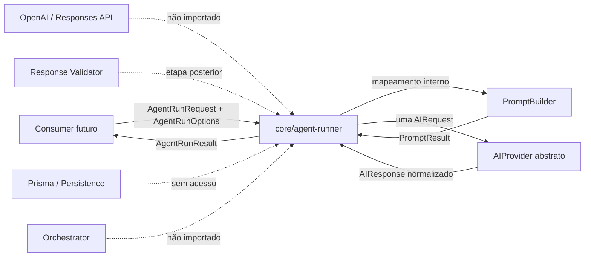
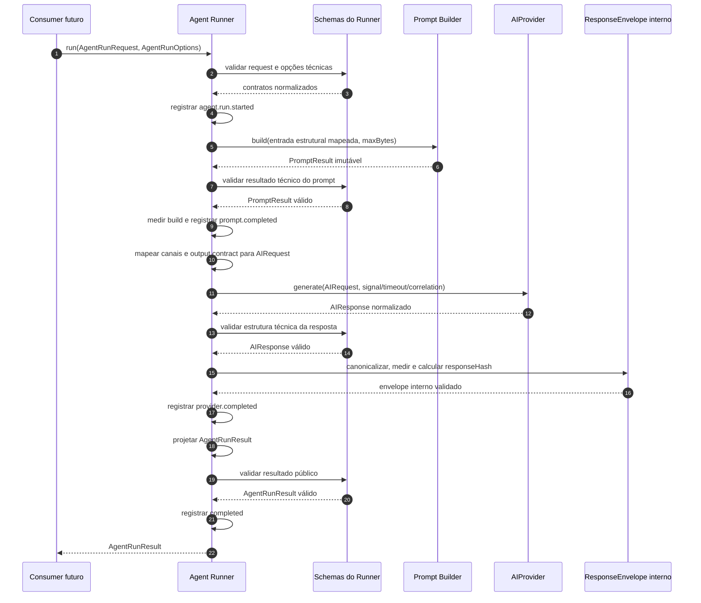
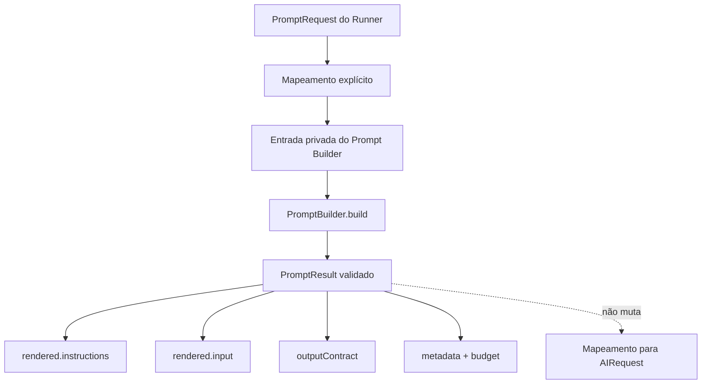
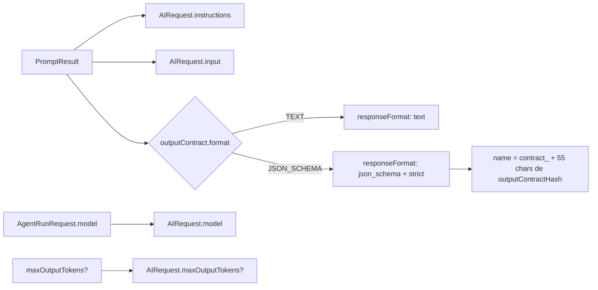
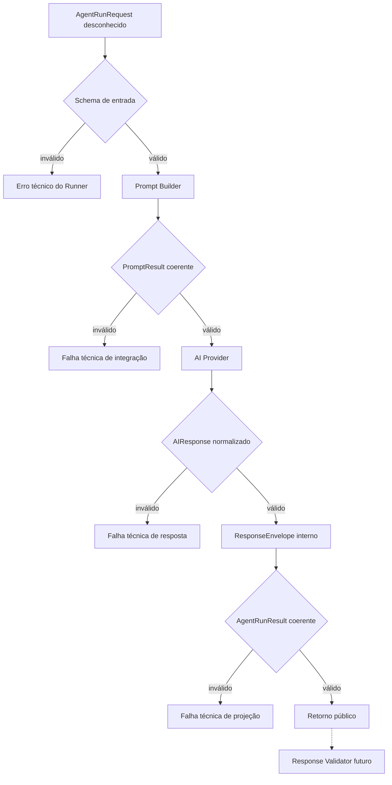
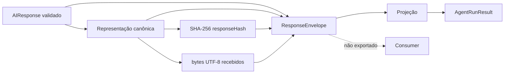
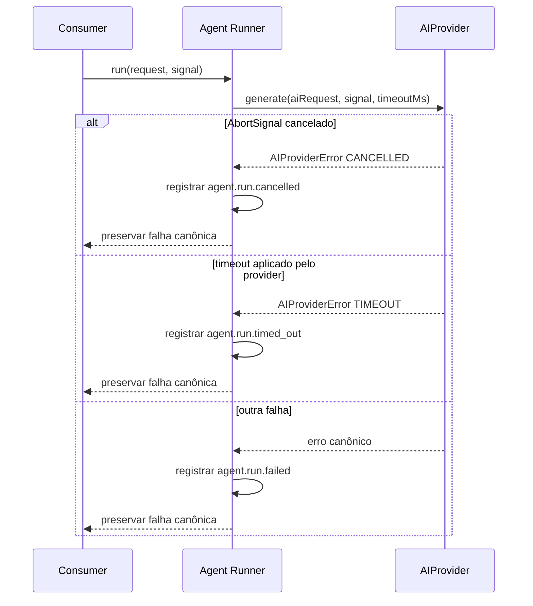
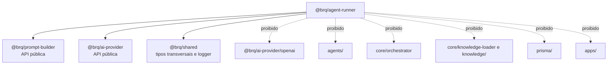

# Agent Runner Flow

## Objetivo

Este documento apresenta visualmente o fluxo do Agent Runner implementado na Sprint 6.

Ele serve como material de onboarding. O [ADR-016](ADR/ADR-016-AGENT-RUNNER-BOUNDARY.md) é a decisão normativa; este documento explica como contratos, validações, Prompt Builder, AI Provider, cancelamento, timeout, envelope interno e resultado público trabalham em conjunto.

---

# Fronteira do Módulo



O Runner é o único componente de produção autorizado a invocar `AIProvider`. Ele depende da interface abstrata injetada, nunca de um adapter concreto.

---

# Contratos de Entrada

```text
AgentRunRequest
├── context: AgentRunContext
│   ├── execution: ExecutionMetadata
│   │   ├── executionId
│   │   ├── agentExecutionId
│   │   ├── agent
│   │   ├── attempt
│   │   └── agentVersion
│   ├── requestId?
│   └── traceId?
├── prompt: PromptRequest
├── model
├── maxOutputTokens?
└── timeoutMs?

AgentRunOptions
└── signal?
```

`agentExecutionId` é obrigatório e acompanha toda a invocação. O Runner não cria a entidade, não incrementa `attempt` e não altera estado.

`PromptRequest` é um contrato público próprio:

```text
PromptRequest
├── template
├── ruleSets
├── contexts
├── variables
├── constraints
├── outputContract
└── maxBytes?
```

Ele não expõe `PromptBuildInput`. A semelhança estrutural é intencional, mas a conversão permanece dentro do Runner para que a API pública não fique acoplada a um tipo de entrada interno do Prompt Builder.

---

# Sequência Completa



Existe exatamente uma chamada a `AIProvider.generate`. Nenhuma etapa do Runner executa retry.

---

# Integração com o Prompt Builder



O Runner preserva os textos renderizados e a fronteira de confiança entre `instructions` e `input`. Ele não reordena seções, não renderiza a AST novamente e não seleciona templates, regras ou contexto.

---

# Mapeamento para o AI Provider



O nome técnico usa somente caracteres aceitos e possui no máximo 64 caracteres. Ele é derivado do hash, e não do ID livre do contrato, evitando incompatibilidade e colisão por normalização.

As opções encaminhadas ao provider são:

```text
signal     ← AgentRunOptions.signal
timeoutMs  ← AgentRunRequest.timeoutMs
requestId  ← AgentRunContext.requestId
traceId    ← AgentRunContext.traceId
```

O Runner conhece apenas `AIProvider`, `AIRequest`, `AIResponse` e seus schemas públicos. Responses API e adapters concretos permanecem fora da fronteira.

---

# Camadas de Validação



Essas validações garantem forma, tipos, limites e coerência técnica. Elas não garantem que:

- `structuredData` obedeça ao output contract funcional;
- a resposta cumpra regras de PO, Developer ou QA;
- o conteúdo seja semanticamente seguro ou correto;
- a resposta possa ser persistida ou convertida em artifact.

O `AgentRunResult` continua sendo entrada não confiável do Response Validator futuro.

---

# ResponseEnvelope Interno



O envelope mantém a resposta normalizada somente durante a execução e concentra a preparação determinística da saída. O `AIResponse` bruto não integra o contrato público do Runner.

---

# AgentRunResult

```text
AgentRunResult
├── output
│   ├── content
│   ├── structuredData
│   ├── finishReason
│   └── responseHash
├── prompt
│   ├── metadata
│   └── budget
├── outputContract
├── provider
│   ├── provider
│   ├── requestedModel
│   ├── responseModel
│   └── responseId
└── metrics
    ├── observed
    │   ├── totalDurationMs
    │   ├── promptBuilderDurationMs
    │   ├── providerDurationMs
    │   ├── bytesSent
    │   └── bytesReceived
    └── reported
        ├── durationMs
        ├── attempts
        └── usage
```

`observed` é medido pelo Runner com relógio monotônico. `reported` preserva os valores do `AIResponse`. Diferenças entre as durações são esperadas porque os limites de medição não são os mesmos. Tokens nunca são estimados pelo Runner.

---

# Cancelamento e Timeout



O Runner não cria `AbortController`, não agenda timer e não repete a chamada. O provider é o único responsável por aplicar o timeout técnico. O consumer futuro decide se uma falha deve gerar outra `AgentExecution`.

---

# Eventos e Dados Permitidos

```text
agent.run.started
agent.run.prompt.completed
agent.run.provider.completed
agent.run.completed
agent.run.failed
agent.run.cancelled
agent.run.timed_out
```

Os eventos podem conter somente metadados técnicos aplicáveis:

- executionId, agentExecutionId, agent, attempt e agentVersion;
- requestId e traceId;
- promptId, versões, hashes e orçamento;
- provider, modelo solicitado e respondido, responseId e finish reason;
- durações observadas e reportadas, tentativas, uso e bytes;
- código de erro.

Nunca podem conter:

- `instructions`, `input` ou outras partes do prompt;
- resposta completa, `content` ou `structuredData`;
- valores de variáveis ou contexto;
- API keys, authorization headers, cookies ou segredos;
- JSON Schemas completos.

---

# Dependências



Adapters fake podem ser usados por testes de integração, sem se tornar dependência da implementação de produção. A suíte padrão não realiza chamada real.

---

# Resumo para Onboarding

```text
AgentRunRequest validado
        ↓
PromptRequest mapeado internamente
        ↓
PromptResult determinístico
        ↓
AIRequest provider-neutral
        ↓
uma chamada a AIProvider.generate
        ↓
AIResponse tecnicamente validado
        ↓
ResponseEnvelope interno
        ↓
AgentRunResult público e rastreável
```

Ao depurar o módulo, verifique primeiro `agentExecutionId`, a fase registrada e a origem da métrica. O Runner integra contratos; ele não coordena o pipeline nem interpreta funcionalmente a resposta.
