# Response Validator Flow

## Objetivo

Este documento apresenta visualmente o Response Validator implementado na Sprint 7.

Ele serve como material de onboarding. O [ADR-017](ADR/ADR-017-RESPONSE-VALIDATOR-BOUNDARY.md) é a decisão normativa; este documento explica como request, contrato funcional, finish reason, conteúdo, JSON Schema, structured output, report interno e resultado público trabalham em conjunto.

---

# Fronteira do Módulo

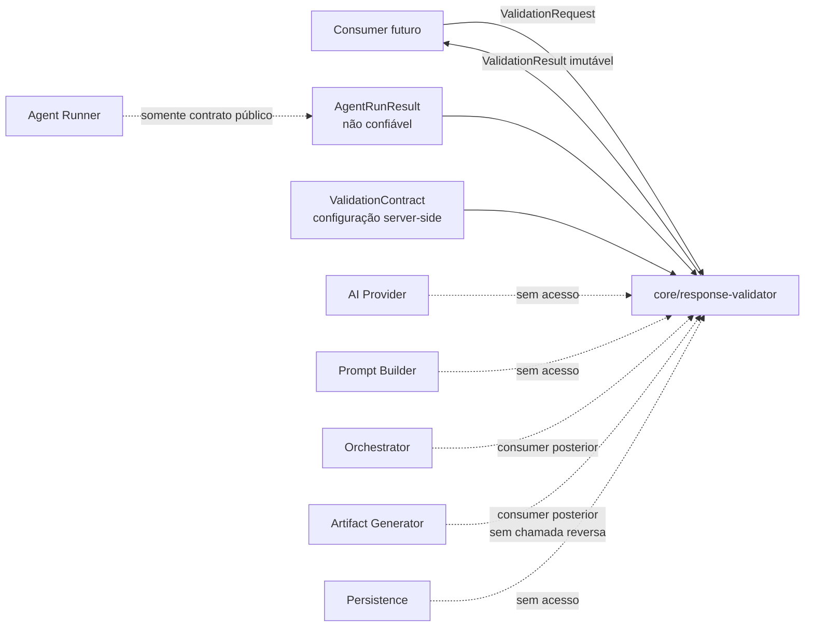

O Validator recebe o resultado público do Runner; ele não pode importar ou reconstruir o `ResponseEnvelope` interno. Também não chama o Runner nem qualquer provider.

Quando `valid: true`, um consumer futuro pode combinar este resultado com uma `ArtifactSpecification` e chamar o Artifact Generator. O Validator não seleciona essa specification e não chama o Generator. A integração visual entre as fronteiras está em [Artifact Generator Flow](30-ARTIFACT_GENERATOR_FLOW.md) e [Artifact Lifecycle](31-ARTIFACT_LIFECYCLE.md).

---

# Contratos Públicos

```text
ValidationRequest
├── runResult: AgentRunResult
└── contract: ValidationContract

ValidationContract
├── id
├── version
├── expectedOutputContractHash
├── format: TEXT | JSON_SCHEMA
├── dialect?                       # DRAFT_2020_12 em JSON_SCHEMA
└── schema?                        # somente JSON_SCHEMA

ValidationResult
├── valid
├── validatedOutput                # TEXT, JSON_SCHEMA ou null
├── issues[]
└── metadata
    ├── contract                   # identidade, formato e contractHash
    ├── source                     # IDs, provider, hashes e finishReason
    ├── contentHash
    ├── schemaHash?
    ├── validatedValueHash?
    ├── validationHash
    └── issuesTruncated
```

O contrato funcional não contém callbacks nem regras específicas de agente. Ele é declarativo, versionado, validável e auditável. `expectedOutputContractHash` vincula a validação ao contrato usado na construção do prompt. Product Owner, Developer e QA fornecem schemas próprios fora deste módulo.

---

# Pipeline Completa

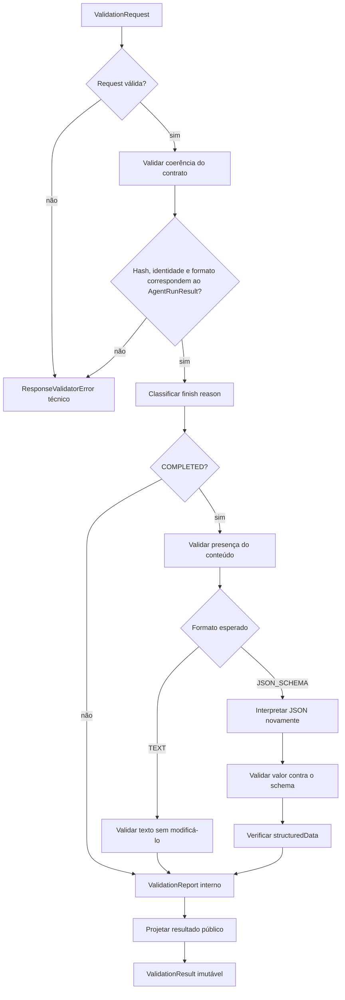

A pipeline não corrige conteúdo e não tenta caminhos alternativos para transformar uma falha em sucesso. Findings são acumulados em ordem estável e projetados uma única vez.

Os estágios técnicos são `REQUEST`, `CONTRACT`, `CONTENT`, `SCHEMA`, `STRUCTURED_OUTPUT` e `RESULT`. Somente configuração, request, contrato ou falha interna inválidos lançam `ResponseValidatorError`, com os códigos `RESPONSE_VALIDATOR_INVALID_CONFIGURATION`, `RESPONSE_VALIDATOR_INVALID_REQUEST`, `RESPONSE_VALIDATOR_INVALID_CONTRACT` ou `RESPONSE_VALIDATOR_INTERNAL_ERROR`.

---

# Sequência Completa

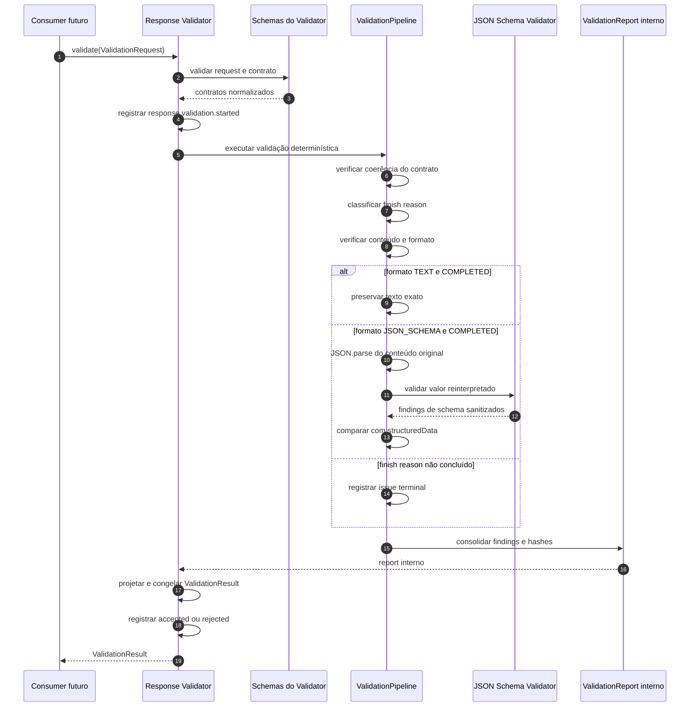

`ValidationReport` existe somente dentro do módulo. Ele permite separar coleta de findings da API pública e prepara a evolução da pipeline sem expor detalhes internos.

---

# Finish Reasons

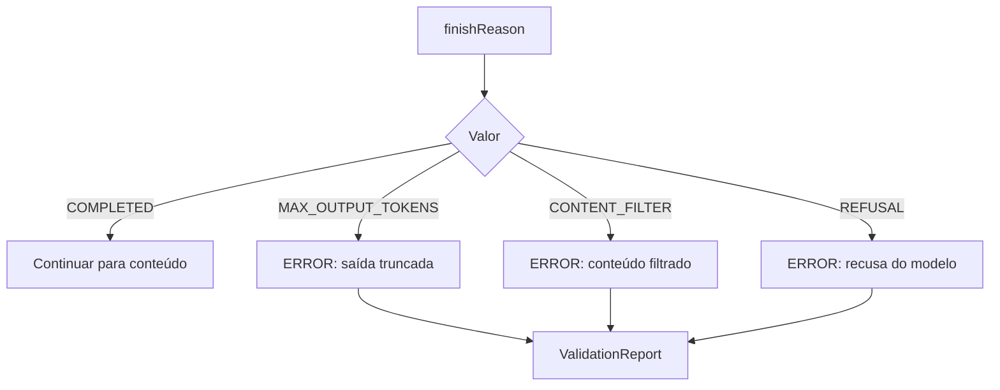

Conteúdo associado a uma saída truncada, filtrada ou recusada é preservado no `AgentRunResult`, mas não é interpretado como candidato válido. O Validator não decide se alguma dessas classificações deve gerar retry ou revisão.

---

# Fluxo TEXT

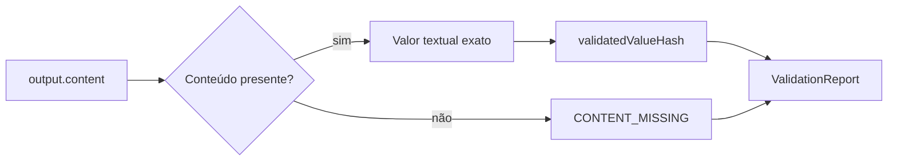

O trim pode ser utilizado somente para decidir se existe conteúdo significativo. O texto aceito e seu hash usam a string original, sem normalização.

No formato `TEXT`, `structuredData` não integra o contrato funcional e é ignorado.

---

# Fluxo JSON_SCHEMA

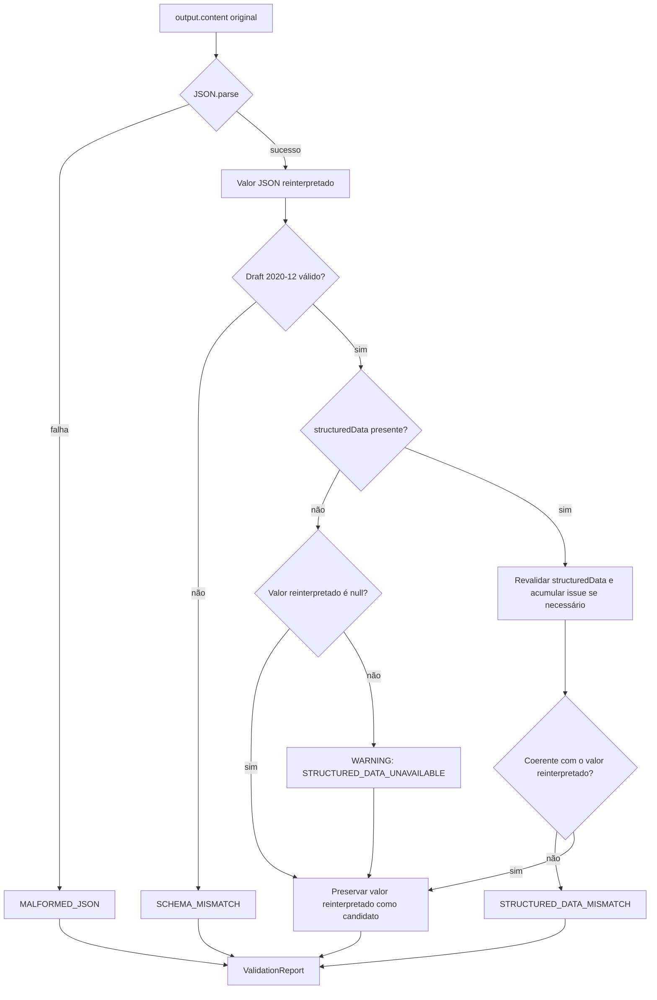

O conteúdo textual é sempre reinterpretado. `structuredData` é uma evidência adicional da normalização do provider, nunca a fonte única da decisão. Quando está ausente, um conteúdo reinterpretado e validado continua suficiente; quando está presente, ele também é revalidado e comparado canonicamente. O schema usa o dialect literal `DRAFT_2020_12` e Ajv 8 em modo estrito; ele não pode aplicar defaults, converter tipos, remover propriedades, resolver referências remotas ou alterar o valor.

---

# Findings, Severidade e Validade

```text
ValidationIssue
├── code
├── category
├── severity: INFO | WARNING | ERROR
├── message segura
├── instancePath?
├── schemaPath?
└── keyword?
```

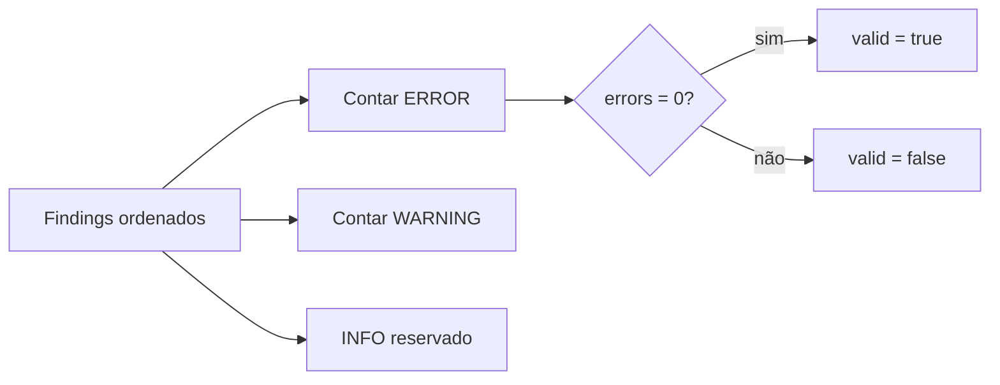

O enum reserva `INFO` para evolução compatível, mas a pipeline de produção da Sprint 7 emite somente `ERROR` e `WARNING`. Mensagens são controladas pelo módulo; erros crus do engine de JSON Schema e valores do payload não atravessam o contrato.

| Categoria       | Códigos de produção                                                                               | Severidade |
| --------------- | ------------------------------------------------------------------------------------------------- | ---------- |
| `FINISH_REASON` | `FINISH_REASON_MAX_OUTPUT_TOKENS`, `FINISH_REASON_CONTENT_FILTER`, `FINISH_REASON_REFUSAL`        | `ERROR`    |
| `CONTENT`       | `CONTENT_MISSING`, `CONTENT_TOO_LARGE`, `CONTENT_NESTING_TOO_DEEP`                                | `ERROR`    |
| `JSON_SYNTAX`   | `MALFORMED_JSON`                                                                                  | `ERROR`    |
| `SCHEMA`        | `SCHEMA_MISMATCH`                                                                                 | `ERROR`    |
| `INTEGRITY`     | `STRUCTURED_DATA_NESTING_TOO_DEEP`, `STRUCTURED_DATA_SCHEMA_MISMATCH`, `STRUCTURED_DATA_MISMATCH` | `ERROR`    |
| `INTEGRITY`     | `STRUCTURED_DATA_UNAVAILABLE`                                                                     | `WARNING`  |

---

# Limites de Validação

```text
Configuração por instância
├── maxContentBytes    # default 1 MiB
├── maxSchemaBytes     # default 128 KiB
├── maxNestingDepth    # default 100
└── maxIssues          # default 50
```

Cada valor possui também um teto absoluto de schema. Conteúdo excessivo e nesting excessivo produzem issues funcionais. Schema excessivo ou configuração inválida produzem erro técnico. Ao atingir `maxIssues`, a pipeline interrompe a expansão da lista e marca `metadata.issuesTruncated`.

---

# ValidationReport Interno

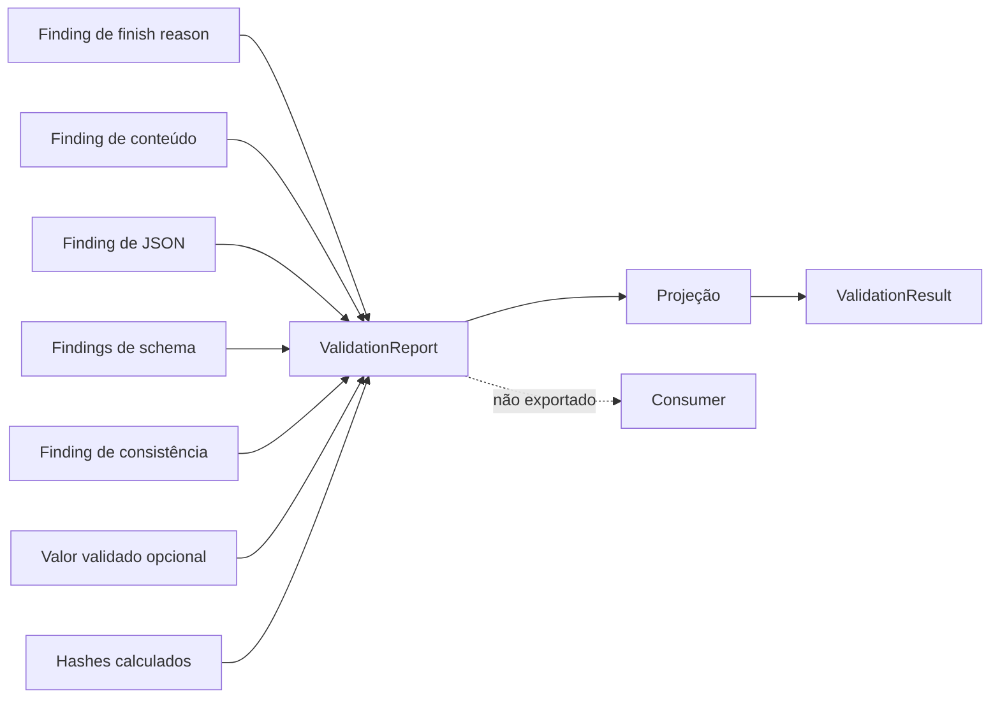

O report pode carregar detalhes necessários à pipeline sem expandir permanentemente a API pública. A projeção remove dados internos, valida o contrato final e aplica imutabilidade profunda.

---

# Hashes

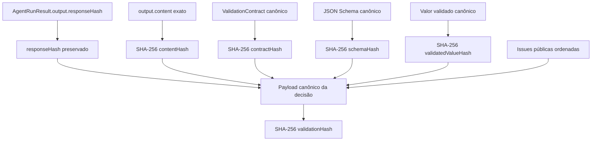

Os hashes não são intercambiáveis:

- `responseHash` identifica a resposta normalizada pelo Runner e não é recalculado pelo Validator;
- `contentHash` identifica exatamente o texto avaliado;
- `contractHash` identifica as regras funcionais declarativas;
- `schemaHash` identifica separadamente o schema quando o formato é `JSON_SCHEMA`;
- `validatedValueHash` existe somente quando há valor aceito;
- `validationHash` identifica a decisão determinística e não inclui duração, timestamp ou conteúdo bruto.

---

# Trust Boundaries

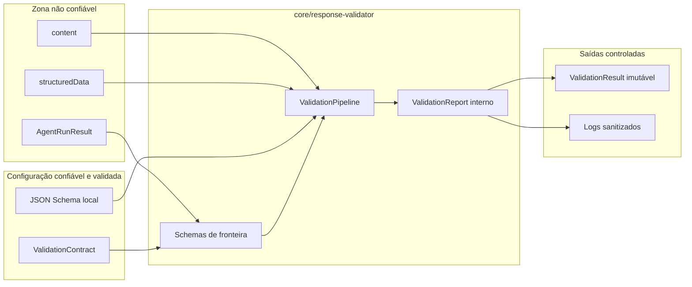

Mesmo o contrato vindo de configuração server-side é validado antes do uso. Schemas remotos, código, callbacks e extensões mutáveis não atravessam a fronteira.

---

# Logging

```text
response.validation.started
response.validation.accepted
response.validation.rejected
response.validation.failed
```

Os eventos podem conter somente:

- executionId e agentExecutionId;
- requestId e traceId;
- provider e modelo respondido;
- ID, versão, formato e hash do contrato;
- responseHash, contentHash, validatedValueHash e validationHash;
- finish reason, validade, duração e quantidade de issues;
- códigos de issues e indicador de truncamento;
- código de erro técnico.

Nunca podem conter:

- conteúdo ou `structuredData`;
- JSON Schema completo;
- valor validado ou rejeitado;
- mensagens e parâmetros crus do engine de schema;
- prompt, contexto ou regras;
- API keys, authorization headers, cookies ou segredos.

---

# Dependências

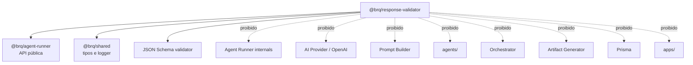

---

# Resumo para Onboarding

```text
ValidationRequest validado
        ↓
Contrato funcional coerente com a execução
        ↓
Finish reason classificado
        ↓
Conteúdo presente
        ↓
TEXT preservado ou JSON reinterpretado
        ↓
Schema e structured output verificados
        ↓
ValidationReport interno
        ↓
ValidationResult público, imutável e rastreável
```

Ao depurar o módulo, verifique primeiro `agentExecutionId`, `finishReason`, o formato do contrato e os códigos das issues. O Validator classifica uma única resposta; ele não corrige, não retenta e não coordena o pipeline.
