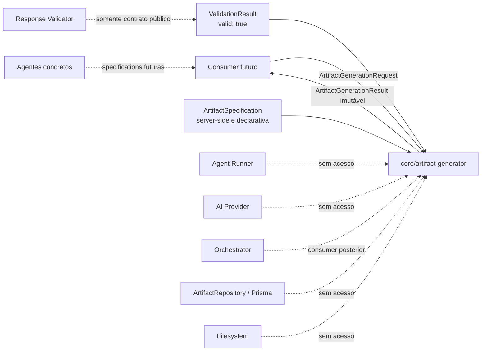
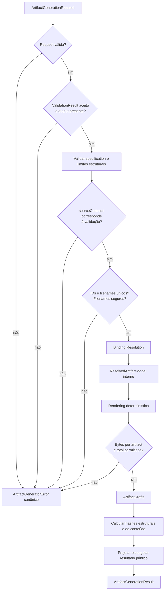
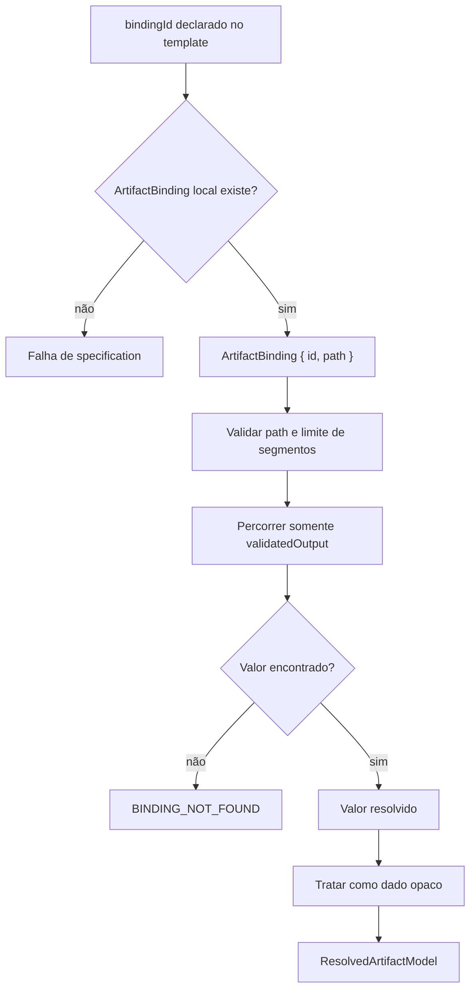
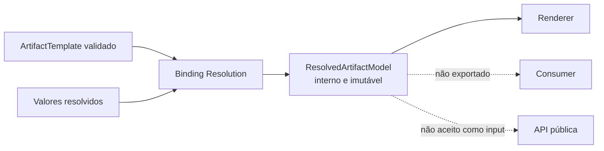
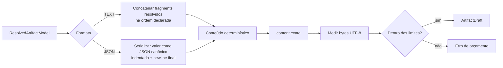
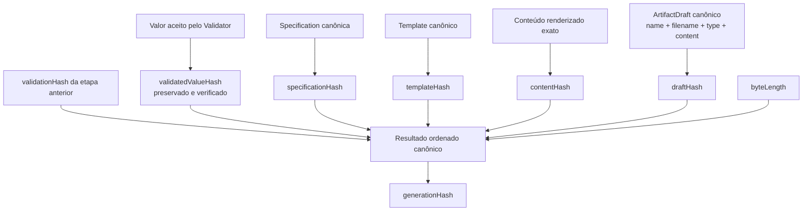
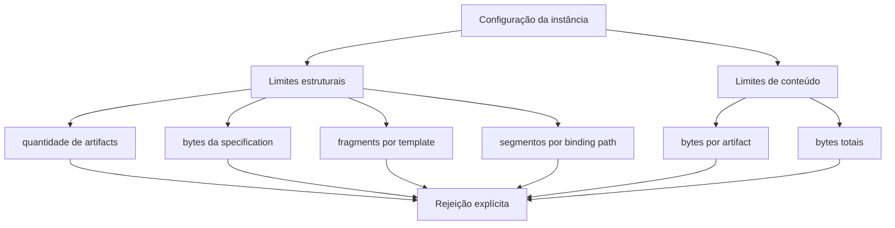
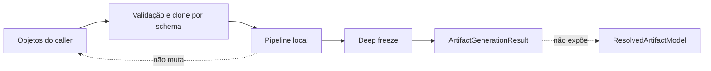
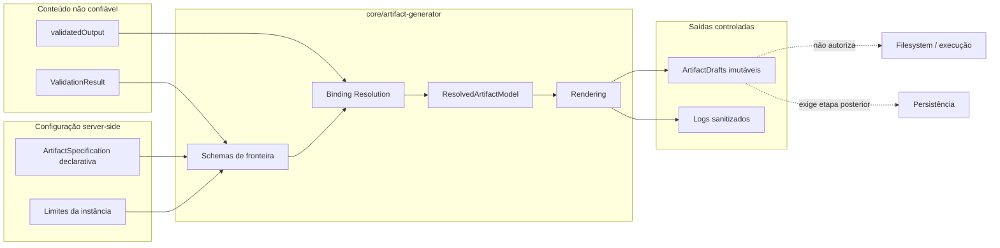
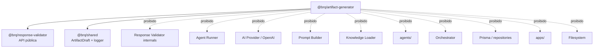

# Artifact Generator Flow

## Objetivo

Este documento apresenta visualmente o Artifact Generator implementado na Sprint 8.

Ele serve como material de onboarding. O [ADR-018](ADR/ADR-018-ARTIFACT-GENERATOR-BOUNDARY.md) é a decisão normativa; este documento explica como resultado validado, specification, bindings, modelo resolvido interno, rendering, drafts, hashes, limites e trust boundaries trabalham em conjunto.

---

# Fronteira do Módulo



O Generator recebe duas estruturas prontas. Ele não escolhe agente, specification, template ou destino e não busca dados externos. Seu resultado contém drafts em memória, não arquivos físicos nem registros versionados.

---

# Contratos Públicos

```text
ArtifactGenerationRequest
├── validation                    # ValidationResult aceito
└── specification                 # definição declarativa pronta

ArtifactSpecification
├── id
├── version
├── sourceContract
│   ├── id
│   ├── version
│   ├── format
│   └── contractHash
└── templates[]
    └── ArtifactTemplate
        ├── id
        ├── name
        ├── filename              # nome seguro, nunca caminho
        ├── type
        ├── mediaType
        └── formato
            ├── TEXT
            │   ├── bindings[]    # ArtifactBinding { id, path }
            │   └── fragments[]   # LITERAL ou BINDING { bindingId, serialization }
            └── JSON
                ├── bindings[]    # ArtifactBinding { id, path }
                └── rootBindingId # valor JSON completo

ArtifactGenerationResult
├── artifacts[]                   # GeneratedArtifacts imutáveis e ordenados
│   ├── draft                     # ArtifactDraft compartilhado
│   └── metadata                  # formato, mediaType, hashes e bytes
└── metadata
    ├── source
    │   ├── executionId + agentExecutionId
    │   ├── requestId? + traceId?
    │   ├── provider + model + finishReason
    │   ├── promptHash + outputContractHash + responseHash
    │   ├── contractId + contractVersion + contractFormat + contractHash
    │   └── validationHash + validatedValueHash
    ├── specificationId
    ├── specificationVersion
    ├── specificationHash
    ├── artifactCount
    ├── totalBytes
    └── generationHash
```

Esta árvore é conceitual: os schemas públicos são a definição executável dos campos e das variantes declarativas. `ResolvedArtifactModel` não integra o contrato público.

O source validado pode ter formato `TEXT` ou `JSON_SCHEMA`. O `sourceContract` da specification precisa corresponder exatamente a ID, versão, formato e `contractHash` registrados pelo Validator.

Specifications específicas de Product Owner, Developer e QA não pertencem ao módulo genérico e serão criadas somente nas Sprints dos respectivos agentes.

`mediaType` usa uma allowlist coerente com o formato: `TEXT` aceita `text/plain` ou `text/markdown`, e `JSON` exige `application/json`.

---

# Pipeline Completa



Não existe fallback ou saída parcial. Uma falha em qualquer template encerra a chamada inteira; o módulo não omite drafts, trunca conteúdo nem corrige bindings silenciosamente.

---

# Sequência Completa

```mermaid
sequenceDiagram
    autonumber
    participant C as Consumer futuro
    participant AG as Artifact Generator
    participant S as Schemas de fronteira
    participant BR as Binding Resolver
    participant RM as ResolvedArtifactModel interno
    participant R as Renderer
    participant H as Hashing

    C->>AG: generate(ArtifactGenerationRequest)
    AG->>S: validar request, resultado e specification
    S-->>AG: estruturas clonadas e normalizadas
    AG->>AG: registrar artifact.generation.started

    loop templates na ordem declarada
        AG->>H: calcular templateHash
        H-->>AG: identidade estrutural do template
        AG->>BR: resolver ArtifactBindings
        BR->>RM: montar modelo sem referências pendentes
        RM-->>BR: modelo interno imutável
        BR-->>AG: ResolvedArtifactModel
        AG->>R: renderizar fragments
        R-->>AG: conteúdo textual e bytes UTF-8
        AG->>H: calcular contentHash e draftHash
        H-->>AG: metadados do draft
    end

    AG->>AG: verificar orçamento total
    AG->>H: calcular specificationHash e generationHash
    H-->>AG: hashes finais
    AG->>AG: projetar e congelar ArtifactGenerationResult
    AG->>AG: registrar artifact.generation.completed
    AG-->>C: ArtifactGenerationResult

    Note over AG: Em falha, registra somente metadados sanitizados<br/>e lança ArtifactGeneratorError; não retorna drafts parciais.
```

---

# Fluxo de Resolução de Bindings



Bindings são locais a cada template. IDs devem ser únicos, toda referência precisa existir e bindings não utilizados são rejeitados, evitando configuração morta ou acoplamento implícito entre artifacts.

O path é um array de segmentos `string | number`; o array vazio seleciona a raiz. Segmentos string acessam somente propriedades próprias de objetos, e segmentos numéricos acessam índices existentes de arrays. Os segmentos `__proto__`, `prototype` e `constructor` são proibidos. Não existe JSON Pointer, JSONPath, expressão, callback ou consulta externa. A resolução não permite que um valor proveniente da resposta altere o path, crie fragments ou escolha o template seguinte.

O `validatedValueHash` recebido é verificado contra o valor aceito antes da geração. Essa verificação preserva a ligação entre a decisão do Validator e os valores lidos pelos bindings.

Templates `TEXT` aceitam fragments `LITERAL` e `BINDING`. O fragment de binding referencia `bindingId` e declara a serialização `TEXT`, `JSON_COMPACT` ou `JSON_PRETTY`; `TEXT` exige que o valor resolvido seja string. Templates `JSON` referenciam um único `rootBindingId` e renderizam o valor inteiro como JSON canônico, indentado e terminado por uma única newline, sem concatenação.

---

# ResolvedArtifactModel Interno



O modelo interno marca a separação entre localizar dados e produzir texto. O renderer recebe apenas fragments já resolvidos; portanto, não conhece JSON paths nem volta a consultar `ValidationResult`.

---

# Rendering



Rendering é uma transformação textual local. Não há Markdown engine, execução de código, template recursivo, escape específico de UI, escrita de arquivo, resumo ou correção semântica. Escaping de apresentação continua responsabilidade do consumer conforme o destino.

Conteúdo vazio — inclusive apenas whitespace — é rejeitado. O Generator não publica um draft vazio nem tenta preenchê-lo automaticamente.

---

# Hashes



| Hash                 | Classe             | Identifica                                                    |
| -------------------- | ------------------ | ------------------------------------------------------------- |
| `validatedValueHash` | conteúdo de origem | valor aceito pelo Response Validator; preservado e verificado |
| `specificationHash`  | estrutural         | specification canônica e versionada                           |
| `templateHash`       | estrutural         | definição canônica de um template                             |
| `contentHash`        | conteúdo           | bytes UTF-8 exatos do conteúdo renderizado                    |
| `draftHash`          | estrutural         | `ArtifactDraft` completo em JSON canônico                     |
| `generationHash`     | estrutural         | resultado ordenado da geração completa                        |

Duração, timestamps e conteúdo bruto não entram no `generationHash`. Trocar a ordem dos templates altera a identidade da geração mesmo que o conjunto de drafts seja igual.

---

# Orçamento e Limites



Defaults permanecem centralizados na configuração do módulo e cada campo possui teto absoluto. Cada instância pode configurar limites dentro desses tetos. A medição de conteúdo usa bytes UTF-8, não quantidade de caracteres.

Para templates `TEXT`, o Binding Resolver acumula bytes a cada fragmento e reutiliza a serialização de referências repetidas ao mesmo par `bindingId + serialization`. Se o limite por artifact for ultrapassado, a resolução para antes do `join`; o Renderer ainda confirma o tamanho exato antes de criar o draft. Isso evita que repetições declarativas materializem primeiro uma string muito maior que o orçamento.

| Configuração              | Default |
| ------------------------- | ------- |
| `maxArtifacts`            | 16      |
| `maxFragmentsPerArtifact` | 256     |
| `maxBindingsPerArtifact`  | 64      |
| `maxBindingPathDepth`     | 32      |
| `maxSpecificationBytes`   | 256 KiB |
| `maxArtifactBytes`        | 1 MiB   |
| `maxTotalBytes`           | 4 MiB   |
| `maxNestingDepth`         | 100     |

Não existe truncamento silencioso. Limite excedido produz erro canônico rastreável e nenhum resultado parcial é publicado.

---

# Imutabilidade



O Generator não congela nem modifica os objetos pertencentes ao caller. Ele trabalha sobre valores validados e clonados e congela profundamente apenas sua saída pública.

---

# Trust Boundaries



`valid: true` significa aderência ao contrato funcional configurado; não transforma o conteúdo em código seguro, HTML seguro ou dado confiável para qualquer destino. A fronteira impede I/O e preserva a necessidade de escaping, revisão e políticas posteriores.

---

# Logging

```text
artifact.generation.started
artifact.generation.completed
artifact.generation.failed
```

Os eventos podem conter somente:

- executionId, agentExecutionId, requestId e traceId quando disponíveis;
- ID e versão da specification;
- `sourceValidationHash` e `sourceValidatedValueHash`;
- `specificationHash`, hashes dos templates, drafts e conteúdos e `generationHash`;
- quantidade de templates e artifacts;
- bytes renderizados e duração;
- estágio, classificação e código de erro canônico.

Nunca podem conter:

- conteúdo validado ou renderizado;
- valores resolvidos por bindings;
- templates, fragments ou specification completa;
- prompt, contexto, regras ou schemas completos;
- paths externos, API keys, authorization headers, cookies ou segredos.

Os estágios públicos são `REQUEST_VALIDATION`, `SPECIFICATION_VALIDATION`, `SOURCE_INTEGRITY_VALIDATION`, `BINDING_RESOLUTION`, `RENDERING`, `DRAFT_VALIDATION`, `BUDGET_VALIDATION` e `FINALIZATION`.

Erros possuem classificação `TECHNICAL` ou `GENERATION`. Os códigos canônicos distinguem configuração ou request inválido, validação fonte rejeitada, integridade ou contrato fonte divergente, limite de specification, binding ausente ou incompatível, limite ou vazio de conteúdo, draft inválido e falha interna. Todos usam o prefixo `ARTIFACT_GENERATOR_`.

| Código sem o prefixo `ARTIFACT_GENERATOR_` | Classificação | Estágio típico                 |
| ------------------------------------------ | ------------- | ------------------------------ |
| `INVALID_CONFIGURATION`                    | `TECHNICAL`   | `REQUEST_VALIDATION`           |
| `INVALID_REQUEST`                          | `TECHNICAL`   | `REQUEST_VALIDATION`           |
| `SOURCE_VALIDATION_REJECTED`               | `GENERATION`  | `REQUEST_VALIDATION`           |
| `SOURCE_INTEGRITY_MISMATCH`                | `GENERATION`  | `SOURCE_INTEGRITY_VALIDATION`  |
| `SOURCE_CONTRACT_MISMATCH`                 | `GENERATION`  | `SPECIFICATION_VALIDATION`     |
| `SPECIFICATION_LIMIT_EXCEEDED`             | `GENERATION`  | `SPECIFICATION_VALIDATION`     |
| `BINDING_NOT_FOUND`                        | `GENERATION`  | `BINDING_RESOLUTION`           |
| `BINDING_TYPE_MISMATCH`                    | `GENERATION`  | `BINDING_RESOLUTION`           |
| `CONTENT_LIMIT_EXCEEDED`                   | `GENERATION`  | `BUDGET_VALIDATION`            |
| `EMPTY_CONTENT`                            | `GENERATION`  | `RENDERING`                    |
| `INVALID_ARTIFACT_DRAFT`                   | `GENERATION`  | `DRAFT_VALIDATION`             |
| `INTERNAL_ERROR`                           | `TECHNICAL`   | estágio em que a falha ocorreu |

---

# Dependências



---

# Resumo para Onboarding

```text
ValidationResult aceito + ArtifactSpecification pronta
                         ↓
            validação de fronteira e limites
                         ↓
                 Binding Resolution
                         ↓
            ResolvedArtifactModel interno
                         ↓
              Rendering determinístico
                         ↓
      ArtifactDrafts + metadados + hashes
                         ↓
        ArtifactGenerationResult imutável
```

Ao depurar o módulo, verifique primeiro `validationHash`, `validatedValueHash`, ID e versão da specification, estágio, código de erro e limites. Não procure arquivos ou registros no banco: a fronteira da Sprint 8 termina no resultado em memória.
