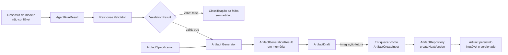
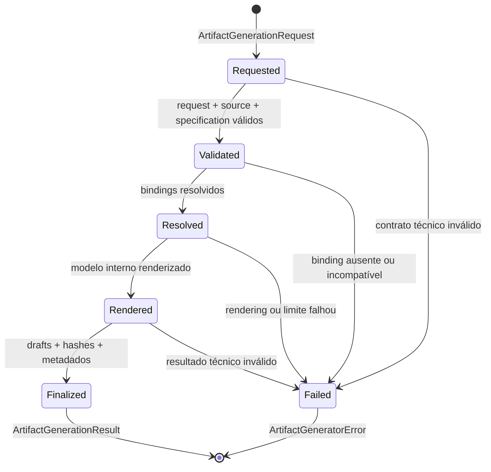
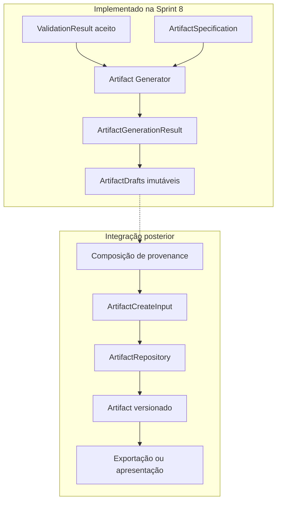
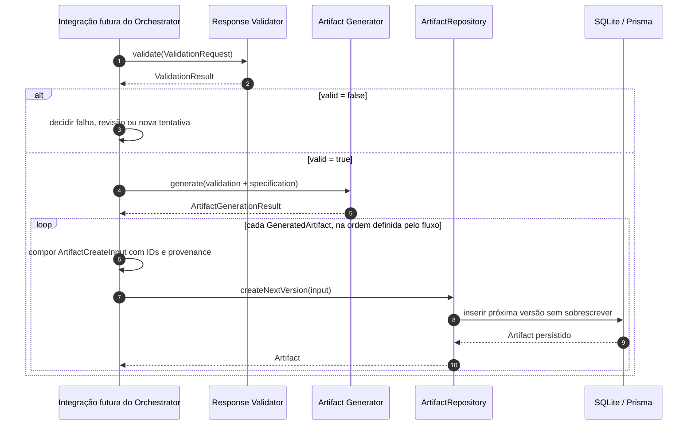
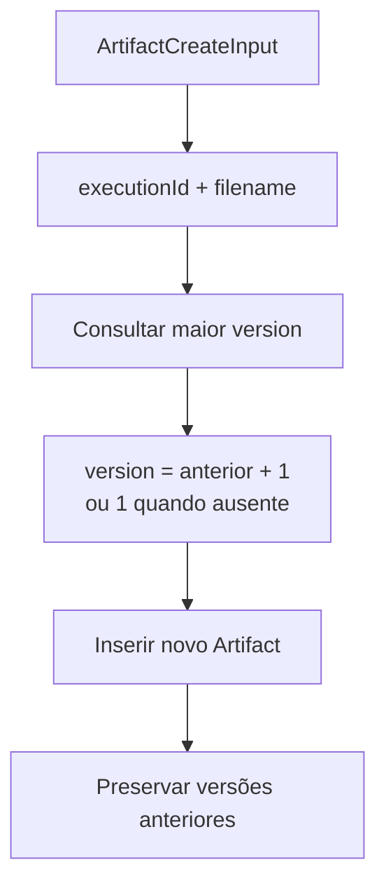
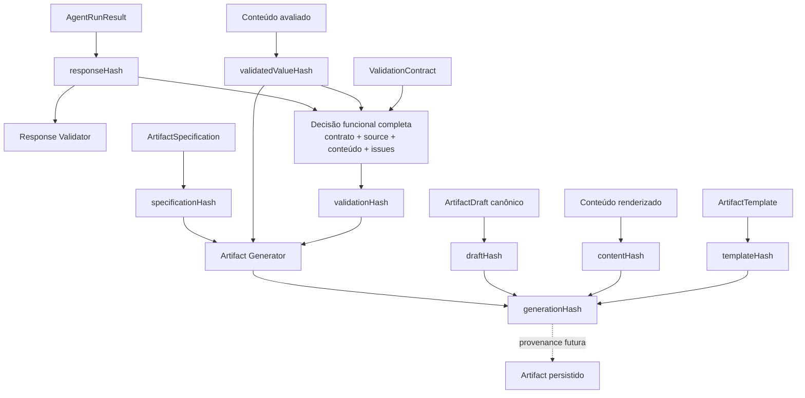
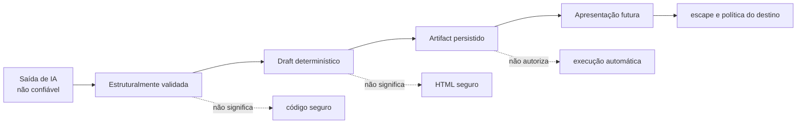

# Artifact Lifecycle

## Objetivo

Este documento distingue as etapas do ciclo de vida de um artifact no BRQ AI Factory: saída do modelo, validação funcional, geração determinística de um draft em memória, enriquecimento futuro e persistência versionada.

Ele evita uma ambiguidade importante: o Artifact Generator da Sprint 8 não cria arquivo físico nem registro de banco. A fronteira normativa do módulo está no [ADR-018](ADR/ADR-018-ARTIFACT-GENERATOR-BOUNDARY.md), e sua pipeline detalhada está em [Artifact Generator Flow](30-ARTIFACT_GENERATOR_FLOW.md).

---

# Visão Geral



As setas tracejadas representam integração ainda não implementada na Sprint 8. O workspace de persistência e seu repository já existem, mas nenhum componente desta Sprint conecta o resultado da geração a eles.

---

# Três Contratos, Três Responsabilidades

| Contrato              | Responsável pela criação              | Conteúdo principal                                     | Persistido?               |
| --------------------- | ------------------------------------- | ------------------------------------------------------ | ------------------------- |
| `ArtifactDraft`       | Artifact Generator                    | `name`, `filename`, `type`, `content`                  | Não                       |
| `ArtifactCreateInput` | consumer/coordenador futuro           | draft + `executionId`, `agentExecutionId` e provenance | Entrada do repository     |
| `Artifact`            | implementação de `ArtifactRepository` | create input + `id`, `version` e `createdAt`           | Sim, registro append-only |

`GeneratedArtifact` envolve um `ArtifactDraft` com metadados técnicos da geração, como ID do template, formato, media type, hashes e bytes. Ele não substitui `ArtifactCreateInput` e não é entidade de banco.

---

# Ciclo da Geração em Memória



Esses estados são estágios locais da chamada, não estados persistidos de `Execution`, `AgentExecution` ou `Artifact`. O Generator não realiza transições de domínio.

---

# Fronteira Exata da Sprint 8



Na Sprint 8 não existe:

- consumer de produção ou Orchestrator conectado ao Generator;
- specification de Product Owner, Developer ou QA;
- atribuição de provenance persistida;
- chamada ao `ArtifactRepository`;
- cálculo de nova versão persistida;
- gravação ou exportação em filesystem;
- execução do conteúdo gerado.

---

# Sequência Futura de Persistência



O diagrama é deliberadamente futuro. O Orchestrator da Sprint 12 apenas consolida os artifacts já
presentes nos resultados públicos e não chama Validator, Generator ou Repository. Uma integração
posterior deverá decidir atomicidade, comportamento diante de falha parcial de persistência e quais
hashes da geração entram na provenance de banco.

---

# Versionamento Persistido



O versionamento pertence ao `ArtifactRepository`, conforme ADR-012. O Artifact Generator não consulta versão anterior e produzir novamente o mesmo draft não cria, por si só, uma nova versão. Versionamento entre Executions continua exigindo um identificador de linhagem ainda não definido.

---

# Linhagem de Hashes



## Significado

- `responseHash` identifica a resposta normalizada pelo Agent Runner;
- `validatedValueHash` identifica o valor aceito pelo Validator e é verificado antes de gerar drafts;
- `validationHash` identifica a decisão funcional completa;
- `specificationHash` e `templateHash` identificam definições declarativas;
- `contentHash` identifica bytes UTF-8 exatos do conteúdo renderizado;
- `draftHash` identifica o `ArtifactDraft` canônico;
- `generationHash` identifica o conjunto ordenado de resultados da geração.

Hashes demonstram identidade e integridade dentro das fronteiras definidas; eles não autenticam origem, não substituem assinatura digital e não tornam conteúdo confiável.

---

# Provenance: Atual e Futura

```text
Disponível no ArtifactGenerationResult
├── source
│   ├── correlação e metadados técnicos herdados da validação
│   ├── contractId + contractVersion + contractFormat + contractHash
│   └── validationHash + validatedValueHash
├── specificationId + specificationVersion + specificationHash
├── templateHash + contentHash + draftHash por artifact
└── generationHash

Exigido hoje por ArtifactCreateInput
├── executionId
├── agentExecutionId
└── provenance
    ├── agent
    ├── promptVersion
    └── model
```

A composição entre os dois conjuntos não pertence ao Generator. Antes da integração com persistência, o projeto deve decidir formalmente quais hashes de validação e geração serão armazenados na provenance persistida, sem remover os campos históricos já existentes.

---

# Ownership por Etapa

| Decisão ou ação                      | Dono atual ou futuro            |
| ------------------------------------ | ------------------------------- |
| validar finish reason, JSON e schema | Response Validator              |
| selecionar specification do agente   | consumer/Orchestrator futuro    |
| validar o vínculo `sourceContract`   | Artifact Generator              |
| resolver bindings                    | Artifact Generator              |
| renderizar conteúdo                  | Artifact Generator              |
| produzir e congelar drafts           | Artifact Generator              |
| atribuir execution IDs e provenance  | consumer/Orchestrator futuro    |
| calcular versão dentro da Execution  | ArtifactRepository              |
| persistir registro                   | adapter Prisma                  |
| exportar para arquivo                | componente futuro de exportação |
| escapar conteúdo para UI             | camada de apresentação futura   |
| executar código contido no artifact  | fora do MVP                     |

---

# Segurança ao Longo do Ciclo



Cada etapa preserva o conteúdo; nenhuma promove automaticamente seu nível de confiança. O nome seguro evita path traversal no contrato, mas somente a ausência de I/O no Generator garante que nenhum arquivo seja criado durante a Sprint 8.

---

# Eventos por Fase

```text
Geração em memória
├── artifact.generation.started
├── artifact.generation.completed
└── artifact.generation.failed

Persistência futura
├── artifact.created
└── artifact.versioned
```

Os eventos não são equivalentes. `artifact.generation.completed` informa que drafts foram produzidos em memória; não afirma que foram persistidos. Da mesma forma, `generationHash` não é ID nem versão de banco.

---

# Resumo para Onboarding

```text
Resposta não confiável
        ↓
ValidationResult válido
        ↓
ArtifactSpecification declarativa
        ↓
ArtifactGenerationResult em memória       ← fim da Sprint 8
        ↓
ArtifactCreateInput enriquecido           ← integração futura
        ↓
ArtifactRepository
        ↓
Artifact persistido e versionado
```

Para diagnosticar uma dúvida de lifecycle, identifique primeiro qual contrato está em mãos. Se houver somente `ArtifactDraft` ou `GeneratedArtifact`, ainda não existe ID, versão, timestamp ou garantia de persistência.
