# Product Owner Agent Flow

## Objetivo

Este documento apresenta visualmente o Product Owner Agent introduzido na Sprint 9. Ele explica como uma demanda não confiável atravessa assets server-side, Knowledge Loader, Agent Runner, Response Validator, Business Validation e Artifact Generator até produzir um resultado imutável.

O [ADR-019](ADR/ADR-019-PRODUCT-OWNER-AGENT-BOUNDARY.md) é a decisão normativa. Este documento é material de onboarding e deve ser lido em conjunto com os fluxos do [Prompt Builder](27-PROMPT_BUILDER_FLOW.md), [Agent Runner](28-AGENT_RUNNER_FLOW.md), [Response Validator](29-RESPONSE_VALIDATOR_FLOW.md) e [Artifact Generator](30-ARTIFACT_GENERATOR_FLOW.md).

## Fronteira do módulo

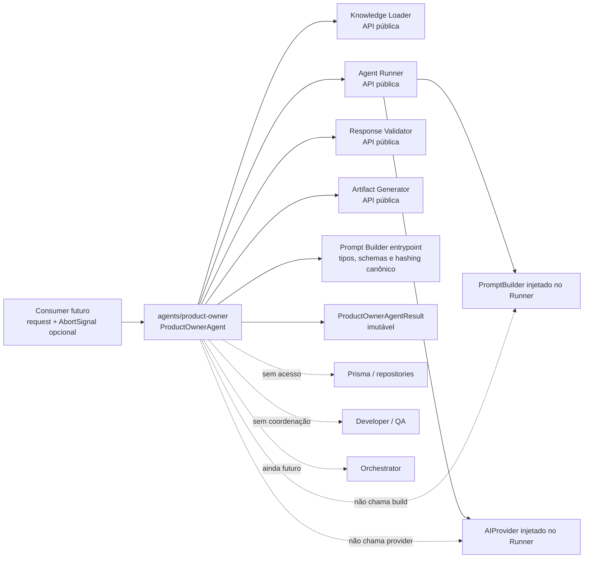

O acesso ao entrypoint do Prompt Builder é estreito: o agente reutiliza contratos declarativos e canonicalização/hashing públicos para validar o bundle. `PromptBuilder.build` não é chamado nem injetado; a construção efetiva continua encapsulada no Agent Runner.

## Contratos conceituais

```text
ProductOwnerAgentRequest
├── context
│   ├── executionId
│   ├── agentExecutionId
│   ├── attempt
│   ├── agentVersion
│   ├── requestId?
│   └── traceId?
├── demand
│   ├── title
│   ├── description
│   ├── businessGoal?
│   ├── targetUsers?
│   ├── constraints?
│   ├── deadline?
│   └── priority?
├── additionalContext?
├── model
└── limits?

ProductOwnerAgentResult
├── outcome: GENERATED
│   ├── specification
│   ├── readiness
│   ├── artifacts[3]
│   └── metadata
└── outcome: VALIDATION_REJECTED
    ├── rejectedAt: RESPONSE_VALIDATION | BUSINESS_VALIDATION
    ├── specification: null
    ├── artifacts: []
    ├── validation
    └── metadata
```

O request não aceita template, rule set, schema, Validation Contract, Artifact Specification ou filename fornecido pelo usuário. Esses elementos vêm exclusivamente do bundle server-side.

## Assets da versão inicial

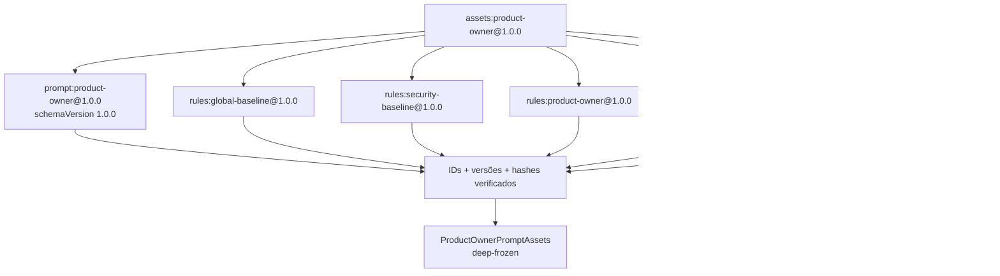

Os assets físicos ficam em `prompts/product-owner/1.0.0/`. O manifest referencia filenames, IDs e versões; o loader calcula e verifica os hashes dos assets e do bundle, cujo valor esperado fica fixado para o release 1.0.0. Ele não executa código, seleciona assets por conteúdo do modelo ou consulta registry externo. O JSON Schema inicial omite `$schema` e `uniqueItems` para permanecer no subconjunto de Structured Outputs visado pelos modelos-base suportados; modelos fine-tuned exigem verificação explícita e permanecem um risco de compatibilidade.

## Sequência completa — sucesso

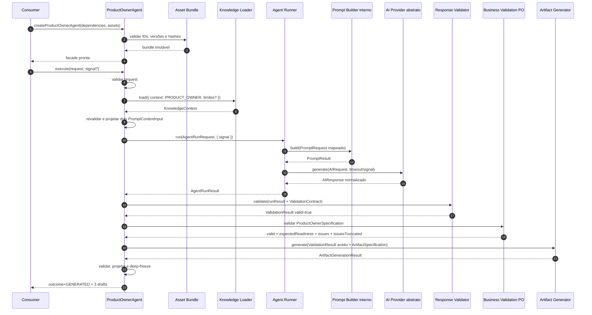

Cada componente permanece dono de sua fronteira. A fachada apenas prepara entradas, chama APIs públicas, valida resultados e projeta o resultado específico do agente.

## Branch de rejeição funcional

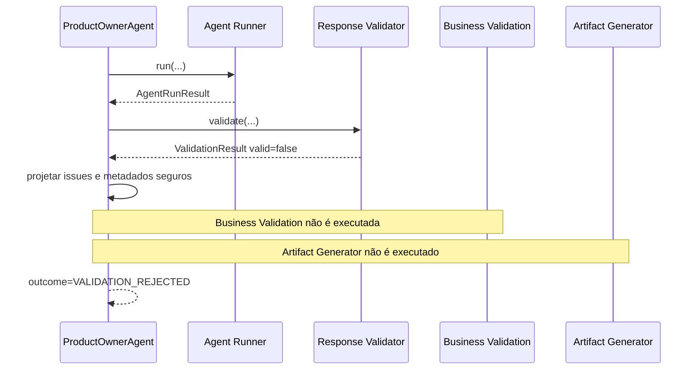

JSON malformado, schema mismatch, refusal, content filter e saída truncada são rejeições funcionais classificadas pelo Validator. A fachada não as converte em exception, não corrige a resposta e não executa retry.

## Business Validation

O Response Validator é genérico. A etapa seguinte pode conhecer o domínio de Product Owner sem transferir essas regras ao módulo de validação compartilhado.

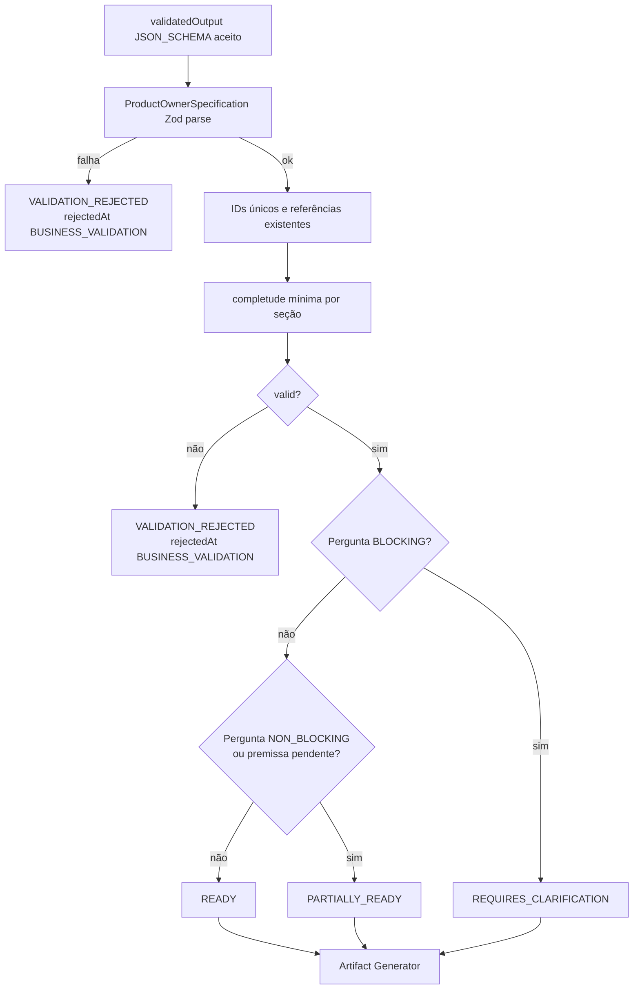

A Business Validation retorna de forma imutável `{ valid, expectedReadiness, issues[], issuesTruncated }`. No máximo 100 issues são expostas; `issuesTruncated` informa se houve corte. Os issues classificam IDs duplicados, referências duplicadas ou desconhecidas, readiness divergente e specification incompleta; não alteram o payload. Os códigos canônicos são:

```text
PRODUCT_OWNER_DUPLICATE_ID
PRODUCT_OWNER_DUPLICATE_REFERENCE
PRODUCT_OWNER_UNKNOWN_ACCEPTANCE_CRITERION_REFERENCE
PRODUCT_OWNER_UNKNOWN_DEPENDENCY_REFERENCE
PRODUCT_OWNER_INVALID_SPECIFICATION_STRUCTURE
PRODUCT_OWNER_READINESS_MISMATCH
PRODUCT_OWNER_INCOMPLETE_SPECIFICATION
```

Readiness não é `ExecutionStatus`, `AgentExecutionStatus` nem autorização para mudar estado. O futuro Orchestrator interpretará essa classificação e aplicará políticas de revisão humana.

## Projeção dos contextos

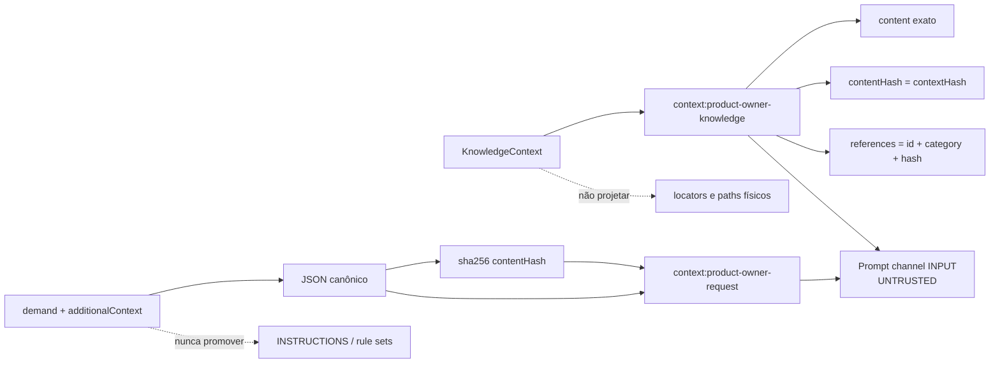

Shape canônico da projeção de conhecimento:

```text
id: context:product-owner-knowledge
kind: KNOWLEDGE
serialization: TEXT
content: KnowledgeContext.content
contentHash: KnowledgeContext.contextHash
references: includedDocuments[{ id, category, hash }]
```

Shape canônico da demanda:

```text
id: context:product-owner-request
kind: USER_INPUT
serialization: JSON
content: { demand, additionalContext }
contentHash: sha256(canonical JSON do content)
references: []
```

Valores inseridos são dados opacos. Strings que imitam delimitadores, slots ou instruções não criam novos nós na AST.

## Trust boundaries

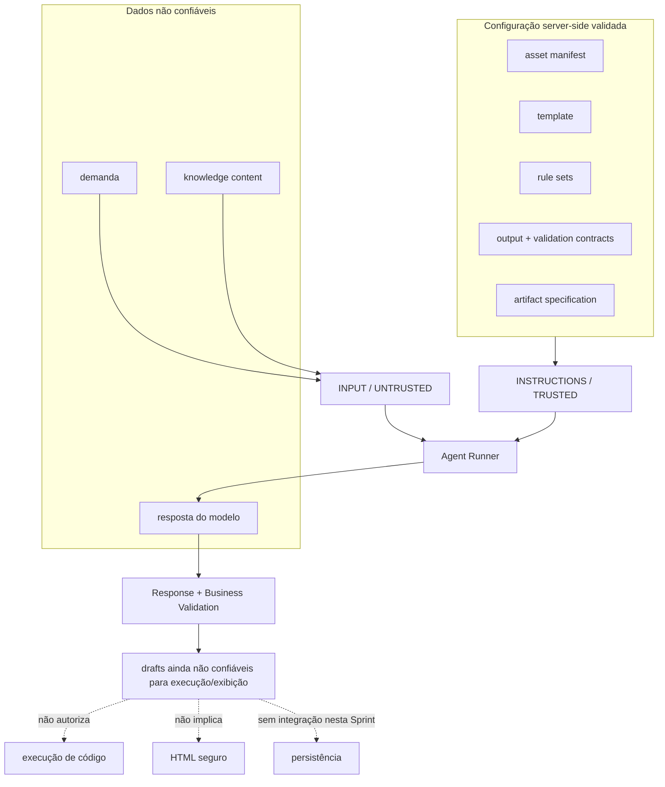

Validação estrutural não promove conteúdo do modelo a conteúdo seguro para qualquer destino. Uma futura UI ainda precisa escapar Markdown/HTML, e código gerado nunca é executado automaticamente no MVP.

## Artifacts

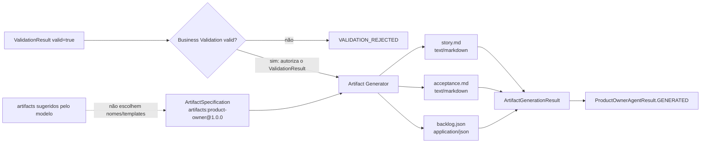

`story.md` reúne title, readiness, summary, objective, context, User Story, assumptions e out of scope. `acceptance.md` reúne acceptance criteria, business rules, scenarios, dependencies, risks, open questions e Definition of Ready. `backlog.json` preserva `backlogItems` como JSON estruturado. A ordem acima é canônica.

Os três resultados continuam sendo `ArtifactDrafts`: não possuem ID, version, timestamp ou garantia de persistência.

## Linhagem de versões e hashes

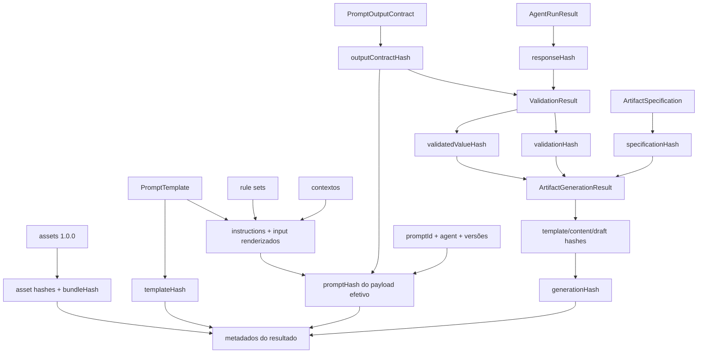

Hashes identificam conteúdo e decisões dentro das fronteiras definidas. Eles não são assinatura digital e não tornam dados confiáveis.

## Cancelamento, timeout e ausência de retry

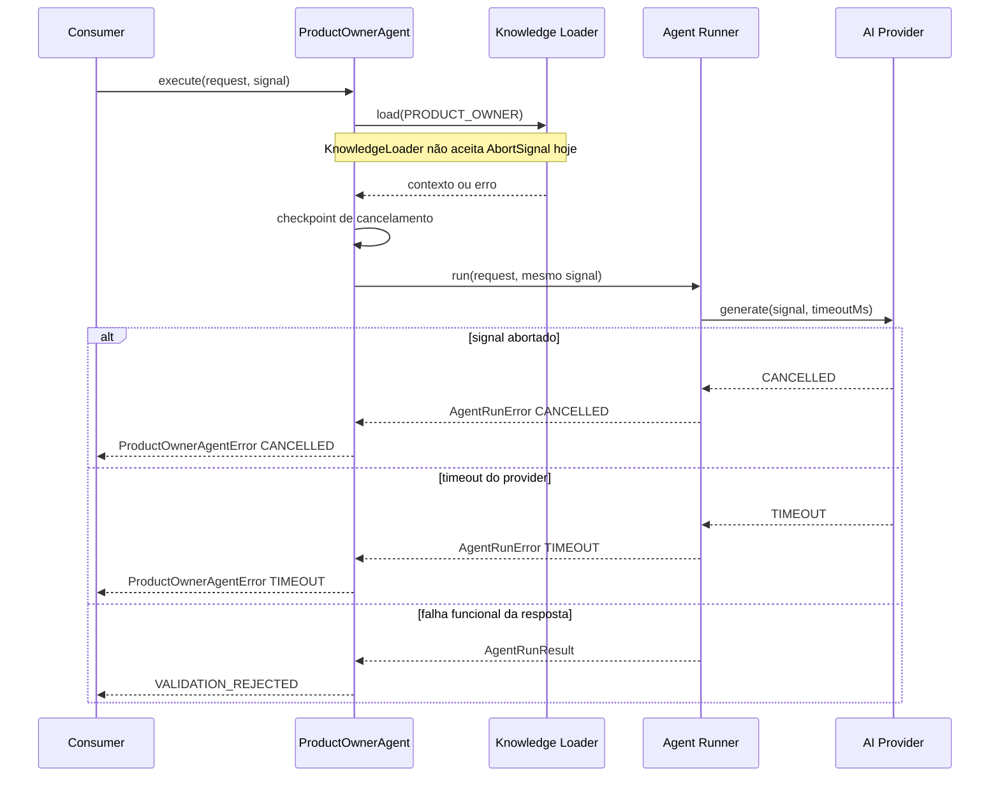

O agente não cria `AbortController`, timer, retry ou nova `AgentExecution`. Cancelamento de uma leitura de Knowledge já iniciada permanece limitação conhecida do contrato atual.

## Erros e logs

Pipeline técnica:

```text
Factory
        ↓
ASSET_VALIDATION

Tentativa

REQUEST_VALIDATION
        ↓
KNOWLEDGE_LOADING
        ↓
CONTEXT_PROJECTION
        ↓
RUNNER_EXECUTION
        ↓
RESPONSE_VALIDATION
        ↓
BUSINESS_VALIDATION
        ↓
ARTIFACT_GENERATION
        ↓
FINALIZATION
```

Eventos da fachada:

```text
product_owner.agent.started
product_owner.knowledge.loaded
product_owner.run.completed
product_owner.validation.accepted
product_owner.validation.rejected
product_owner.artifacts.generated
product_owner.agent.completed
product_owner.agent.failed
```

Dados permitidos incluem IDs, versões, hashes, contagens, bytes, duração, provider, modelo, finish reason, outcome, readiness, códigos de issues, estágio e código técnico. Não são permitidos demanda, conteúdo de knowledge, locators, prompt, regras, schemas completos, resposta, specification funcional, perguntas, riscos, conteúdo de artifacts, segredos ou mensagens cruas de causa.

## Dependências proibidas

```mermaid
flowchart TD
    PO2["@brq/product-owner-agent"] --> KL2["@brq/knowledge-loader<br/>entrypoint"]
    PO2 --> AR2["@brq/agent-runner<br/>entrypoint"]
    PO2 --> RV2["@brq/response-validator<br/>entrypoint"]
    PO2 --> AG2["@brq/artifact-generator<br/>entrypoint"]
    PO2 --> PBPUBLIC["@brq/prompt-builder<br/>contratos + canonicalização/hashing"]
    PO2 --> SHARED["@brq/shared"]

    PO2 -.->|"proibido"| PBBUILD["PromptBuilder.build direto"]
    PO2 -.->|"proibido"| PROVIDER["AI Provider / OpenAI"]
    PO2 -.->|"proibido"| INTERNALS["deep imports de core"]
    PO2 -.->|"proibido"| PRISMA["Prisma / repositories"]
    PO2 -.->|"proibido"| FS["filesystem / network"]
    PO2 -.->|"proibido"| NEXT["Developer / QA"]
    PO2 -.->|"proibido"| ORCHESTRATOR["Orchestrator / Execution Engine"]
```

## Resumo para onboarding

```text
Request validado + assets 1.0.0
                 ↓
KnowledgeContext PRODUCT_OWNER
                 ↓
Knowledge + demanda em INPUT/UNTRUSTED
                 ↓
Agent Runner — uma chamada
                 ↓
Response Validator genérico
        ┌────────┴────────┐
        ↓                 ↓
valid=false          valid=true
        ↓                 ↓
VALIDATION_REJECTED  Business Validation PO
                          ↓
                      readiness
                          ↓
                  Artifact Generator
                          ↓
            story.md + acceptance.md + backlog.json
                          ↓
                 outcome=GENERATED
```

Ao depurar, verifique primeiro `agentExecutionId`, outcome, estágio, hashes do bundle, `promptHash`, `validationHash`, readiness e `generationHash`. Não procure estado persistido, retry ou chamada ao próximo agente: essas responsabilidades não pertencem à Sprint 9.
