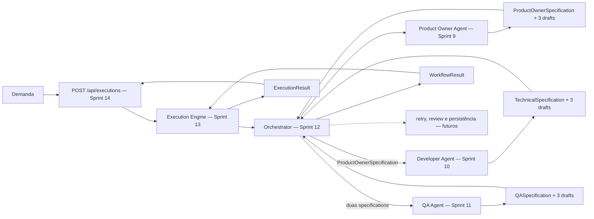
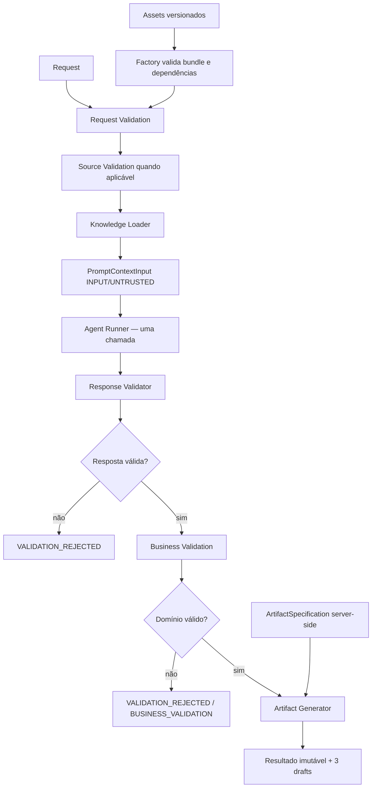
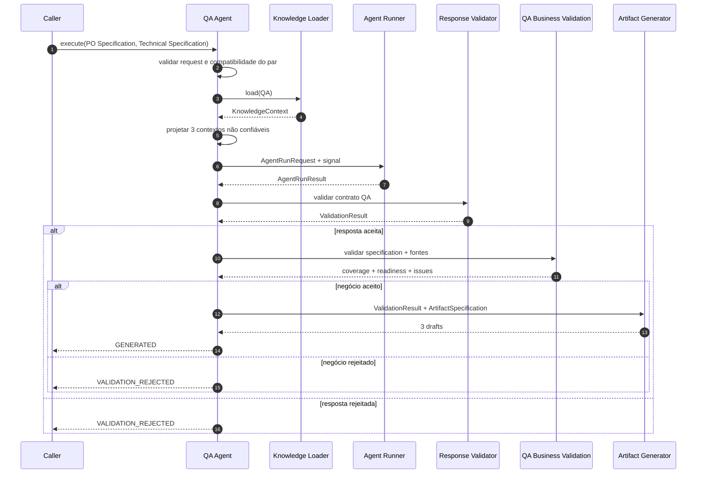
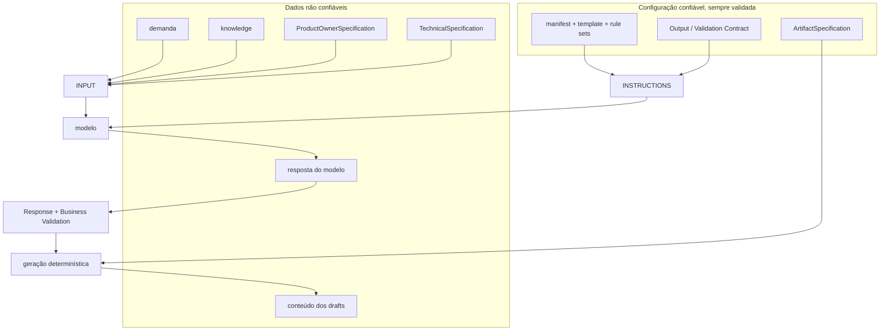
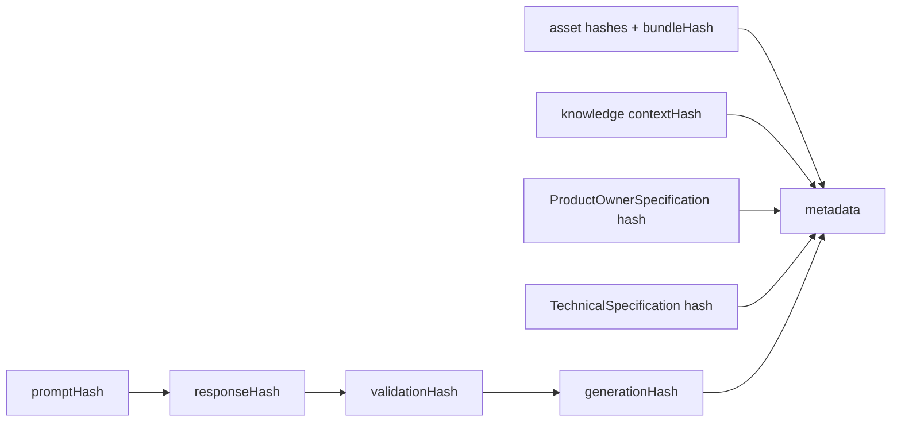

# Pipeline Overview

## Objetivo

Este documento apresenta o pipeline implementado até a Sprint 14. Product Owner, Developer e QA
continuam fachadas isoladas de tentativa única; o Orchestrator coordena a sequência, o Execution
Engine controla o ciclo efêmero e a API apenas adapta HTTP.

Decisões normativas: [ADR-019](ADR/ADR-019-PRODUCT-OWNER-AGENT-BOUNDARY.md), [ADR-020](ADR/ADR-020-DEVELOPER-AGENT-BOUNDARY.md), [ADR-021](ADR/ADR-021-QA-AGENT-BOUNDARY.md), [ADR-022](ADR/ADR-022-ORCHESTRATOR-BOUNDARY.md), [ADR-023](ADR/ADR-023-EXECUTION-ENGINE-BOUNDARY.md) e [ADR-024](ADR/ADR-024-HTTP-API-ADAPTER-BOUNDARY.md).

## Visão macro



Nenhuma seta representa comunicação direta entre fachadas. O Orchestrator recebe os resultados e
projeta somente as specifications públicas necessárias para a próxima chamada.

## Esqueleto reutilizável



O Agent Runner encapsula Prompt Builder e AI Provider. Response Validator e Artifact Generator permanecem genéricos; regras específicas vivem em cada fachada.

## Contratos por agente

| Agente        | Entrada                                                | Specification               | Drafts                                                                  |
| ------------- | ------------------------------------------------------ | --------------------------- | ----------------------------------------------------------------------- |
| Product Owner | demanda estruturada                                    | `ProductOwnerSpecification` | `story.md`, `acceptance.md`, `backlog.json`                             |
| Developer     | `ProductOwnerSpecification`                            | `TechnicalSpecification`    | `architecture.md`, `implementation-plan.md`, `technical-decisions.json` |
| QA            | `ProductOwnerSpecification` + `TechnicalSpecification` | `QASpecification`           | `test-plan.md`, `traceability-matrix.json`, `qa-specification.md`       |

Nenhuma fachada executa a anterior. Developer importa o contrato público do Product Owner; QA importa os dois contratos públicos e usa a validação pura do Developer apenas para verificar a compatibilidade das fontes.

## QA Agent



QA Business Validation exige que cada `AC`, `BR`, `DEC` e `DOD` apareça em cenário, mapa de cobertura e matriz. Totais e readiness são recalculados. O agente produz uma estratégia futura; não recebe código, não executa testes, não gera Playwright e não afirma aprovação operacional.

## Trust boundaries



Conteúdo validado continua não confiável para apresentação ou execução.

## Linhagem



O QA preserva hashes separados das duas fontes. O Orchestrator calcula os hashes canônicos das
specifications recebidas, verifica os valores declarados e consolida os vínculos no contrato
`lineage`, separado de `provenance`.

## Readiness e outcomes

`VALIDATION_REJECTED` termina a tentativa sem drafts. Uma saída aceita pode ter readiness `READY`, `PARTIALLY_READY` ou `REQUIRES_CLARIFICATION`.

No QA, a precedência é:

1. fonte que exige esclarecimento, dúvida bloqueante ou blocker;
2. fonte parcial, dúvida não bloqueante ou premissa pendente;
3. `READY`.

Outcome e readiness não alteram estados persistidos.

## Observabilidade

```text
Componentes genéricos
├── knowledge.context.*
├── prompt.build.*
├── agent.run.*
├── response.validation.*
└── artifact.generation.*

Fachadas
├── product_owner.*
├── developer.*
└── qa.*

Workflow Sprint 12
├── workflow.started
├── workflow.stage.started|completed|rejected
└── workflow.completed|failed|cancelled
```

Eventos das fachadas indicam somente o término de uma tentativa em memória.

## Evolução futura

O Orchestrator atual cria requests, decide apenas continuidade sequencial, propaga cancelamento e
liga criptograficamente os handoffs. Revisão, nova tentativa, enriquecimento e persistência de
drafts permanecem futuros. Nenhuma dessas responsabilidades está nas fachadas.

## O que não existe na Sprint 14

- criação ou transição de estados persistidos;
- retry funcional;
- revisão humana auditável;
- persistência ou versionamento de artifacts;
- frontend funcional;
- execução ou geração de código e testes;
- Playwright;
- seleção dinâmica ou registry global de prompts.

## Resumo para onboarding

```text
Demanda -> Product Owner Specification
                      ↓
              Technical Specification
                      ↓
       QA Specification declarativa
                      ↓
WorkflowResult com timeline, lineage, provenance, métricas e hashes
                      ↓
ExecutionResult com ciclo local e metadata versionada
                      ↓
HTTP Response versionada e sanitizada
```

Os três resultados continuam contratos e drafts de tentativas isoladas. `WorkflowResult` os
coordena em memória. O Execution Engine da Sprint 13 envolve esse resultado em um ciclo efêmero,
e o adapter da Sprint 14 o transporta sem alteração, mas ainda não representa uma `Execution`
persistida.
