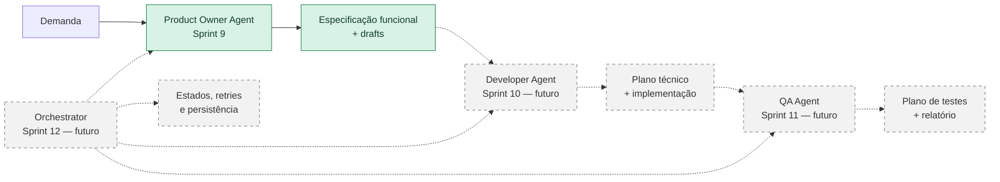
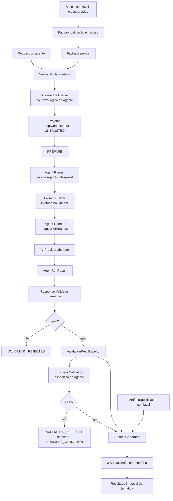
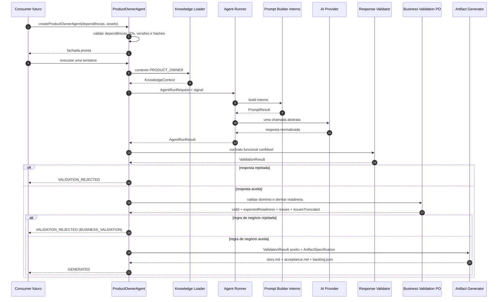
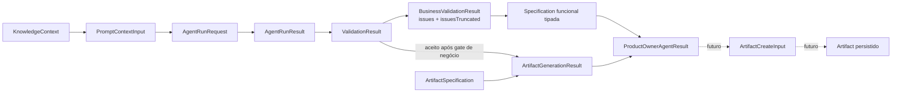
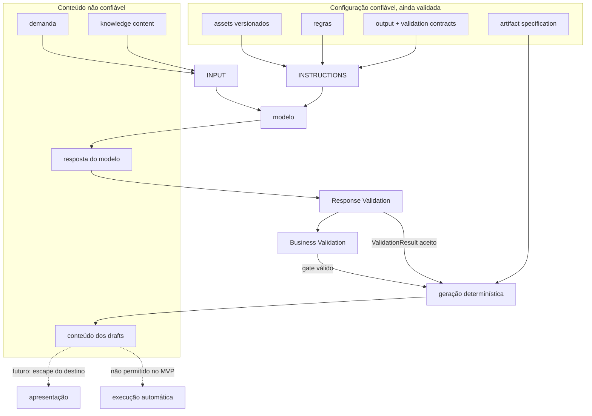
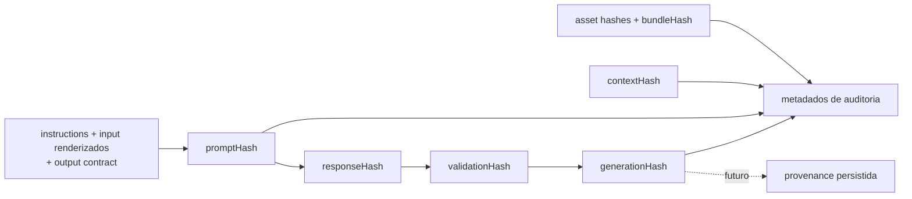
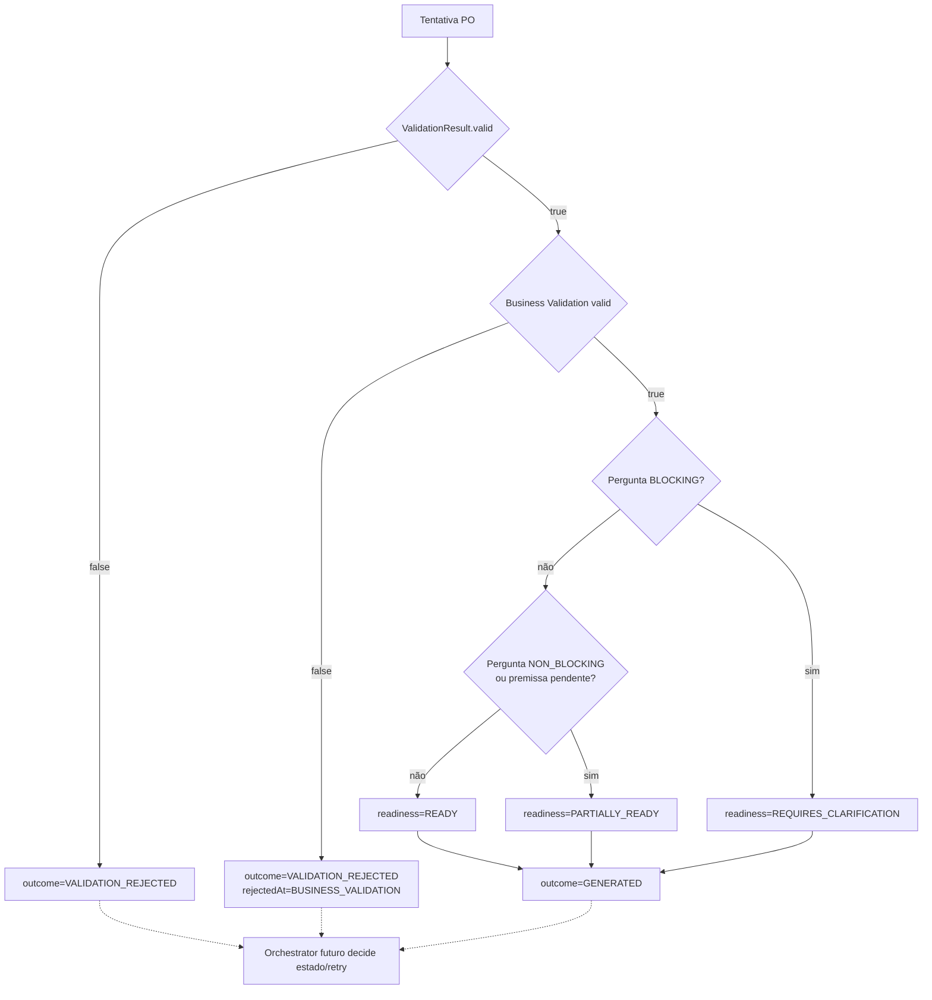
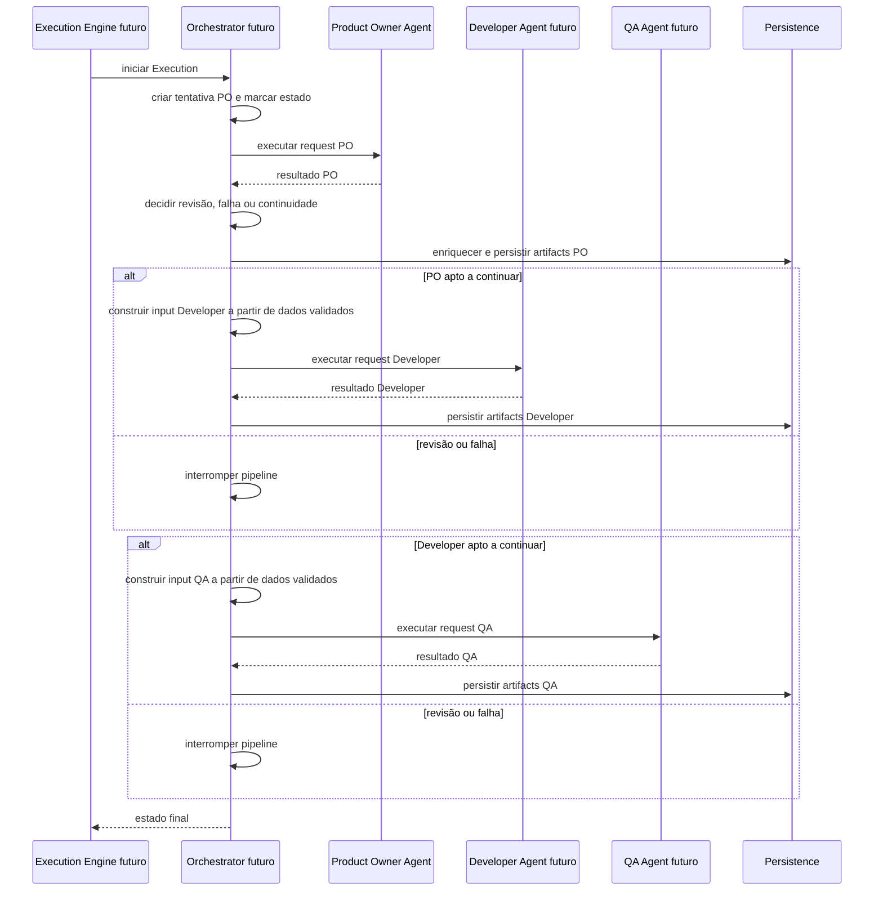
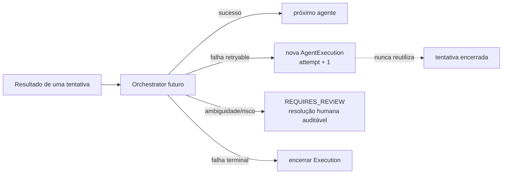

# Pipeline Overview

## Objetivo

Este documento apresenta a visão integrada do pipeline do BRQ AI Factory após a introdução do primeiro agente concreto. Ele mostra o que já existe, como o Product Owner Agent reutiliza componentes genéricos e onde entram Developer Agent, QA Agent e Orchestrator nas Sprints futuras.

As decisões normativas permanecem nos ADRs de cada componente. Para a fronteira específica do primeiro agente, consulte o [ADR-019](ADR/ADR-019-PRODUCT-OWNER-AGENT-BOUNDARY.md) e o [fluxo detalhado do Product Owner Agent](32-PRODUCT_OWNER_AGENT_FLOW.md).

## Visão macro por estágio



As setas contínuas representam a capacidade entregue pelo primeiro agente. Setas tracejadas representam integração futura; não indicam chamadas existentes na Sprint 9.

## Pipeline reutilizável de uma tentativa

Cada agente concreto reutilizará o mesmo esqueleto, mantendo assets, contratos e Business Validation próprios.



O Response Validator não recebe regras específicas de Product Owner, Developer ou QA. A Business Validation existe depois da validação genérica para verificar invariantes de domínio e derivar classificações como readiness, sem corrigir a resposta. Sua rejeição também é funcional: produz `VALIDATION_REJECTED` com `rejectedAt: BUSINESS_VALIDATION`, não exception técnica.

## Implementação atual do Product Owner



O Agent Runner mantém a única chamada ao provider e encapsula o Prompt Builder. A fachada não chama `PromptBuilder.build`, embora possa usar tipos, schemas e hashing canônico exportados pelo entrypoint público do Builder para validar assets.

O JSON Schema inicial evita `$schema` e `uniqueItems` para permanecer no subconjunto de Structured Outputs visado pelos modelos-base suportados pelo adapter. A compatibilidade de modelos fine-tuned deve ser verificada explicitamente e permanece um risco conhecido.

## Componentes e ownership

| Componente                | Responsabilidade atual                                                 | Não faz                                                  |
| ------------------------- | ---------------------------------------------------------------------- | -------------------------------------------------------- |
| Knowledge Loader          | autoriza, seleciona, carrega e verifica documentos                     | não monta prompt                                         |
| Prompt Builder            | resolve AST, canais, orçamento, rendering e hashes                     | não conhece agente nem chama provider                    |
| Agent Runner              | constrói prompt via Builder e executa uma chamada ao provider          | não valida função, não retenta e não persiste            |
| AI Provider               | chama modelo e normaliza resposta                                      | não conhece workflow                                     |
| Response Validator        | valida finish reason, JSON, schema e structured output                 | não contém regras específicas do agente                  |
| Business Validation       | valida invariantes do domínio do agente e deriva readiness             | não corrige resposta nem muda estado                     |
| Artifact Generator        | resolve bindings e produz drafts determinísticos                       | não escolhe specification, não grava e não versiona      |
| Product Owner Agent       | compõe uma tentativa usando APIs públicas e assets PO                  | não coordena outro agente, retry, estado ou persistência |
| Developer Agent — futuro  | transformará especificação funcional em resultado técnico              | não existe na Sprint 9                                   |
| QA Agent — futuro         | avaliará especificação e implementação                                 | não existe na Sprint 9                                   |
| Orchestrator — futuro     | coordenará ordem, estados, retries, revisão, provenance e persistência | não está antecipado pelo Product Owner Agent             |
| Execution Engine — futuro | iniciará, acompanhará e encerrará uma Execution completa               | não chama IA diretamente                                 |

## Contratos entre fronteiras



Cada seta representa uma transformação explícita e validada. Nenhum componente compartilha objetos internos para contornar a API pública da etapa anterior.

## Trust boundaries do pipeline



`valid: true` significa aderência aos contratos configurados, não segurança universal. Conteúdo validado continua sujeito a escape de apresentação, revisão humana e políticas do destino.

## Linhagem e auditoria



Metadados da tentativa preservam as identidades e versões do agente, assets, prompt e contratos, além dos hashes produzidos por cada fronteira. `bundleHash` e hashes de assets pertencem à trilha de auditoria; eles não são concatenados diretamente no cálculo de `promptHash`, que identifica o payload efetivo. A política exata para persistir hashes de geração continua uma decisão futura já registrada como questão aberta.

## Outcomes, readiness e estados



Outcome e readiness não alteram `ExecutionStatus` ou `AgentExecutionStatus`. Uma `AgentExecution` e seu número de tentativa serão criados e persistidos pelo fluxo futuro, não pela fachada do agente.

## Pipeline futuro com três agentes



Esse diagrama é deliberadamente futuro. Na Sprint 9 não existem chamadas a Developer, QA, Orchestrator, Execution Engine ou Persistence.

## Retry e revisão humana futuros



Agentes e componentes genéricos apenas reportam resultados ou erros. Eles não aplicam essa política.

## Observabilidade por nível

```text
Componente genérico
├── knowledge.context.*
├── prompt.build.*
├── ai.request.*
├── agent.run.*
├── response.validation.*
└── artifact.generation.*

Fachada do agente
└── product_owner.*

Workflow futuro
├── execution.*
├── agent.execution.*
├── artifact.created
└── artifact.versioned
```

Os níveis não são equivalentes. `product_owner.agent.completed` informa apenas que a tentativa em memória terminou. Não afirma que um estado foi persistido ou que artifacts foram versionados.

## O que não existe na Sprint 9

- Developer Agent e QA Agent;
- sequência multiagente;
- criação ou transição de estados;
- retry funcional;
- revisão humana auditável;
- enriquecimento como `ArtifactCreateInput`;
- persistência ou versionamento de artifacts;
- API, frontend ou deploy;
- execução de código ou exportação de arquivos;
- seleção dinâmica, registry global ou hot reload de prompts;
- avaliação semântica por outro modelo.

## Resumo para onboarding

```text
Componentes genéricos e independentes
                ↓
Product Owner Agent compõe uma tentativa
                ↓
Specification funcional + 3 drafts em memória
                ↓
Developer e QA ainda futuros
                ↓
Orchestrator futuro controla workflow, estado, retry e persistência
```

Ao diagnosticar o pipeline, identifique primeiro o nível do evento e o contrato em mãos. Um `ProductOwnerAgentResult` ainda não é uma Execution concluída, um artifact persistido nem autorização para iniciar automaticamente o próximo agente.
