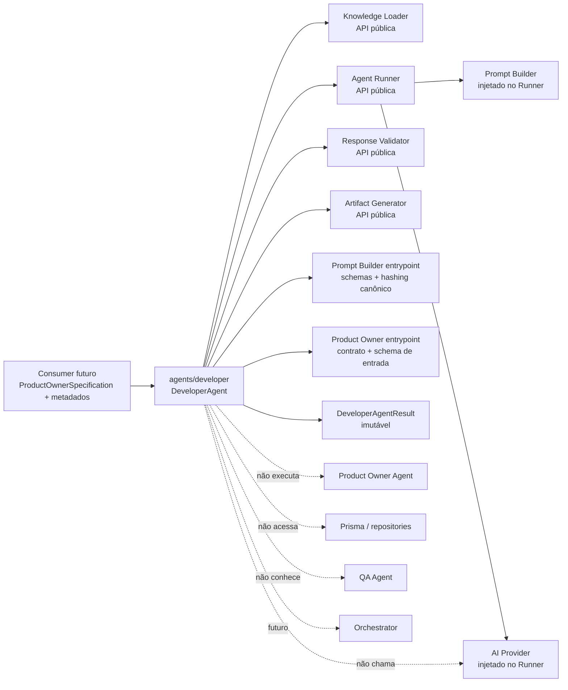
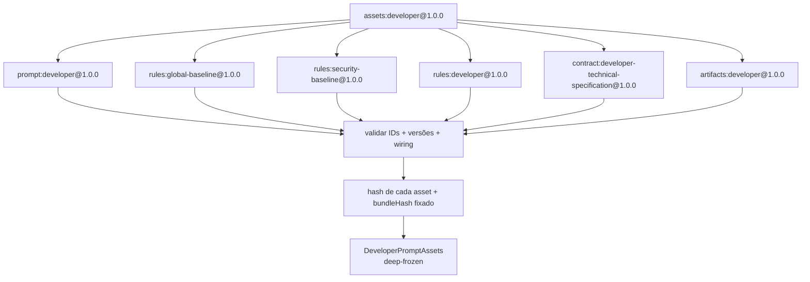
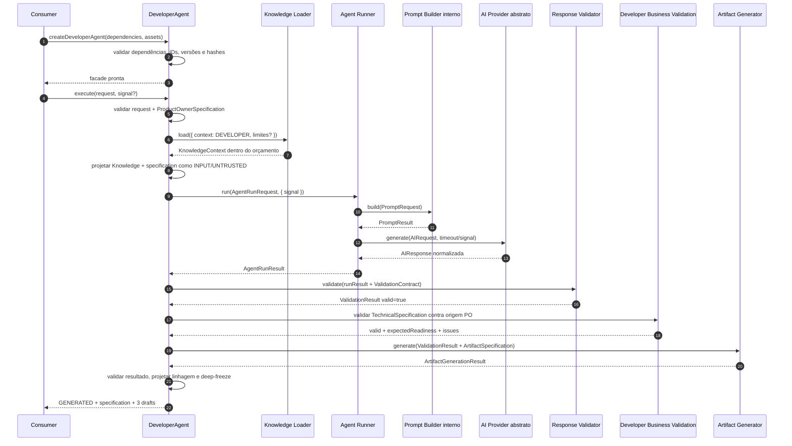
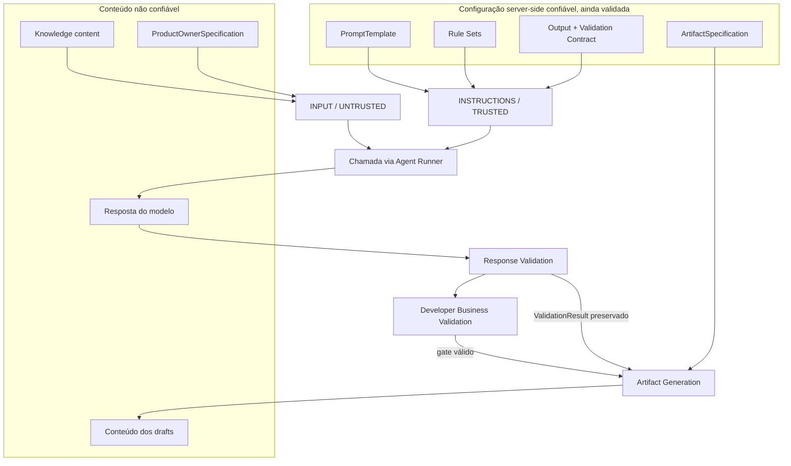
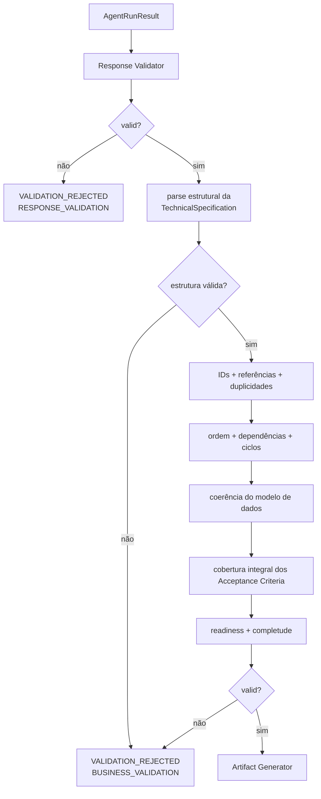
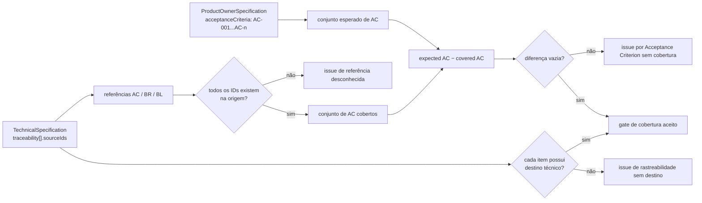
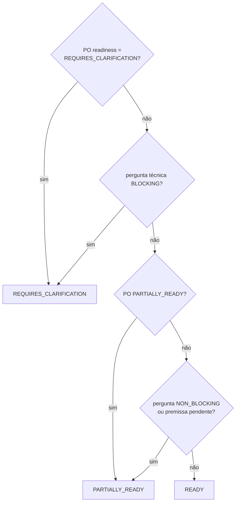
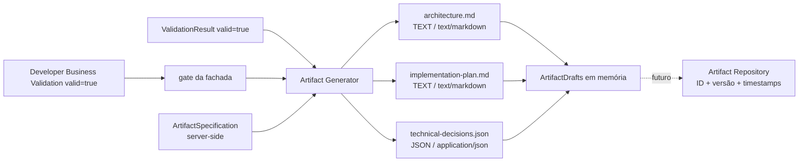
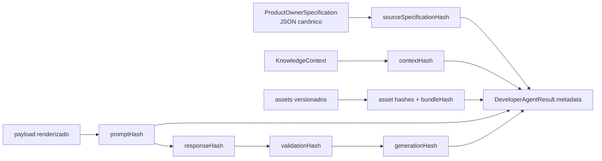
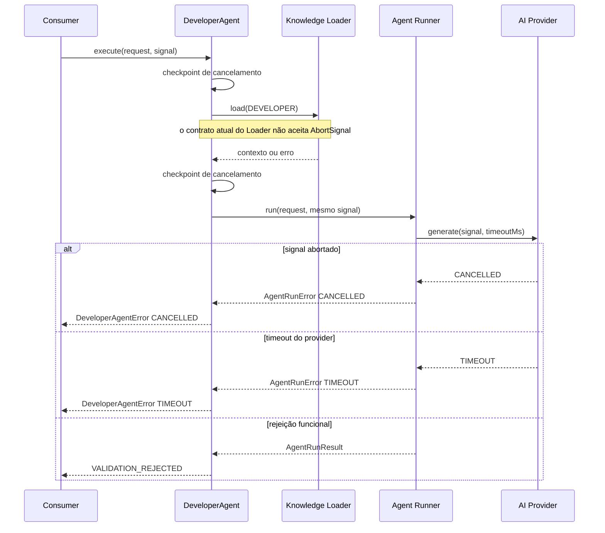

# Developer Agent Flow

## Objetivo

Este documento apresenta visualmente o Developer Agent da Sprint 10. O agente transforma exclusivamente uma `ProductOwnerSpecification` validada em uma `TechnicalSpecification` declarativa e três `ArtifactDrafts`, sem gerar código ou testes e sem coordenar o workflow.

O [ADR-020](ADR/ADR-020-DEVELOPER-AGENT-BOUNDARY.md) é a decisão normativa. Para entender as fronteiras reutilizadas, consulte também os fluxos do [Agent Runner](28-AGENT_RUNNER_FLOW.md), [Response Validator](29-RESPONSE_VALIDATOR_FLOW.md), [Artifact Generator](30-ARTIFACT_GENERATOR_FLOW.md) e a [visão geral do pipeline](33-PIPELINE_OVERVIEW.md).

## Fronteira do módulo



O acesso ao pacote do Product Owner serve somente para validar o contrato entregue. Não existe chamada entre fachadas. O acesso ao Prompt Builder é limitado aos contratos públicos e ao hashing canônico; `build` continua encapsulado pelo Agent Runner.

## Contratos conceituais

```text
DeveloperAgentRequest
├── context
│   ├── executionId
│   ├── agentExecutionId
│   ├── attempt
│   ├── agentVersion
│   ├── requestId?
│   └── traceId?
├── productOwnerSpecification
├── model
└── limits?

TechnicalSpecification
├── readiness
├── title, summary, objective
├── complexity + estimatedStoryPoints
├── architecture
├── components + modules + flows
├── contracts + apis + events
├── dataModel
├── internalDependencies + externalDependencies
├── risks
├── implementationPhases + implementationPlan
├── technicalBacklog + definitionOfDone
├── decisions + traceability
└── assumptions + openQuestions + outOfScope

DeveloperAgentResult
├── outcome: GENERATED
│   ├── specification
│   ├── readiness
│   ├── artifacts[3]
│   └── metadata
└── outcome: VALIDATION_REJECTED
    ├── rejectedAt: RESPONSE_VALIDATION | BUSINESS_VALIDATION
    ├── specification: null
    ├── artifacts: []
    ├── validation
    └── metadata
```

O request não aceita prompt, rule sets, output contract, Artifact Specification, filenames ou demanda bruta. Uma `ProductOwnerSpecification` válida é a única entrada funcional; sua própria readiness pode indicar pendências ou necessidade de esclarecimento e participa da derivação da readiness técnica.

## Assets da versão inicial



Os assets ficam em `prompts/developer/1.0.0/`. O manifest é declarativo e não seleciona arquivos a partir de conteúdo externo. Alterar qualquer asset sem versionar o bundle causa rejeição na factory.

## Sequência completa — sucesso



O Agent Runner faz exatamente uma chamada abstrata ao provider. A fachada não executa retry e não inicia automaticamente outro agente.

## Trust boundaries



Validação contratual não transforma conteúdo em instrução nem torna a proposta universalmente segura. Drafts continuam sendo dados e exigirão escaping no destino e políticas futuras de revisão.

## Response Validation e Business Validation



O Response Validator continua genérico. Somente a Developer Business Validation conhece IDs funcionais, grafos técnicos, readiness e cobertura de critérios de aceite. Nenhuma etapa corrige a resposta.

## Cobertura dos Acceptance Criteria



Cobertura integral significa que todo ID `AC-nnn` da origem aparece em pelo menos um `traceability[].sourceIds`. Isso não avalia qualidade semântica; estabelece uma relação declarativa e verificável para revisão e auditoria.

## Readiness técnica



A readiness calculada deve coincidir com o valor declarado pela resposta. Divergência é rejeição funcional, nunca correção silenciosa.

## Rendering dos artifacts



A specification de artifacts controla ordem, nomes, filenames, tipos, media types, bindings e rendering. O modelo não escolhe os artifacts. A fronteira com Repository permanece futura.

## Linhagem e hashes



Hashes identificam conteúdo e decisões determinísticas; não são assinatura digital nem prova de qualidade. O resultado também preserva a readiness funcional de origem.

## Cancelamento, timeout e ausência de retry



O Developer Agent não cria timer, `AbortController`, retry ou nova `AgentExecution`. Retries e continuidade serão decisões do Orchestrator.

## Resumo para onboarding

```text
ProductOwnerSpecification válida
                ↓
KnowledgeContext DEVELOPER dentro de 64 KiB por padrão
                ↓
Knowledge + specification em INPUT/UNTRUSTED
                ↓
Agent Runner — uma chamada
                ↓
Response Validator genérico
                ↓
Developer Business Validation
        ┌───────┴────────┐
        ↓                ↓
rejeição       cobertura integral dos AC
                         ↓
                 Artifact Generator
                         ↓
 architecture.md + implementation-plan.md
          + technical-decisions.json
                         ↓
               outcome=GENERATED
```

Ao depurar, verifique `agentExecutionId`, `sourceSpecificationHash`, `bundleHash`, `contextHash`, `promptHash`, `responseHash`, `validationHash`, readiness, códigos da Business Validation e `generationHash`. Não procure código gerado, estado persistido, retry, chamada ao QA Agent ou coordenação do Orchestrator: essas responsabilidades não pertencem à Sprint 10.
