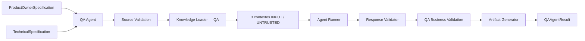
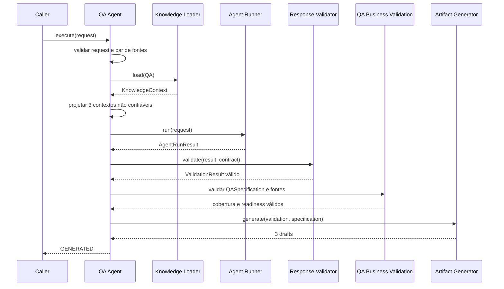
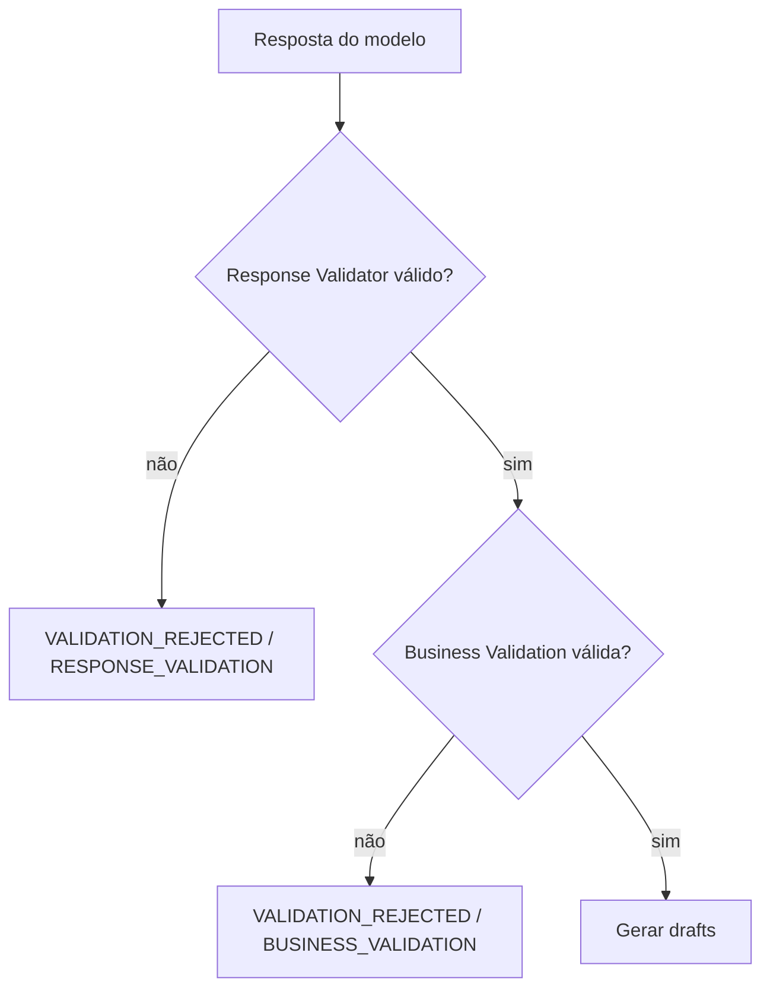
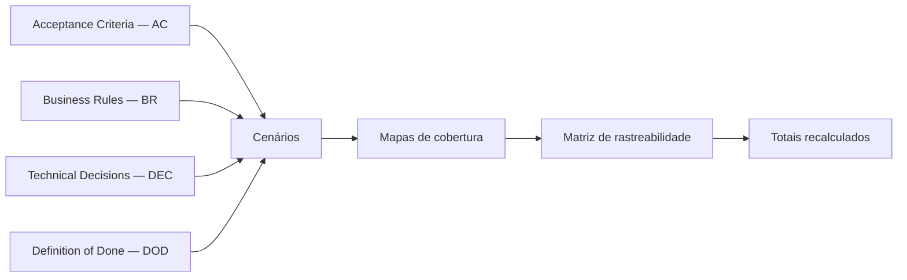
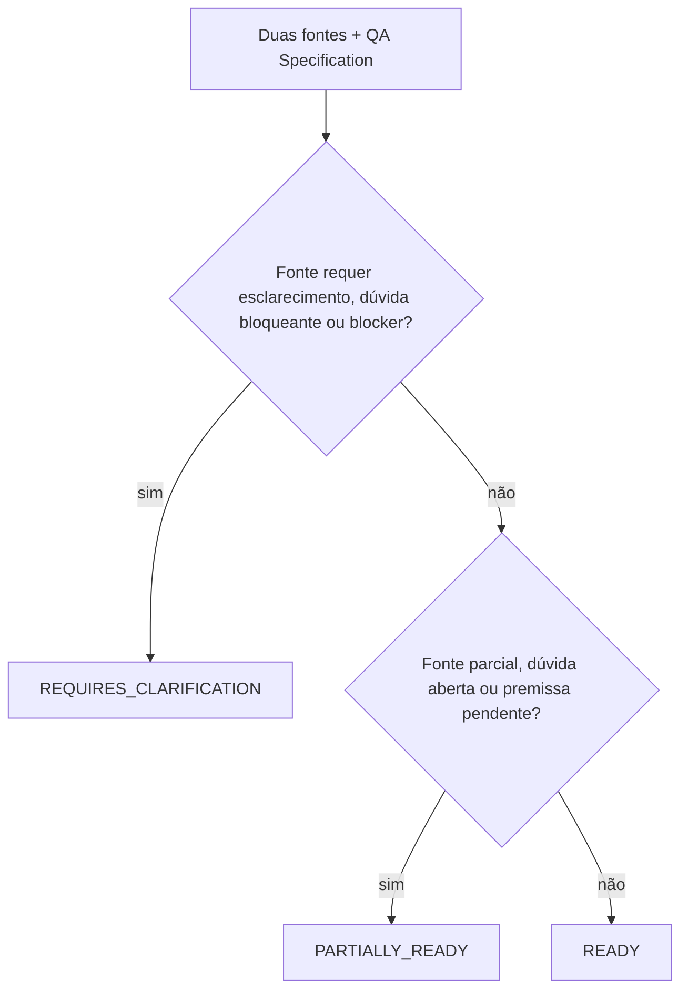

# QA Agent — fluxo e fronteiras

O QA Agent é uma fachada de tentativa única que transforma contratos funcionais e técnicos em uma especificação declarativa de qualidade. O [ADR-021](ADR/ADR-021-QA-AGENT-BOUNDARY.md) é a decisão normativa.

## Fronteira

O Agent Runner encapsula Prompt Builder e AI Provider. A fachada não chama esses componentes diretamente e não chama outros agentes.

## Sequência de sucesso

## Rejeições

Nenhum artifact é gerado nas duas rejeições. Request inválido, fontes incompatíveis e falhas de infraestrutura produzem erros classificados.

## Contextos

| Ordem | ID                                       | Kind        | Serialização | Trust       |
| ----- | ---------------------------------------- | ----------- | ------------ | ----------- |
| 1     | `context:qa-knowledge`                   | `KNOWLEDGE` | `TEXT`       | `UNTRUSTED` |
| 2     | `context:qa-product-owner-specification` | `ARTIFACT`  | `JSON`       | `UNTRUSTED` |
| 3     | `context:qa-technical-specification`     | `ARTIFACT`  | `JSON`       | `UNTRUSTED` |

## Cobertura obrigatória

Cada fonte obrigatória deve aparecer nas três projeções: cenário, mapa e matriz.

## Readiness

Readiness não é evidência de teste executado.

## Hashes e artifacts

Os hashes canônicos cobrem assets, bundle, prompt, resposta, validação, as duas fontes e a geração. Timestamps, duração e usage não participam dos hashes determinísticos.

Artifacts canônicos:

1. `test-plan.md`;
2. `traceability-matrix.json`;
3. `qa-specification.md`.

Não são produzidos código, Playwright, relatório de execução ou defeitos baseados em teste executado.
