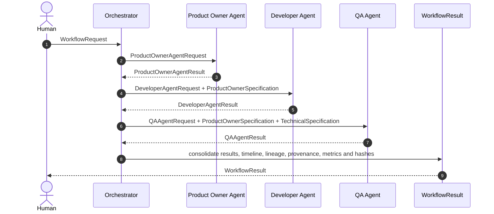
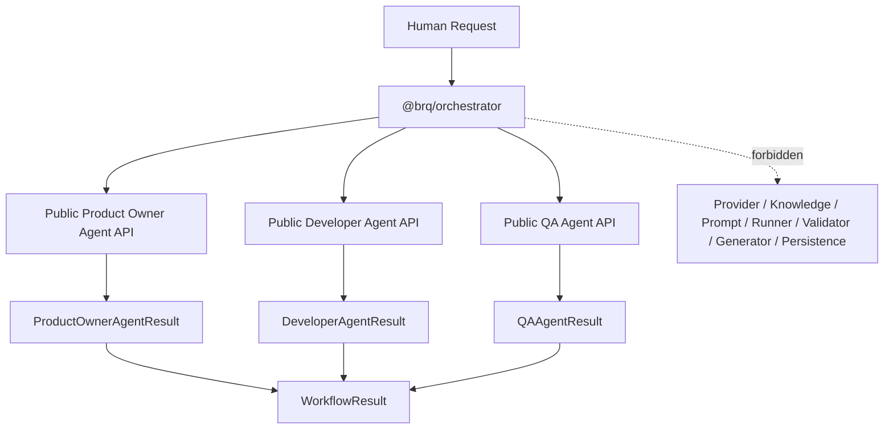
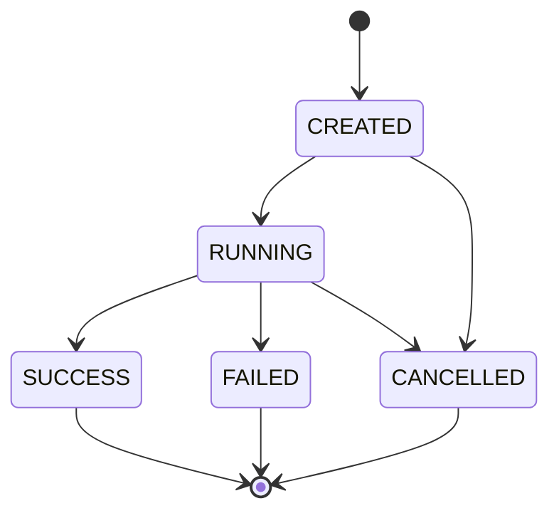
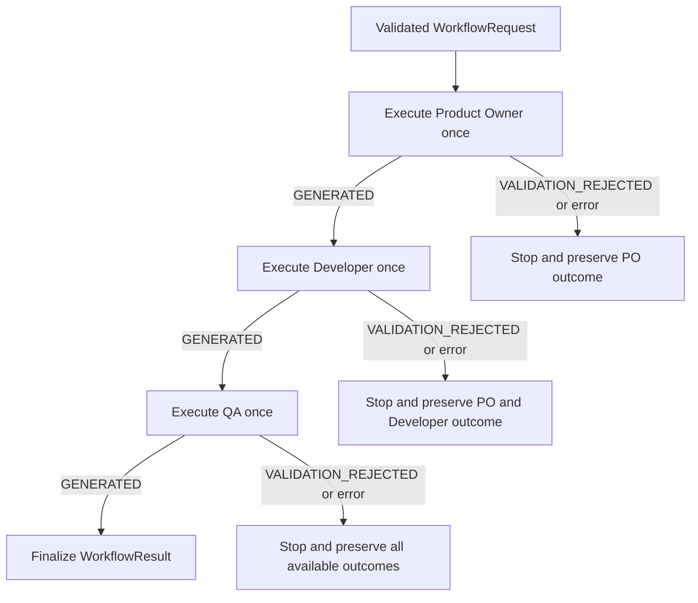

# Orchestrator Flow

## Objetivo

Documentar o workflow determinístico implementado na Sprint 12 e a fronteira do
`@brq/orchestrator`.

## Sequência completa



Cada chamada somente ocorre após um resultado `GENERATED` da etapa anterior. Readiness é
preservada, mas não interrompe um resultado gerado, pois revisão humana está fora da Sprint 12.

## Fronteira de dependências



O vínculo pontilhado representa dependências proibidas, não uma chamada de runtime.

## Máquina de estados



Os estados são locais e não são persistidos.

## Interrupção determinística



Não há loop, retry, backoff ou chamada concorrente.

## Context propagation

```text
WorkflowRequest.demand
  → ProductOwnerAgentRequest

ProductOwnerAgentResult.specification
  → DeveloperAgentRequest.productOwnerSpecification

ProductOwnerAgentResult.specification
  + DeveloperAgentResult.specification
  → QAAgentRequest
```

Somente specifications públicas atravessam etapas. Artifacts e implementações internas nunca são
usados para montar a entrada do agente seguinte.

## Lineage e provenance

`lineage` registra os hashes calculados das três specifications e os handoffs verificados:

```text
ProductOwnerSpecification → Developer
ProductOwnerSpecification → QA
TechnicalSpecification    → QA
```

`provenance` registra separadamente, por etapa, identidades de execução e hashes públicos de
assets, knowledge, prompt, response, validação, geração e artifacts. Nenhuma specification ou
conteúdo de artifact é duplicado dentro de provenance.

## Timeline e determinismo

A timeline possui sequência contígua, evento, etapa, agente, `timestampMs` monotônico e duração.
Ela cobre início, início/fim de etapas e término do workflow.

Timeline, timestamps, durações e métricas são observacionais e ficam fora de `requestHash`,
`stageHash`, `lineageHash`, `provenanceHash` e `workflowHash`.

## Falhas e cancelamento

- rejeição funcional retorna `WorkflowResult` com `FAILED`;
- erro técnico lança `OrchestratorError` com resultado parcial;
- cancelamento lança `OrchestratorError` com `CANCELLED`;
- o mesmo `AbortSignal` é repassado a cada agente;
- nenhuma etapa posterior começa depois de falha ou cancelamento;
- `cause`, stack e conteúdo nunca entram em logs.

## Logs

Contexto permitido: `workflowId`, `executionId`, etapa, agente, duração, hashes, métricas e erro
sanitizado. Demanda, prompts, specifications, artifacts e respostas são proibidos.

## Fora do escopo

Persistência, retry, filas, scheduler, concorrência, revisão humana, API, frontend, websocket,
execução de testes e geração de código continuam fora do Orchestrator. Desde a Sprint 13, o
Execution Engine é seu único caller de produção, mas a dependência é unidirecional e não altera
esta fronteira.
