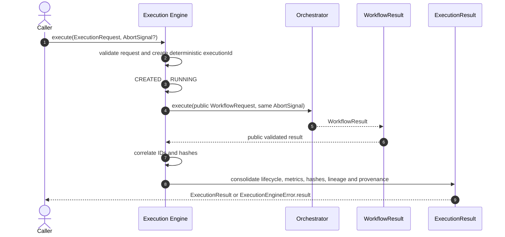
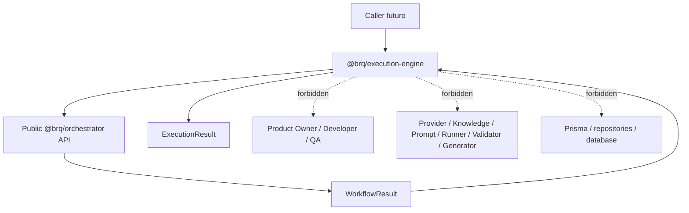
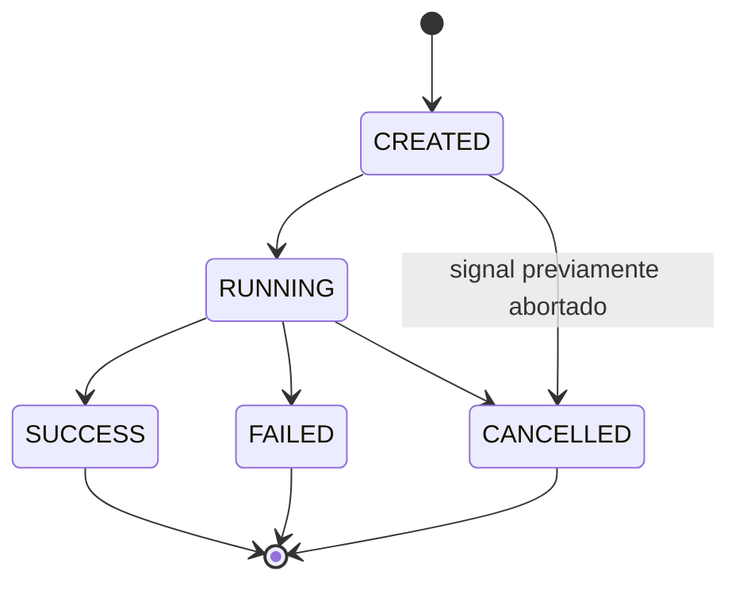
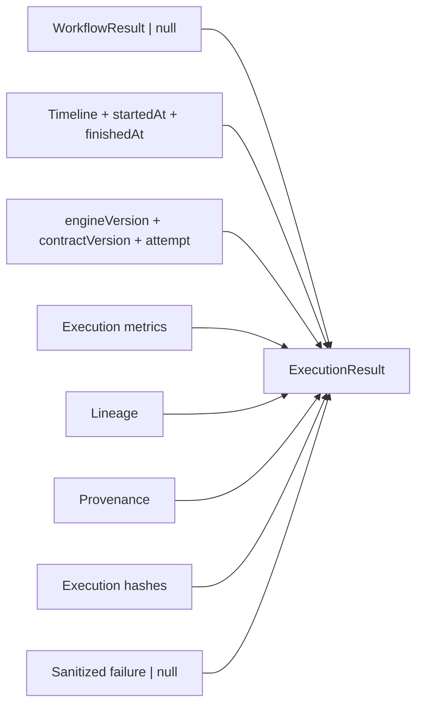
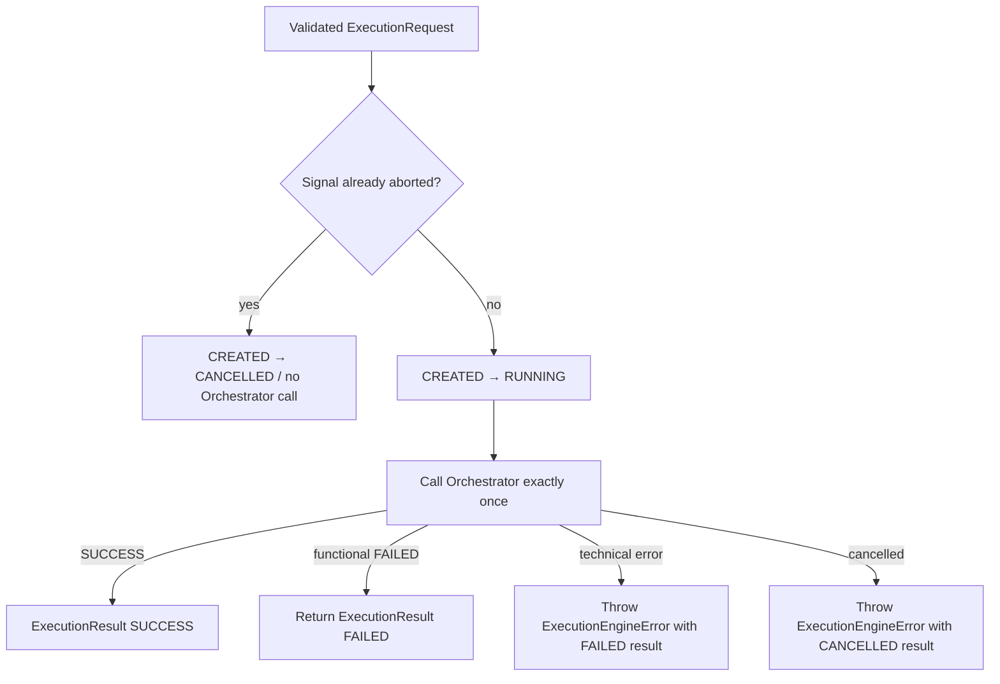

# Execution Engine Flow

## Objetivo

Documentar o ciclo de vida efêmero implementado na Sprint 13 e a fronteira do
`@brq/execution-engine` definida pelo ADR-023.

## Sequência completa



O Engine não enxerga Product Owner, Developer, QA ou qualquer componente usado internamente pelo
Orchestrator.

## Fronteira de dependências



Os vínculos pontilhados representam dependências proibidas, não chamadas de runtime.

## Criação da identidade

```text
ExecutionRequest sem executionId
  → validação Zod estrita
  → executionRequestHash canônico
  → SHA-256({ contractVersion, executionRequestHash })
  → execution-<32 primeiros caracteres hex>
```

O ID não utiliza `Math.random()`, `Date.now()`, UUID, contador, processo externo ou estado global.

## Máquina de estados



Não existe `REQUIRES_REVIEW`, retomada ou transição a partir de estado terminal.

## Resultado



Lineage preserva continuidade das specifications. Provenance preserva evidências técnicas. Os
dois contratos são promovidos do `WorkflowResult` sem mistura ou interpretação pelo Engine.

## Falhas e cancelamento



Um `WorkflowResult` parcial somente é preservado depois de validado e correlacionado. Na ausência
de resultado válido, lineage, provenance, métricas e hashes do workflow permanecem nulos.

## Determinismo e observabilidade

Participam do `executionHash`:

- `engineVersion` e `contractVersion`;
- execution e workflow IDs;
- attempt e status;
- request hashes;
- workflow, lineage e provenance hashes;
- códigos estáveis de falha.

Não participam:

- `startedAt` e `finishedAt`;
- timeline e timestamps;
- durações;
- métricas;
- mensagens de erro;
- conteúdo de requests, specifications ou artifacts.

## Logs

Eventos: `execution.created`, `execution.started`, `execution.completed`, `execution.failed` e
`execution.cancelled`.

O contexto contém somente IDs, estado/status, versões, duração, hashes, métricas, resumo de
lineage e erro sanitizado. Demanda, contexto do usuário, `WorkflowRequest`, `WorkflowResult`,
prompts, specifications, artifacts e respostas nunca são registrados.

## Fora do escopo

Persistência, repositories, Prisma, retry, resume, revisão humana, filas, scheduler, workers,
concorrência, paralelismo, consulta ou cancelamento por ID, API, frontend, websocket, autenticação,
autorização, eventos externos, execução de testes, geração de código e qualquer item da Sprint 14.
