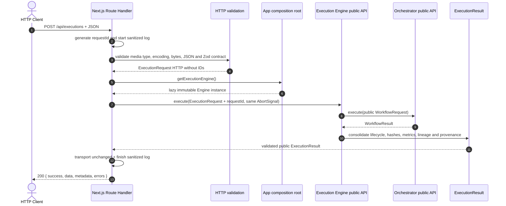
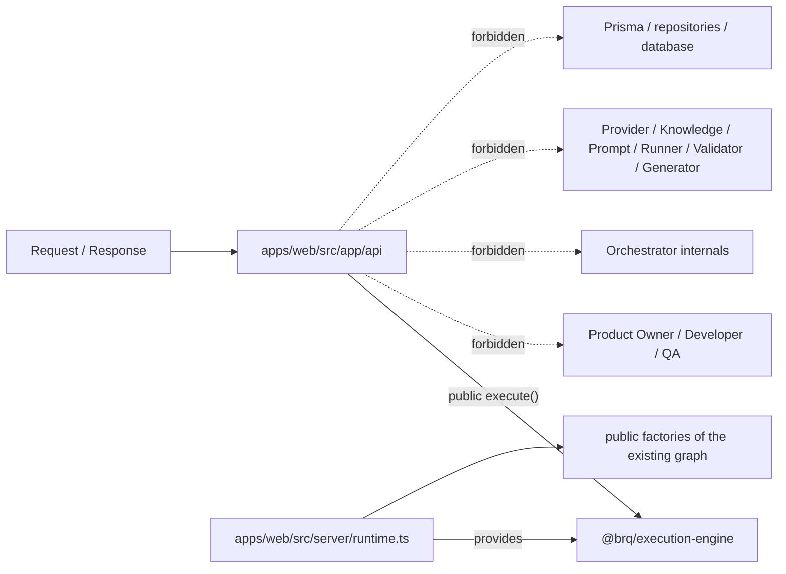
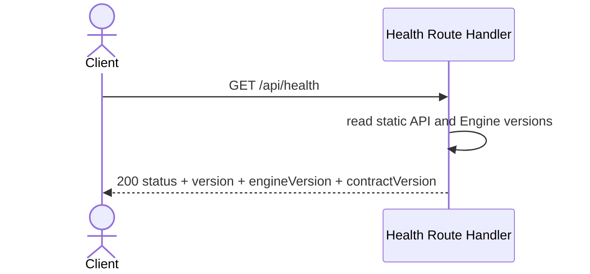
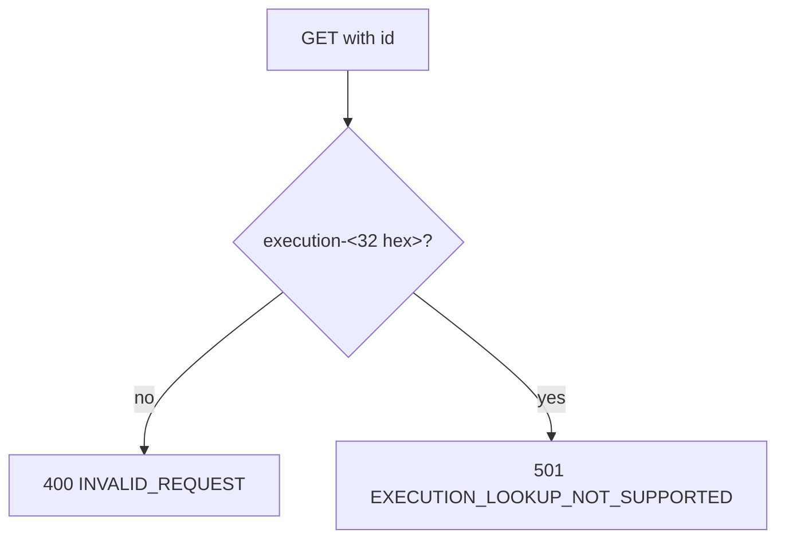
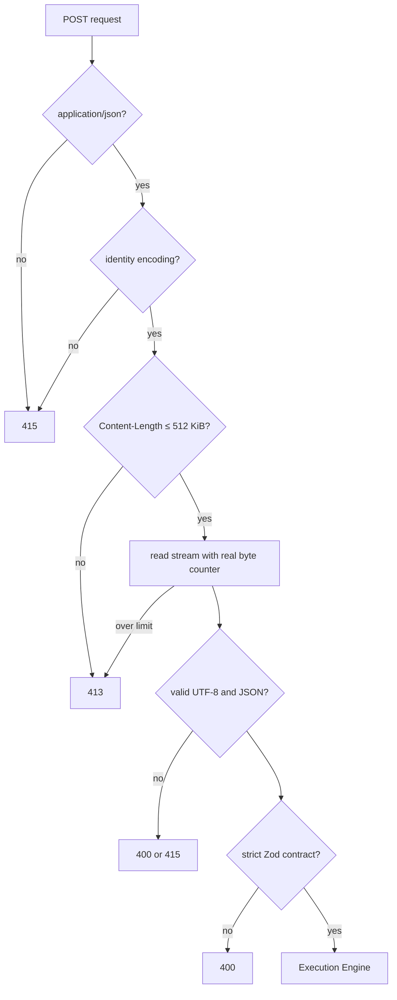

# HTTP API Flow

## Objetivo

Documentar a camada HTTP implementada na Sprint 14 e a fronteira do adapter definida pelo
ADR-024. A API não é um serviço de domínio: ela transporta um `ExecutionRequest` até o
Execution Engine e devolve seu `ExecutionResult`.

## Fluxo completo de criação



O Route Handler não enxerga nenhum agente ou componente interno. O composition root é bootstrap do
host: ele monta as factories públicas, mas não participa da chamada após fornecer o Engine.

## Fronteiras



Não existe `core/ai-factory-runtime`. A composição concreta pertence à aplicação Next.js.

## Endpoints

### `GET /api/health`



O endpoint não acessa banco, IA, knowledge, runtime ou workflow.

### `POST /api/executions`

Recebe o contrato do Engine sem `requestId` e sem `executionId`. O adapter cria apenas o
`requestId`; o Engine continua sendo o único responsável por criar `executionId`.

Um resultado funcional `FAILED` é um resultado válido e retorna 200. Falhas técnicas são mapeadas
para respostas HTTP sanitizadas.

### `GET /api/executions/[id]`



Não existe store em memória, repository ou banco oculto. O 501 mantém explícita a ausência de
consulta no MVP.

## Validação do payload



Campos desconhecidos, query parameters e IDs de etapa duplicados são rejeitados antes do Engine.

## Contratos de resposta

Sucesso:

```json
{
  "success": true,
  "data": {},
  "metadata": {
    "requestId": "request-...",
    "apiVersion": "1.0.0"
  },
  "errors": []
}
```

Erro:

```json
{
  "success": false,
  "data": null,
  "metadata": {
    "requestId": "request-...",
    "apiVersion": "1.0.0"
  },
  "errors": [{ "code": "INVALID_REQUEST", "message": "...", "path": "body" }]
}
```

`executionId` é incluído nos metadados quando já existe. Causas, stacks e mensagens internas não
são retornadas.

## Status HTTP

| Código | Uso                                                      |
| -----: | -------------------------------------------------------- |
|    200 | health ou `ExecutionResult` resolvido                    |
|    400 | JSON, query, path ou contrato inválido                   |
|    405 | método não permitido, com `Allow`                        |
|    408 | cancelamento propagado                                   |
|    413 | payload acima de 512 KiB                                 |
|    415 | media type, encoding ou bytes incompatíveis              |
|    500 | falha técnica ou violação do resultado público           |
|    501 | lookup por ID ainda não suportado                        |
|    503 | composition root ou configuração do runtime indisponível |

## Segurança e observabilidade

Todas as respostas são JSON, `no-store`, `nosniff`, negam framing e usam CSP, referrer policy,
permissions policy e resource policy restritivas. A Sprint não habilita CORS, autenticação,
autorização ou rate limit.

Eventos `http.request.started`, `http.request.completed` e `http.request.failed` registram somente
requestId, endpoint estático, método, status, duração, executionId quando conhecido e código de
erro. Body, URL completa, query, headers, prompts, specifications, artifacts, respostas do modelo
e resultados nunca são registrados pela API.

## Determinismo

O adapter não recalcula nem altera hashes, lineage, provenance ou métricas do `ExecutionResult`.
O `requestId` criado por chamada integra o `ExecutionRequest` entregue ao Engine; a partir dessa
entrada completa, toda sequência e todos os hashes continuam determinísticos. Timestamps e duração
HTTP permanecem somente observacionais.

## Fora do escopo

Persistência, lookup real, autenticação, autorização, filas, execução assíncrona, retry, scheduler,
workers, concorrência, cache, rate limit, websocket, SSE, upload, download, OpenAPI, SDK, CLI,
frontend funcional, Playwright, monitoramento distribuído e qualquer item da Sprint 15.
