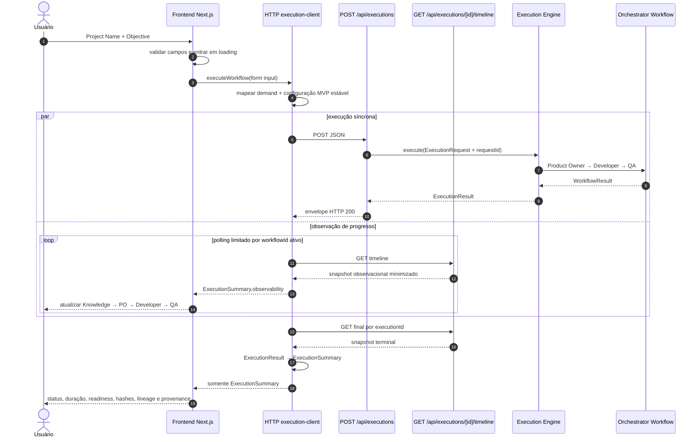
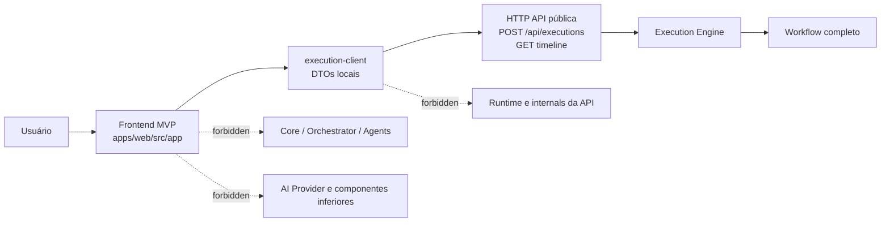
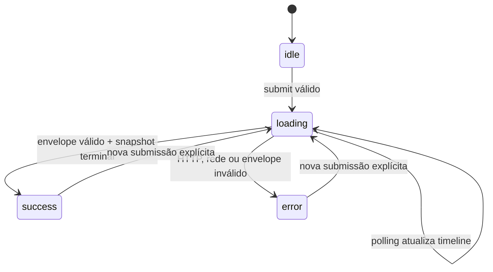

# Frontend MVP Flow

## Objetivo

Documentar a interface implementada na Sprint 15 e a fronteira definida pelo
[ADR-025](ADR/ADR-025-FRONTEND-MVP.md). O Frontend é um Presentation Adapter: ele recebe dois campos
do usuário, chama exclusivamente a API HTTP e exibe um resumo seguro do resultado.

A Sprint 16 preserva essa fronteira e acrescenta uma timeline viva de metadados. O client interno
faz polling limitado de `GET /api/executions/[id]/timeline`; componentes React continuam recebendo
somente o contrato local `ExecutionSummary`.

## Fluxo completo



O `ExecutionResult` bruto e o snapshot HTTP completo de observabilidade terminam no client HTTP.
Specifications, artifacts, prompts, contextos, knowledge, respostas da IA, eventos brutos e logs
não entram em props nem no estado React.

## Fronteira de dependências



Somente o client interno conhece a forma do envelope HTTP. Componentes recebem o contrato local
`ExecutionSummary` e não importam contratos do núcleo.

## Mapeamento do formulário

```text
FrontendExecutionInput
├── projectName → demand.title
└── objective   → demand.description

HTTP client configuration
├── workflowId técnico gerado no submit
├── Product Owner: agentExecutionId + agentVersion + model
├── Developer: agentExecutionId + agentVersion + model
└── QA: agentExecutionId + agentVersion + model
```

Project Name não representa uma entidade persistida. Ele nomeia somente a demanda enviada à API.

Os IDs e metadados técnicos no browser existem porque a API `1.0.0` ainda os exige. Essa é uma
limitação temporária, não a responsabilidade arquitetural final: uma evolução futura e versionada
do contrato deverá mover esses defaults para configuração confiável no backend. A Sprint 15 não
altera o contrato existente.

## Contrato de apresentação

```text
ExecutionSummary
├── executionId
├── status
├── durationMs
├── readiness | null
├── hashes
├── lineage | null (resumo de outputs e handoffs)
├── provenance | null (resumo por estágio)
└── observability | null
    ├── revision + status
    ├── stages (Knowledge, Product Owner, Developer, QA)
    ├── stageMetrics (Product Owner, Developer, QA)
    └── summary | null
        ├── totalTokens
        ├── totalCostEstimate | null
        └── executedStages + skippedStages
```

- `durationMs` vem de `ExecutionResult.metrics.observed.totalDurationMs`;
- readiness vem do resultado público do QA e pode não estar disponível;
- lineage resume a quantidade de outputs e handoffs verificados;
- provenance resume estágios, versões dos agentes, outcomes e readiness;
- hashes são apenas transportados, nunca recalculados;
- `totalCostEstimate` permanece `null` sem rate card aprovado e versionado;
- timeline, métricas e summary são projeções minimizadas; a lista bruta de eventos não é propagada
  para React.

O payload completo permanece visível na inspeção de rede do browser porque a API o transporta. A
minimização desta Sprint ocorre imediatamente depois do parse, antes de qualquer dado chegar ao
React. Reduzir o payload na origem exige evolução futura do contrato HTTP.

## Estados da interface



Um HTTP 200 cujo resultado possui status `FAILED` segue para `success`: o transporte concluiu e a
execução possui resultado terminal válido.

Desde a Sprint 16 existe polling exclusivamente observacional durante `loading`. Ele permite uma
única consulta em andamento, respeita `AbortSignal`, aplica deadline degradável de cinco segundos
por leitura, termina no unmount ou no resultado terminal e nunca repete o POST nem retenta o
workflow.

## Componentes

```text
HomePage — Server Component de composição
└── ExecutionExperience — Client Component e estado local
    ├── ExecutionForm
    ├── LoadingState
    │   └── ExecutionTimeline
    ├── ErrorState
    └── ExecutionResult
        └── ExecutionTimeline
```

Os componentes são pequenos, acessíveis e não contêm lógica de domínio. O botão fica indisponível
durante loading, estados assíncronos são anunciados semanticamente e erros exibem apenas mensagens
sanitizadas.

## Segurança

- nenhum segredo ou acesso ao provider chega ao navegador;
- não há `dangerouslySetInnerHTML` nem interpretação de Markdown/HTML;
- todo valor remoto é renderizado por interpolação textual do React;
- requests, responses e summaries não são registrados em console ou storage;
- erros internos e payloads proibidos não são exibidos;
- uso restrito a ambientes permitidos e dados sintéticos enquanto autenticação, autorização e
  rate limit não existirem.

## Testes

Vitest e Testing Library cobrem formulário, validação, loading, sucesso, resultado funcional
`FAILED`, erros HTTP/rede/contrato, projeção do client, componentes e acessibilidade. Testes de
fronteira rejeitam imports do núcleo, `fetch` fora do client e `dangerouslySetInnerHTML`.

Na Sprint 16, a cobertura inclui polling, interrupção e limpeza, projeção do snapshot, ordenação das
quatro etapas, estados terminal/falha/ignorado e renderização acessível da timeline. Providers reais
não são chamados.

Playwright, browser real e chamadas reais ao provider não integram esta Sprint.

## Fora do escopo

Esta lista registra o limite histórico da Sprint 15: persistência, consulta por ID, páginas
adicionais, dashboard, artifacts completos, logs, polling, websocket, SSE, cache, autenticação,
autorização, rate limit, cancelamento pela UI, retry, revisão humana, upload, download, Playwright e
qualquer item da Sprint 16.

A Sprint 16 implementa somente polling de metadados da timeline e não altera o restante dessa
fronteira. Persistência durável, consulta do `ExecutionResult`, dashboard completo, WebSocket, SSE e
observabilidade distribuída continuam fora do escopo, sem atribuição automática a uma Sprint
futura.
