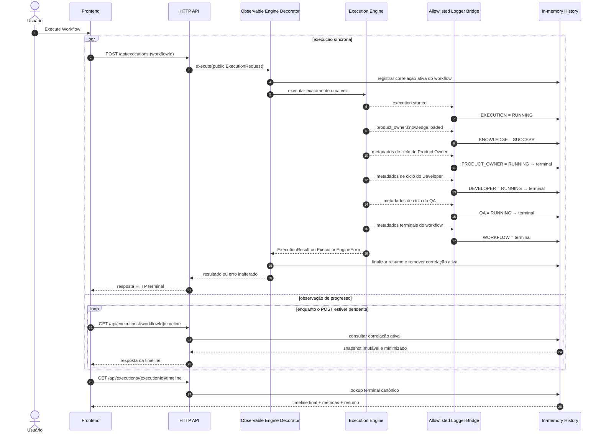
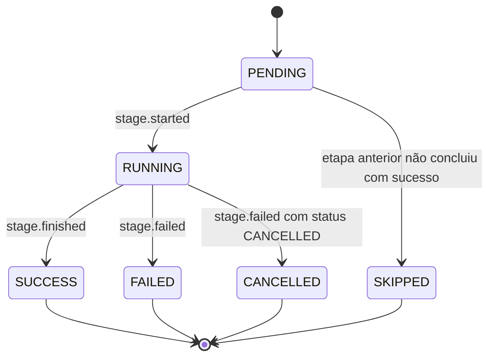
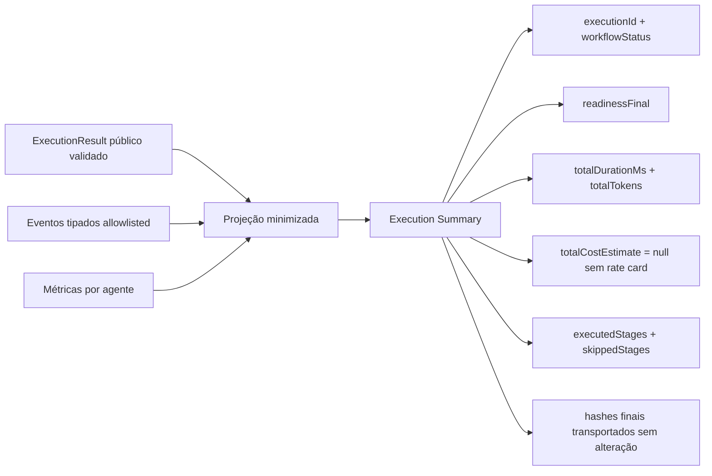
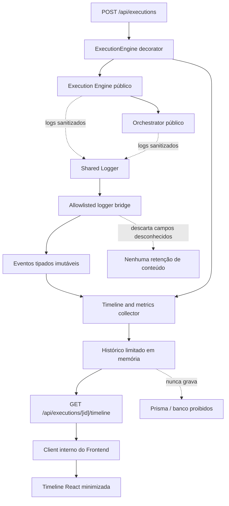

# Observability Flow

## Objetivo

Documentar o fluxo de histórico e observabilidade da Sprint 16 definido pelo
[ADR-026](ADR/ADR-026-OBSERVABILITY-BOUNDARY.md). A nova fronteira observa o Execution Engine
público sem controlar o workflow e armazena somente metadados técnicos limitados e locais ao
processo.

Este documento e o ADR-026 não integram o manifesto ou a política runtime do Knowledge Loader na
Sprint 16. Essa separação preserva sem alterações os contextos, bytes, hashes e prompts dos três
agentes funcionais.

## Fronteira

```text
HTTP host
  → observable ExecutionEngine decorator
    → public @brq/execution-engine
      → public @brq/orchestrator

shared sanitized logger
  → allowlisted logger bridge
    → @brq/observability collector
      → bounded in-memory history
```

`@brq/observability` depende somente de `@brq/execution-engine`, `@brq/shared` e Zod. Ele não
importa agentes, Orchestrator, componentes inferiores, Prisma ou código da aplicação. O decorator
delega exatamente uma vez e nunca altera o resultado, erro propagado, sinal de cancelamento ou
decisão do workflow.

## Execution Timeline



O lookup ativo por `workflowId` existe somente durante o POST síncrono. Ao atingir estado terminal,
o store remove essa correlação e o histórico retido passa a ser endereçado exclusivamente pelo ID
canônico `execution-<32 lowercase hex>`.

## Timeline canônica

| Ordem | Stage ID        | Nome          | Sinal de conclusão                                  |
| ----: | --------------- | ------------- | --------------------------------------------------- |
|     1 | `KNOWLEDGE`     | Knowledge     | Contexto inicial do Product Owner carregado         |
|     2 | `PRODUCT_OWNER` | Product Owner | Product Owner gerado, rejeitado, falho ou cancelado |
|     3 | `DEVELOPER`     | Developer     | Developer gerado, rejeitado, falho ou cancelado     |
|     4 | `QA`            | QA            | QA gerado, rejeitado, falho ou cancelado            |

`EXECUTION` e `WORKFLOW` continuam disponíveis como `stageId` dos eventos internos que delimitam o
ciclo local do Engine e a consolidação do workflow, mas não aparecem como entradas adicionais no
array público `stages`.

A etapa de topo `KNOWLEDGE` significa somente o contexto inicial do Product Owner. Os carregamentos
de Developer e QA permanecem internos às durações de suas fachadas inalteradas.

Cada entrada contém `stageId`, `stageName`, `status`, `startedAt`, `finishedAt`, `durationMs`,
`requestId` e `executionId`. Entradas pendentes ou em execução usam `null` para timestamps ou
duração ainda inexistentes. Arrays retornados e valores aninhados são profundamente imutáveis.

## Stage Lifecycle



Não existe transição a partir de status terminal. Falha ou cancelamento preserva etapas concluídas e
marca todas as etapas pendentes posteriores como `SKIPPED`. Um `VALIDATION_REJECTED` funcional é
observado como etapa falha, mas permanece um resultado de negócio resolvido na semântica existente
do Engine e da API.

## Eventos internos

```text
execution.started
execution.finished
execution.failed
stage.started
stage.finished
stage.failed
```

Esses eventos tipados e imutáveis não substituem os nomes existentes de logs. A bridge normaliza
somente sinais técnicos aprovados. Cancelamento é mapeado para evento terminal de falha com status
`CANCELLED`; os logs históricos `execution.cancelled` e `workflow.cancelled` permanecem
inalterados.

Os dados permitidos em cada evento limitam-se a sequência, IDs de correlação, etapa, status,
timestamps, duração e código sanitizado de erro. Métricas e hashes pertencem às projeções separadas
do snapshot; conteúdo nunca entra na pipeline de eventos.

## Métricas por etapa

| Métrica                        | Origem                                                     |
| ------------------------------ | ---------------------------------------------------------- |
| `durationMs`                   | Duração pública da etapa do workflow                       |
| `promptBytes`                  | `usedBytes` do orçamento público do prompt no Agent Runner |
| `completionBytes`              | Bytes recebidos observados pelo Agent Runner               |
| `inputTokens`                  | Uso reportado pelo provider                                |
| `outputTokens`                 | Uso reportado pelo provider                                |
| `totalTokens`                  | Soma segura das duas contagens reportadas                  |
| `providerLatencyMs`            | Duração observada do provider no Agent Runner              |
| `validationDurationMs`         | Evento sanitizado e correlacionado `response.validation.*` |
| `artifactGenerationDurationMs` | Evento sanitizado e correlacionado `artifact.generation.*` |

Trabalho não executado é representado por `null`, nunca por zero fabricado. Product Owner,
Developer e QA preservam métricas separadas; medições observadas e reportadas pelo provider não são
silenciosamente substituídas entre si.

## Execution Summary



A readiness vem da última specification pública gerada com sucesso e pode estar indisponível. O
custo permanece `null` até o host fornecer rate card aprovado e versionado. O resumo nunca contém
demanda, specifications, artifacts, prompts, respostas ou knowledge.

`executedStages` e `skippedStages` particionam, em ordem canônica, as quatro etapas públicas:
Knowledge, Product Owner, Developer e QA. As métricas detalhadas continuam limitadas aos agentes.

## Frontend Timeline

```mermaid
sequenceDiagram
    autonumber
    actor User as Usuário
    participant Experience as React Execution Experience
    participant Client as Internal HTTP Client
    participant Create as POST /api/executions
    participant Timeline as GET /api/executions/[id]/timeline

    User->>Experience: enviar Project Name + Objective
    Experience->>Experience: renderizar etapas canônicas como pending
    Experience->>Client: executar + observar(workflowId)
    par manter POST síncrono
        Client->>Create: POST da execução
        Create-->>Client: envelope terminal de ExecutionResult
    and consultar observação ativa
        loop intervalo limitado enquanto o POST estiver pendente
            Client->>Timeline: GET com workflowId ativo
            Timeline-->>Client: snapshot minimizado da timeline
            Client-->>Experience: projeção de apresentação imutável
            Experience->>Experience: atualizar status sem interpretar HTML
        end
    end
    Client->>Timeline: GET final com executionId canônico
    Timeline-->>Client: timeline final + resumo
    Client-->>Experience: projeção terminal minimizada
    Experience-->>User: etapas concluídas, falhas, canceladas e ignoradas
```

Somente o client interno chama `fetch`. O polling permite uma única consulta em andamento, usa
`AbortSignal`, aplica deadline degradável de cinco segundos a cada leitura, para em status terminal
ou unmount e nunca retenta o workflow. Uma timeline indisponível não bloqueia o resultado do POST.
Texto e labels acessíveis acompanham as cores: verde indica sucesso, a etapa ativa recebe destaque,
vermelho indica falha ou cancelamento e neutro indica pendência ou etapa ignorada.

Nenhum `ExecutionResult`, registro de histórico, specification, artifact ou log bruto entra no
estado ou nas props React. Valores remotos são renderizados como texto React;
`dangerouslySetInnerHTML` permanece proibido.

## Observability Pipeline



A bridge encaminha o comportamento original do logger e duplica somente metadados allowlisted para
o collector. Falha no collector ou no store é contida na fronteira observacional depois de um log
técnico sanitizado; ela não pode substituir o resultado ou erro do Engine.

## Store em memória

- a capacidade é centralizada e configurável pelo host;
- entradas terminais são removidas deterministicamente em ordem de inserção;
- entradas ativas não são expulsas; com toda a capacidade ativa, a nova observação é omitida;
- correlações ativas de workflow são temporárias e removidas ao término;
- snapshots são profundamente congelados antes de sair do store;
- o `ExecutionResult` completo é projetado e descartado, nunca retido;
- um singleton do host compartilha o store entre Route Handlers no mesmo processo;
- restart, HMR, substituição de processo e deploy não oferecem continuidade garantida;
- múltiplas instâncias da aplicação não compartilham registros;
- nenhuma fila, worker, limpeza por timer ou persistência é introduzida.

Identificadores desconhecidos, removidos ou inativos retornam a mesma semântica de ausência. O
endpoint não revela se outra instância contém a execução.

## Hashes e determinismo

A camada de observabilidade transporta os hashes finais do Engine sem alteração. Ela não calcula
hashes de execution, workflow, stage, lineage ou provenance.

Timestamps, durações, totais de tokens, custo estimado, eventos, polling e eviction são
observacionais e permanecem fora de todos os hashes determinísticos. A mesma entrada validada
mantém a mesma sequência de chamadas, decisões, IDs, lineage, provenance e hashes independentemente
da observação.

## Segurança

Dados armazenados e retornados são restritos a metadados técnicos:

- correlações de request, workflow e execution;
- identidade e status de etapa;
- timestamps e durações;
- métricas seguras e contagens de tokens;
- hashes já expostos pelos resultados públicos;
- códigos estáveis e sanitizados de falha.

São sempre proibidos:

- prompts, regras e output contracts;
- demanda e contexto adicional do usuário;
- conteúdo de knowledge;
- specifications de Product Owner, Developer ou QA;
- respostas do provider e structured data;
- artifacts e conteúdo renderizado;
- issues cruas de validação, exceptions, causas ou stacks;
- segredos, credenciais, headers e cookies.

As respostas permanecem `no-store` e usam os headers de segurança HTTP existentes. Sem autenticação
ou autorização, a funcionalidade é restrita a ambientes locais ou explicitamente permitidos e
dados sintéticos.

## Falha e cancelamento

- uma rejeição funcional marca a etapa do agente como `FAILED`, ignora etapas posteriores e
  preserva o contrato resolvido de execução `FAILED`;
- um erro técnico preserva todas as etapas concluídas e a observação parcial sanitizada;
- cancelamento marca etapa ativa e execução como `CANCELLED`, com etapas posteriores `SKIPPED`;
- falha de observabilidade nunca muda o resultado do workflow;
- nenhum evento de observabilidade autoriza retry, retomada, revisão ou outra chamada de agente.

## Limitações

- o histórico é local ao processo e limitado;
- HMR e restart apagam os dados;
- o polling precisa alcançar a mesma instância da aplicação que atende o POST ativo;
- a correlação ativa por `workflowId` não existe depois do término;
- nenhum custo é reportado sem rate card aprovado;
- a etapa Knowledge de topo cobre somente o contexto inicial do Product Owner;
- histórico durável e inspeção entre instâncias exigem decisão futura de persistência.

## Fora do escopo

Prisma, banco, repositories duráveis, RabbitMQ, Redis, Kafka, filas, scheduler, workers, background
jobs, retry, autenticação, autorização, WebSocket, SSE, Playwright, OpenTelemetry, tracing
distribuído, chamadas reais à OpenAI, mudanças no comportamento existente de agentes, prompts ou
validação e todos os itens da Sprint 17 permanecem fora do escopo.
