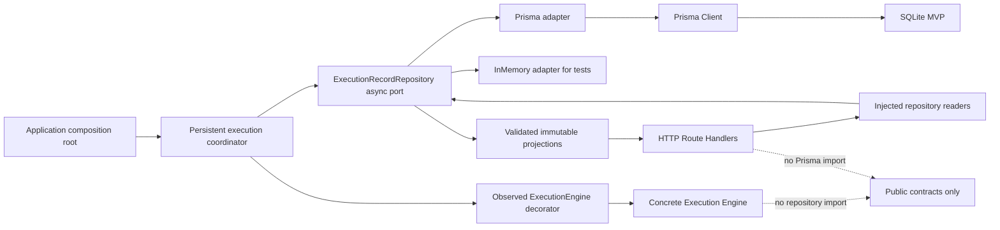
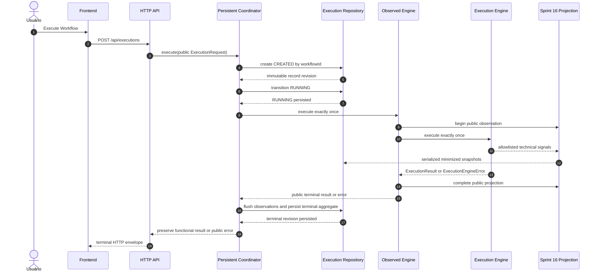
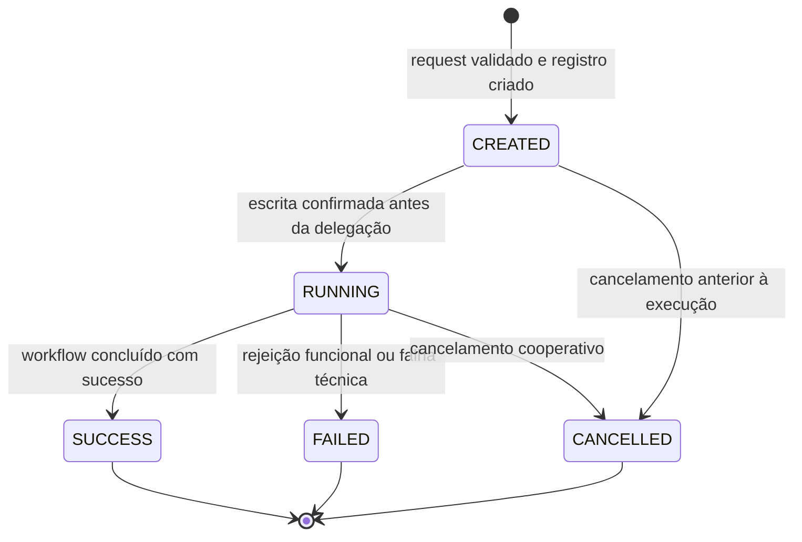
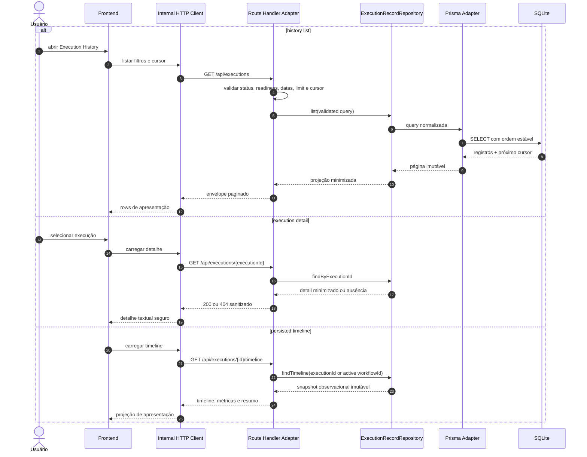
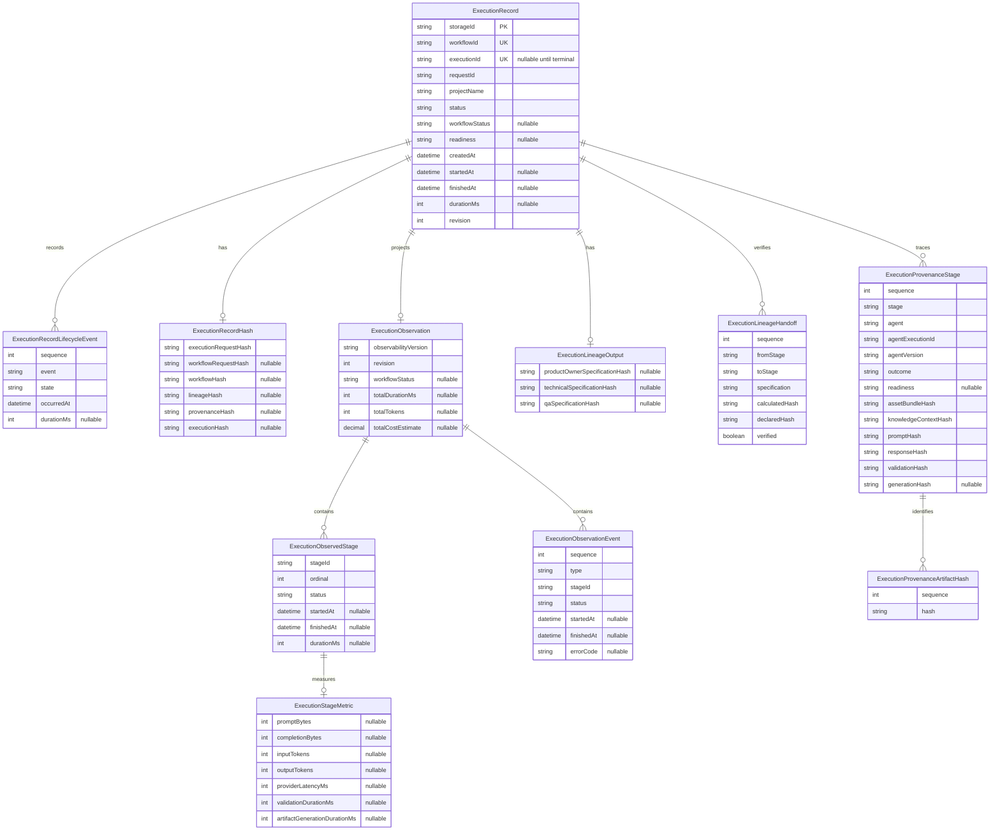

# Execution Repository Flow

## Objetivo

Documentar o fluxo de persistência da Sprint 17 definido pelo
[ADR-027](ADR/ADR-027-EXECUTION-REPOSITORY-BOUNDARY.md). A nova fronteira substitui o histórico
terminal em memória por um repository assíncrono e durável, mantendo o Execution Engine concreto,
a semântica de Observability e os componentes da timeline da Sprint 16 inalterados.

O dado persistido é uma projeção minimizada. Prompts, objetivo, contexto adicional, knowledge,
specifications, artifacts, respostas completas, output bruto, segredos, signals e objetos internos
nunca atravessam o mapper do repository.

Este documento e o ADR-027 não integram o manifesto nem a política runtime do Knowledge Loader.
Essa separação preserva sem alterações os contextos, bytes, hashes e prompts protegidos dos três
agentes funcionais.

## Fronteira

```text
HTTP host
  → persistent execution coordinator
    → observable ExecutionEngine decorator
      → concrete @brq/execution-engine

persistent execution coordinator
  → public ExecutionRecordRepository port
    → Prisma adapter | InMemory adapter

Route Handlers
  → injected repository readers
    → public minimized HTTP projections
```

O coordinator chama o Engine observado exatamente uma vez. Ele adiciona persistência ao redor da
API pública, mas não inicia agentes, não constrói prompts, não interpreta specifications e não
recalcula IDs ou hashes. O adapter Prisma permanece fora do Engine, Observability e HTTP Adapter e
é instanciado exclusivamente no composition root.

O aggregate durável `ExecutionRecord` é aditivo e separado do modelo legado `Execution`. Essa
separação preserva os contratos e repositories da Persistence Base.

## Repository



O port oferece create, transição, finalização, lookup, timeline e listagem paginada. Todos os
inputs e outputs passam por schemas estritos e são profundamente imutáveis. Os adapters Prisma e
in-memory compartilham a mesma semântica observável e são exercitados pelo mesmo contrato de
testes.

O entrypoint principal do workspace não obriga consumidores do port a carregar Prisma. O adapter
concreto é exposto por subpath público explícito, e boundary tests rejeitam deep imports e
dependências de agentes, Orchestrator, componentes inferiores ou `apps/`.

## Persistence Flow



`CREATED` e `RUNNING` devem ser confirmados antes da delegação. Falha nessas escritas é fail-closed
e impede que o Engine seja chamado. O `executionId` permanece `null` até o Engine público devolver
um resultado; o coordinator nunca duplica o algoritmo privado que o deriva.

A projeção síncrona da Sprint 16 continua fail-open. Uma bridge externa enfileira snapshots
minimizados do recorder público para escrita serializada, sem mudar seus contratos nem bloquear o
logger. O coordinator aguarda o flush antes da gravação terminal. Falhas intermediárias da fila
permanecem observacionais e são sanitizadas; a gravação terminal volta a projetar o snapshot final
em uma transação e nunca autoriza nova chamada ao Engine.

## Execution Lifecycle



Estados terminais são imutáveis. Cada transição cria uma entrada ordenada em
`ExecutionRecordLifecycleEvent` e avança a revisão monotônica do aggregate. O adapter rejeita
transições a partir de um estado terminal.

O lifecycle persistido envolve, mas não substitui, a máquina local do ADR-023. O Engine conserva
`attempt: 1`, a mesma sequência de decisões e a mesma timeline observacional. Não existe retry,
resume, reexecução, revisão humana ou transição a partir de estado terminal.

Se o processo cair depois de `RUNNING` e antes da escrita terminal, o registro pode permanecer
obsoleto nesse estado. A Sprint 17 não adiciona outbox, reconciler, worker ou recovery automático.

## API Query Flow



Os Route Handlers são adapters: validam transporte, chamam o port e mapeiam resposta ou erro. Eles
não importam Prisma, não contêm regra de lifecycle e não recalculam hashes. O client HTTP é o único
caller de `fetch`; componentes React recebem contratos de apresentação minimizados.

A listagem aceita:

| Parâmetro       | Semântica                             |
| --------------- | ------------------------------------- |
| `status`        | lifecycle/status terminal allowlisted |
| `readiness`     | readiness final allowlisted           |
| `createdAfter`  | limite inferior ISO 8601 inclusivo    |
| `createdBefore` | limite superior ISO 8601 inclusivo    |
| `limit`         | tamanho validado e limitado da página |
| `cursor`        | posição opaca na ordenação estável    |

Ordenação e desempate são determinísticos no repository. O cursor é tratado como valor opaco pelo
Frontend. Query inválida retorna `400`, ausência retorna `404`, e indisponibilidade do repository é
mapeada para erro técnico sanitizado.

## Prisma Model



Os nomes acima representam o aggregate novo; o modelo legado `Execution` não participa dessas
relações e permanece intocado. A migration cria tabelas e índices de forma aditiva.

Campos consultáveis usam colunas escalares. Arrays e estruturas repetidas usam relações ordenadas,
não grandes blobs JSON. Datas são `DateTime` no banco e ISO 8601 nos contratos. Hashes são copiados
exatamente; não há transformação, truncamento ou normalização de seu valor.

## Mapping and immutability

O mapper opera por allowlist:

```text
ExecutionRequest minimizado
  → workflowId + requestId + projectName

ExecutionResult público
  → IDs + lifecycle + tempos + versões + hashes
  → observability summary + canonical stages + stage metrics + events
  → lineage outputs + verified handoffs
  → provenance stages + artifact hashes
```

Campos não listados não possuem coluna e não são serializados. Em particular, `demand`,
`additionalContext`, `workflowResult` completo, specifications e artifacts nunca são passados ao
Prisma Client.

Leituras reconstroem o contrato público a partir das relações, validam com Zod, clonam arrays e
objetos aninhados e congelam profundamente o snapshot. Mutar o objeto devolvido não altera o
adapter, o cache do Prisma nem uma leitura posterior.

## Execution History Frontend

A página de histórico consome somente HTTP e lista:

- Execution ID;
- status;
- readiness;
- startedAt;
- duration;
- project name.

Selecionar uma linha navega para detalhe carregado pelos endpoints existentes. Enquanto o
`executionId` canônico ainda não existe, um registro ativo permanece correlacionado por
`workflowId` e não inventa um ID de apresentação; o link canônico fica disponível depois do
resultado público do Engine.

O Frontend não importa repository, Prisma, Engine, Orchestrator ou agentes. Ele não renderiza HTML
remoto nem usa `dangerouslySetInnerHTML`. Nenhuma biblioteca pesada, polling novo, WebSocket ou
streaming é introduzido pela página.

## Hashes and determinism

O repository preserva, sem recalcular:

- execution request hash;
- workflow request hash;
- workflow hash;
- lineage hash;
- provenance hash;
- execution hash;
- hashes de outputs, handoffs e provenance.

Lifecycle persistido, revisão, timestamps, durações, eventos, métricas, custo, filtros, cursor e
latência do banco permanecem observacionais e fora dos hashes. Mudar o adapter de in-memory para
Prisma não altera IDs, decisões, lineage, provenance, hashes nem sequência de agentes.

## Logging and security

Logs do workspace usam allowlist e podem conter somente:

- operação do repository;
- `workflowId`, `executionId` e `requestId` técnicos;
- status e revisão;
- duração e contagem de registros;
- código sanitizado de erro.

Não são registrados `projectName`, filtros com valores livres, registros completos ou parâmetros
do Prisma. Causas, mensagens cruas do banco e stack traces não atravessam a fronteira pública.

Persistência é limitada a metadados técnicos e ao `projectName` necessário à listagem. São sempre
proibidos:

- prompts, rules, templates e output contracts;
- objetivo, demanda e contexto adicional do usuário;
- knowledge context e documentos carregados;
- specifications e respostas completas da IA;
- artifacts, output bruto e conteúdo renderizado;
- segredos, chaves, headers, cookies e credenciais;
- signals, logger, callbacks, exceptions cruas e objetos internos.

Sem autenticação e autorização, os endpoints continuam apropriados somente para ambientes locais
ou explicitamente permitidos e para dados sintéticos.

## Failure model

- erro ao persistir `CREATED` ou `RUNNING` impede a chamada do Engine;
- erro observacional continua contido pela fronteira fail-open da Sprint 16;
- erro de gravação terminal é sanitizado e não dispara uma segunda execução;
- falha funcional persiste `FAILED` e os metadados anteriores disponíveis;
- cancelamento persiste `CANCELLED` e preserva as etapas concluídas;
- operação Prisma multi-tabela usa transação local;
- conflito de revisão rejeita escrita obsoleta;
- leitura ausente não revela detalhes do banco ou de outra instância.

Não há exatamente uma vez entre efeito externo da execução e commit terminal. Um crash depois da
chamada do Engine pode deixar o registro em `RUNNING`. Esse risco é explícito e não é disfarçado por
retry automático.

## Limitations

- SQLite continua sendo banco local de single host;
- múltiplas instâncias não possuem coordenação distribuída;
- crash entre `RUNNING` e terminal pode deixar registro obsoleto;
- não existe outbox, reconciler, worker, retry ou retomada;
- o `executionId` só é conhecido pelo coordinator após o retorno público do Engine;
- custo permanece `null` sem rate card aprovado e versionado;
- não existe retenção, purge, autenticação ou autorização;
- o store em memória da Sprint 16 continua apenas como projeção interna de captura, não como fonte
  durável de consultas concluídas.

## Out of scope

RabbitMQ, Kafka, Redis, filas, scheduler, workers, cron, background jobs, outbox, retry, resume,
reconciliação automática, WebSocket, SSE, streaming, OpenTelemetry, autenticação, autorização,
Playwright, chamadas reais à OpenAI, mudanças em agentes, Prompt Builder, Response Validator,
Business Validation, output contracts, prompt assets, runtime prompt budget, Observability,
timeline ou Frontend da Sprint 16 e qualquer item da Sprint 18 permanecem fora do escopo.
