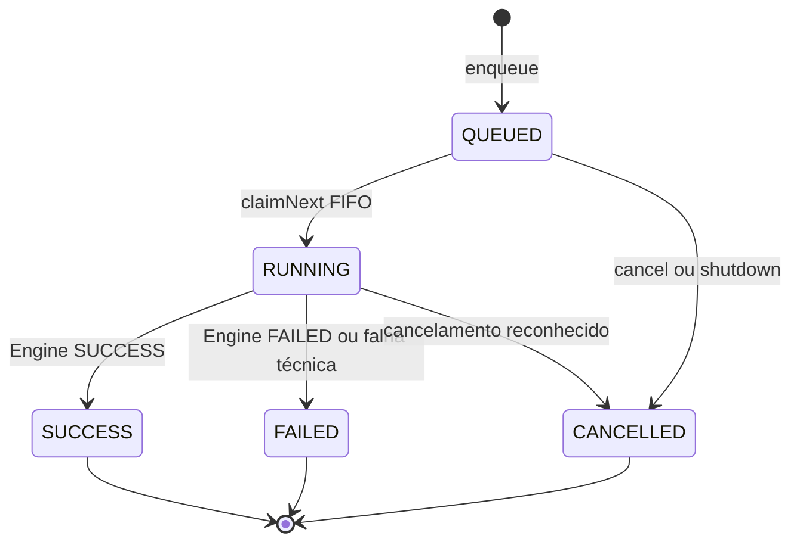
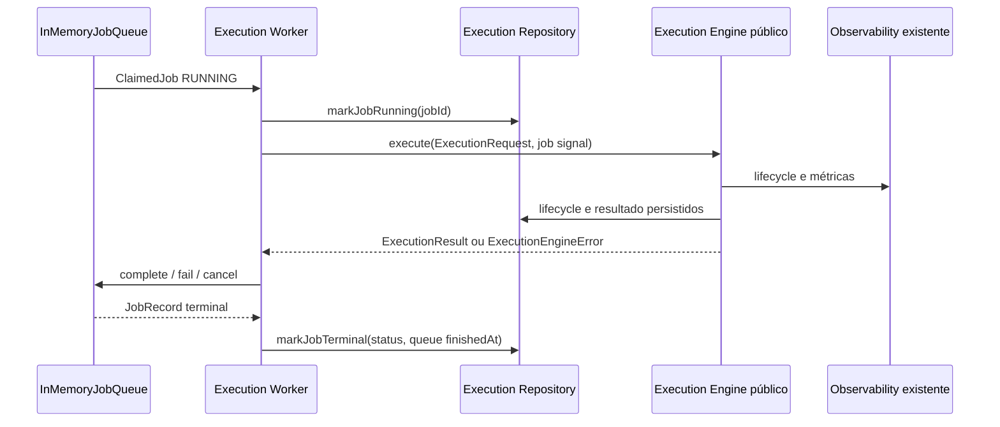
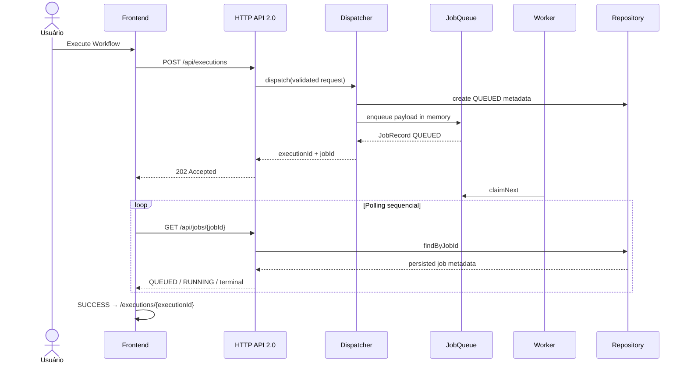
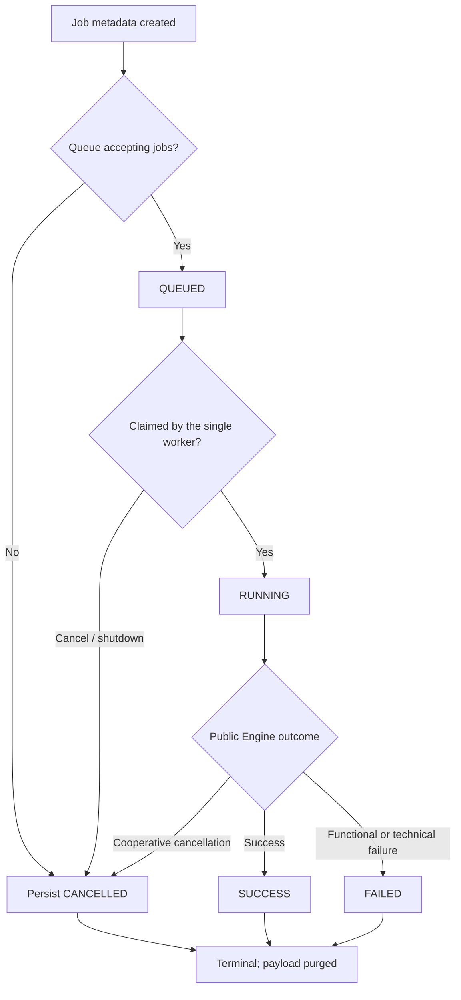
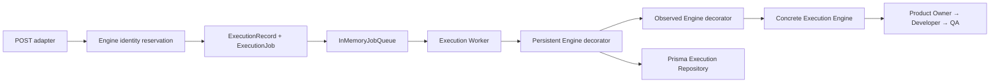

# Job Queue Flow

## Objetivo

Representar a arquitetura assíncrona local aprovada no
[`ADR-028`](ADR/ADR-028-JOB-QUEUE-BOUNDARY.md), sem introduzir execução paralela, retry ou fila
externa.

## Queue Lifecycle

Não existe retorno para `QUEUED`. Todo job possui `attempt: 1` e uma única entrega ao Worker.

## Worker

O Worker nunca chama Orchestrator ou agentes. Esses componentes permanecem atrás do Execution
Engine.

## HTTP Async Flow

## Job State Machine

## Execution Dispatch

## Fronteiras de dados

Persistidos:

- `jobId`, `jobStatus`, `queuedAt`, início e término do job;
- metadata minimizada da execução, timeline, métricas, hashes, lineage e provenance já aprovados.

Somente em memória enquanto ativo:

- `ExecutionRequest` necessária ao Worker;
- `AbortController` do job.

Nunca armazenados pela fila:

- prompts, respostas do modelo, knowledge context, specifications completas, artifacts ou segredos.

Os eventos `job.*` são observacionais e separados da timeline de etapas do workflow. Nenhum
timestamp, polling ou evento participa dos hashes determinísticos.

O adapter local elimina o payload em estados terminais, mas mantém records e eventos técnicos pela
vida do processo para lookup e métricas. Política de retenção ou capacidade limitada pertence a um
adapter futuro e não é implementada nesta Sprint.
