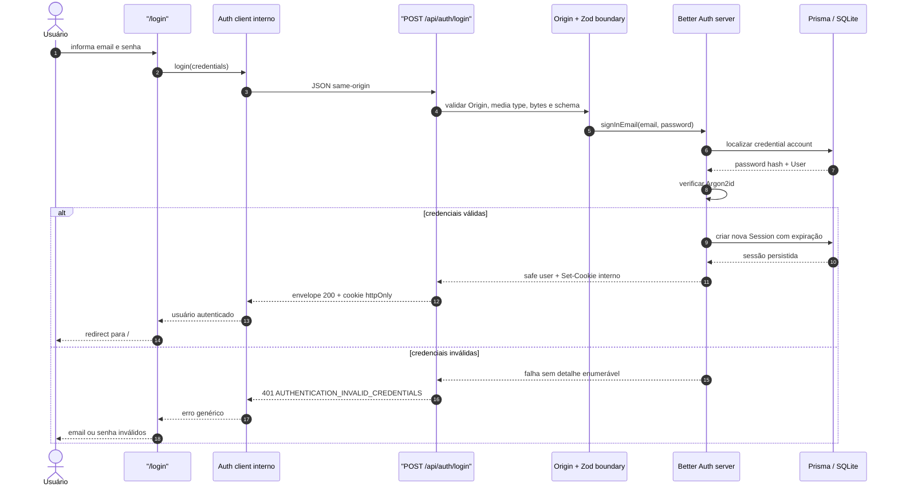
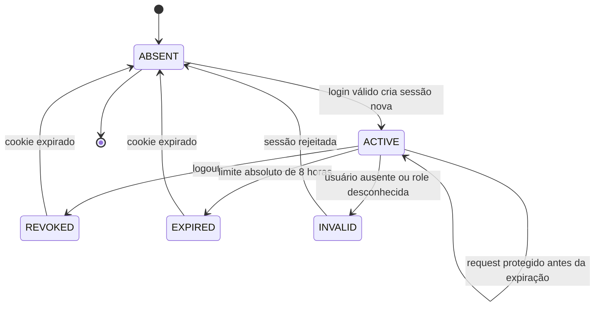
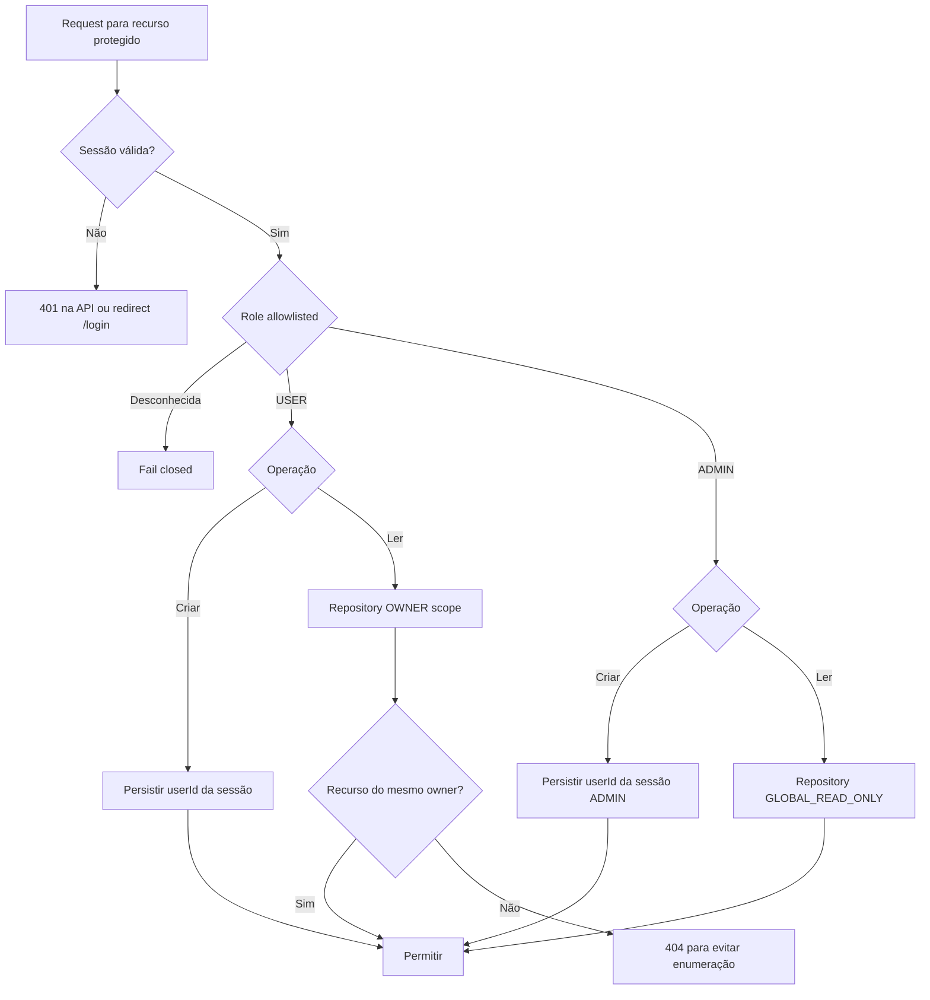
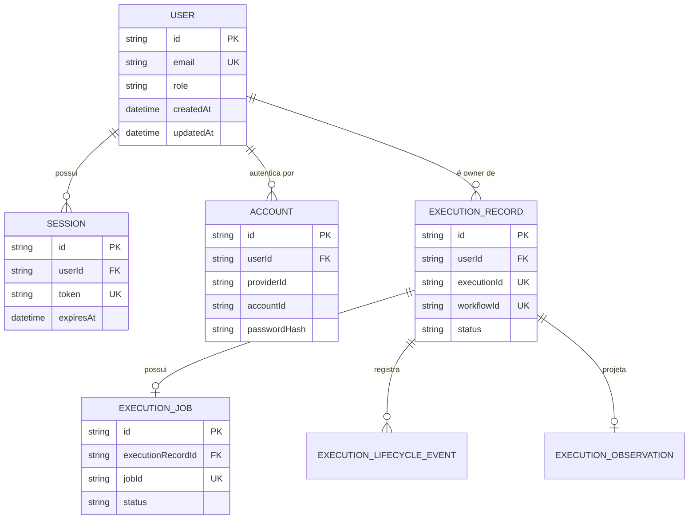
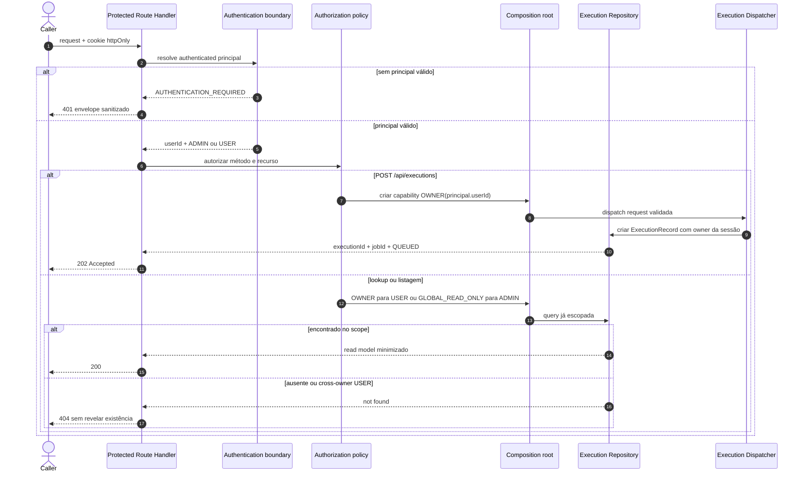
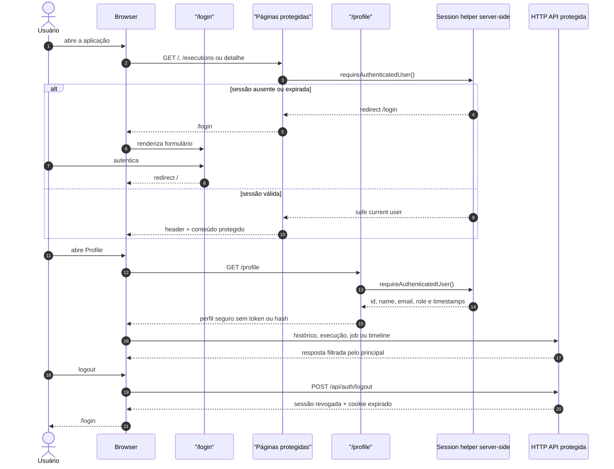

# Authentication and Authorization Flow

## Objetivo

Documentar a fronteira de autenticação, autorização e ownership da Sprint 19 definida pelo
[ADR-029](ADR/ADR-029-AUTHENTICATION-AUTHORIZATION-BOUNDARY.md). A identidade pertence ao host
Next.js; os agentes, Orchestrator, Execution Engine, Execution Worker e Job Queue permanecem sem
conhecimento de usuário, sessão, cookie ou role.

O fluxo usa email e senha no MVP local, Better Auth com adapter Prisma, Argon2id e sessões
server-side revogáveis. OAuth, SSO, MFA e permission engine não integram esta Sprint.

## Better Auth versus Auth.js

A escolha foi reavaliada depois da aprovação do planejamento:

| Necessidade da AI Factory     | Better Auth                                   | Auth.js                                                                                     |
| ----------------------------- | --------------------------------------------- | ------------------------------------------------------------------------------------------- |
| Email e senha local           | Fluxo integrado                               | Credentials exige que a aplicação implemente persistência e lifecycle de credenciais        |
| Database session              | Integrada ao adapter Prisma                   | Credentials não oferece a combinação desejada sem composição adicional e tende ao fluxo JWT |
| Logout revogável              | Remove a sessão persistida                    | Exige estratégia adicional quando Credentials usa JWT                                       |
| Cookie server-side            | Cookie opaco e `httpOnly`                     | Suportado, mas não elimina o trabalho customizado de Credentials                            |
| Superfície de código sensível | Menor para este escopo                        | Maior para hashing, account lookup e persistência de senha                                  |
| Trade-off                     | Quatro models técnicos e uma dependência nova | Integração histórica madura e menos tabelas no modo JWT                                     |

Better Auth foi escolhido porque atende o conjunto completo, e não por preferência genérica de
biblioteca. O token interno nunca é projetado para o contrato HTTP ou para componentes React. A
reavaliação usa as documentações oficiais de [Credentials do
Auth.js](https://authjs.dev/getting-started/authentication/credentials), [migração para Better
Auth](https://authjs.dev/getting-started/migrate-to-better-auth), [integração Next.js do Better
Auth](https://better-auth.com/docs/integrations/next) e [adapter
Prisma](https://better-auth.com/docs/adapters/prisma).

## Fronteira

```text
Frontend HTTP-only
  → Next.js page / Route Handler
    → authentication helpers no host
      → authenticated principal
        → application authorization policy
          → scoped Execution Repository / existing Dispatcher

Better Auth
  → Prisma adapter
    → User + Session + Account + Verification
```

Somente a aplicação resolve a sessão e interpreta `ADMIN` ou `USER`. O Execution Repository recebe
uma capability explícita de owner, leitura global ou lifecycle interno; ele não recebe cookies,
papéis ou objetos Better Auth.

## Login Flow



O endpoint devolve somente `id`, `name`, `email`, `role`, `createdAt` e `updatedAt`. Password,
hash, token, cookie e resposta completa da biblioteca são descartados na fronteira.

## Session Lifecycle



Não existe renovação automática nesta Sprint. Cada login válido emite uma nova sessão. Logout
revoga o registro server-side e expira o cookie; uma sessão expirada, revogada ou incoerente nunca
é convertida em principal.

O cookie é host-only, `httpOnly`, `sameSite=lax` e `secure` em produção. A origem confiável é
exatamente `BRQ_APP_ORIGIN`, e `BETTER_AUTH_SECRET` não possui fallback inseguro.

## Authorization Flow



`USER` e `ADMIN` podem iniciar workflows. O que muda é o alcance de leitura. Nenhuma policy confia
em `userId` do JSON, query string ou path. A leitura global do ADMIN não permite mutação global.

## Execution Ownership



`ExecutionJob` não duplica `userId`: seu owner é o owner do `ExecutionRecord`. Timeline, hashes,
lineage, provenance e métricas permanecem filhos do mesmo agregado. O `userId` é metadata de
ownership e não participa de `ExecutionRequest`, `executionId` ou hashes do workflow.

Registros anteriores à Sprint 19 são atribuídos pela migration a um usuário técnico legado
determinístico. Esse usuário preserva integridade referencial, não recebe senha e não representa
uma conta interativa.

## Protected API Flow



O mesmo guard protege `GET /api/executions`, detail, timeline e `GET /api/jobs/[id]`. O
`GET /api/health` e o login permanecem públicos. O Worker usa capability interna somente para
concluir o lifecycle de registros que já possuem owner; ele nunca atua como caller autenticado.

## Frontend Auth Flow



As páginas são protegidas no servidor; esconder links no browser não autoriza operações. O header
mostra usuário atual, role, acesso a `/profile` e logout. O perfil é deliberadamente mínimo e não
expõe Session, Account, token, hash ou dados de workflow.

## Password e seed local

Argon2id usa memória de 19.456 KiB, duas iterações e paralelismo 1. O seed explícito:

```bash
BRQ_SEED_ADMIN_PASSWORD='senha-local-forte' \
BRQ_SEED_USER_PASSWORD='outra-senha-local-forte' \
npm run auth:seed
```

Os valores acima são placeholders e não devem ser copiados para um ambiente compartilhado. O seed
cria ou atualiza somente `admin@example.local` e `user@example.local`; nenhum password real fica
versionado. O host também exige `BETTER_AUTH_SECRET` e `BRQ_APP_ORIGIN` em `.env`.

## Logs e dados proibidos

Permitidos:

- request, execution, workflow e job IDs quando aplicável;
- `userId`, role validada e auth outcome;
- endpoint, status HTTP, duração e código de erro sanitizado.

Sempre proibidos:

- password e password hash;
- cookie e session token;
- authorization header e segredo do adapter;
- payload completo de login;
- prompts, knowledge, specifications, respostas da IA e artifacts.

## Limitações e riscos

- não há rate limiting, lockout ou CAPTCHA; brute force permanece risco antes de exposição pública;
- não há MFA, verificação de email, reset ou troca de senha;
- sessões e fila continuam limitadas ao desenho local/single-host do MVP;
- não existe administração completa de usuários ou audit log de identidade;
- o owner técnico de dados históricos não representa pessoa autenticável;
- uma nova estratégia de identidade corporativa exigirá ADR próprio, sem atravessar os módulos
  funcionais existentes.

## Fora do escopo

OAuth, Google, Microsoft Entra ID, SSO, LDAP, MFA, Organizations, Teams, multi-tenancy completo,
permission engine, API keys, rate limit, billing, audit log completo, Redis, session store externo,
alterações em agentes ou no pipeline funcional, chamadas reais à OpenAI e qualquer item da Sprint
20 permanecem fora do escopo.
