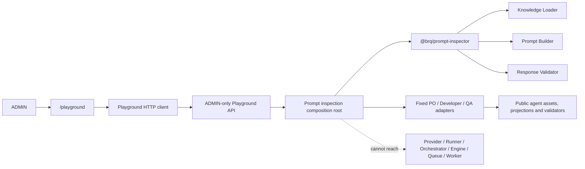
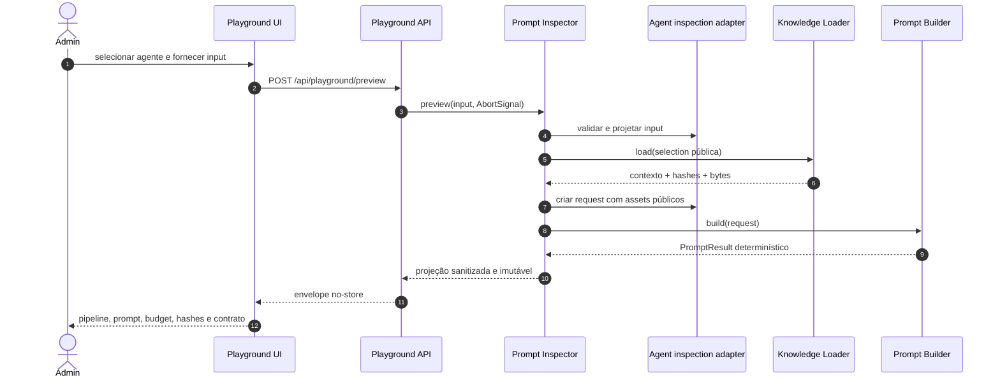
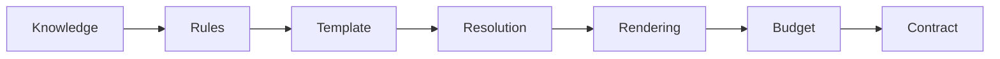
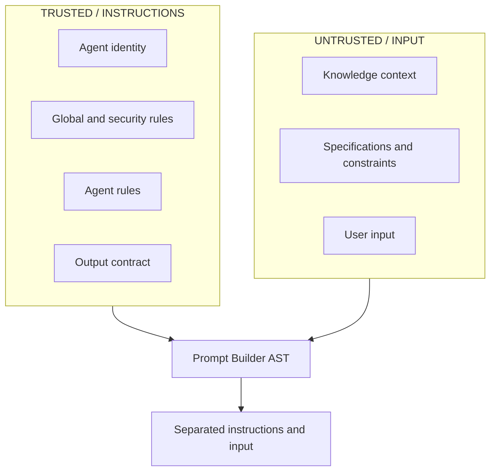
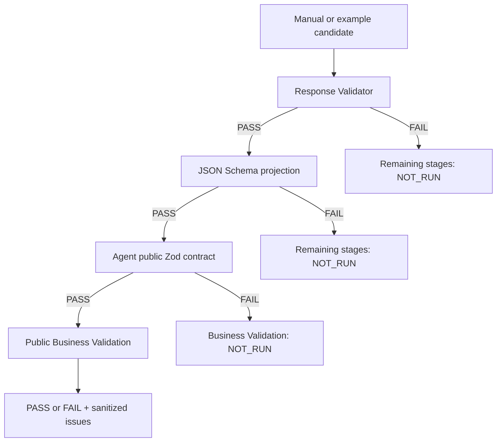
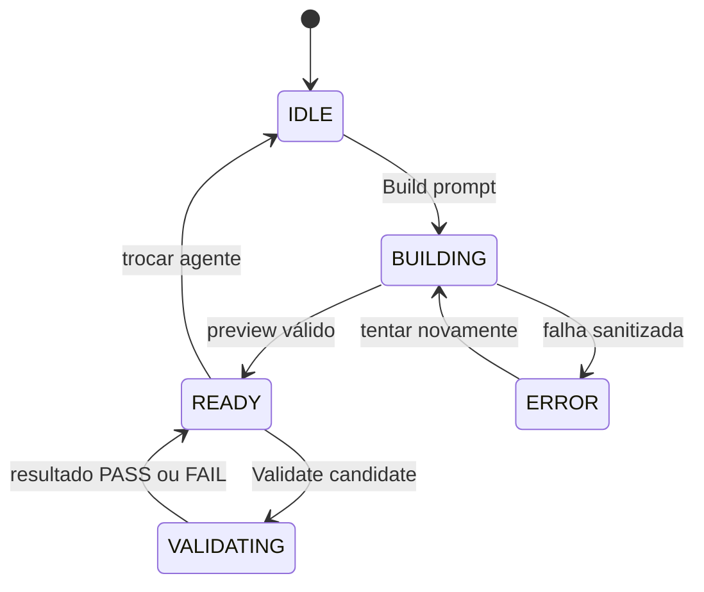
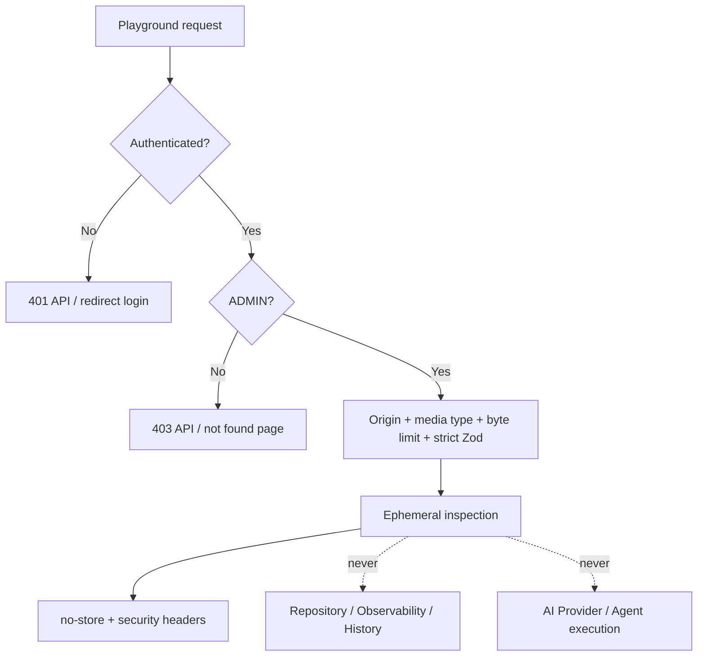

# Prompt Playground & Agent Debugger Flow

## Objetivo

Documentar o Playground administrativo da Sprint 20 e a fronteira definida pelo
[ADR-030](ADR/ADR-030-PROMPT-PLAYGROUND-BOUNDARY.md). A ferramenta inspeciona a construção real dos
prompts e valida respostas manuais sem executar agentes e sem acessar OpenAI.

Toda informação é transitória: **Inspection data is ephemeral and is not persisted.**

## Playground Architecture

O runtime do Inspector é separado de `apps/web/src/server/runtime.ts`. A aresta pontilhada representa
uma fronteira proibida e protegida por testes de dependência, não uma dependência disponível.

## Prompt Inspection Flow

Nenhum passo chama `AgentRunner`, `AIProvider.generate` ou uma fachada `execute()` de agente.

## Visual Pipeline

Cada node possui estado textual `IDLE`, `VALID`, `WARNING` ou `ERROR`. Selecionar um node apenas
altera o detalhe exibido no browser; não dispara execução.

## Trust Boundary Flow

Os rótulos são derivados das sections produzidas pelo Prompt Builder. O frontend não reclassifica
conteúdo nem duplica uma política própria.

## Validation Preview Flow

`JSON Schema` é a projeção da etapa de schema do Response Validator, e não uma segunda engine. O
conteúdo não é corrigido, truncado ou persistido. O `candidateHash` identifica apenas esse payload
diagnóstico em memória.

## Frontend Interaction

Trocar o agente ou desmontar a experiência aborta requests pendentes e descarta todo estado
ephemeral. Nada é gravado em storage ou query string.

## Security Boundary

Logs usam somente request ID, user ID, agente, bytes, hashes, duração, status e códigos
sanitizados. Prompt, input, Knowledge content, specifications, candidato e output contract completo
permanecem proibidos.

## Dados apresentados

- prompt: instructions e input renderizados;
- budget: bytes de instructions, input e output contract, total, limite e percentual;
- Knowledge: ID, categoria, required/optional, bytes e hash;
- hashes: template, instructions, input, output contract, prompt, rules e Knowledge;
- contrato: formato, versões, propriedades, required, arrays, enums, constraints, hash e JSON
  read-only;
- validação: status por estágio e issues sanitizadas.

Somente um ADMIN recebe prompt e schema completos. Conteúdo documental não integra o Knowledge
Inspector nesta Sprint porque a API pública atual não oferece leitura individual adequada sem
ampliar a fronteira.

## Fora do escopo

Não existem execução, provider selector, edição/versionamento de assets, persistência, histórico de
preview, A/B testing, evaluation framework, prompt registry, streaming, WebSocket, editor Monaco
ou qualquer funcionalidade da Sprint 21.
