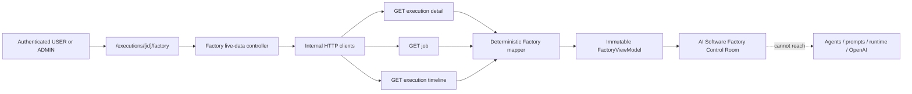
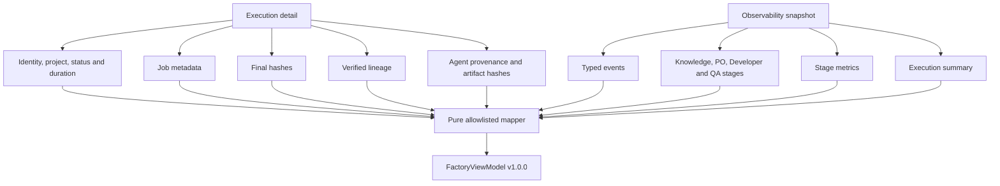
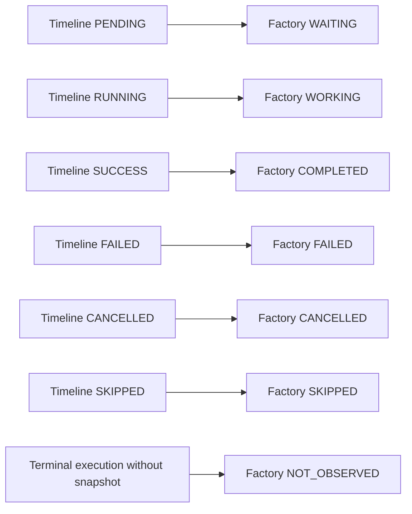
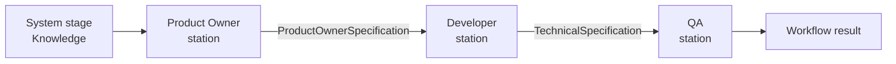
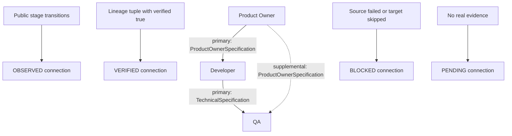
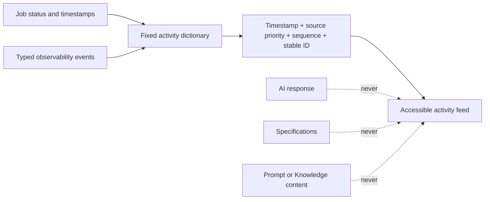
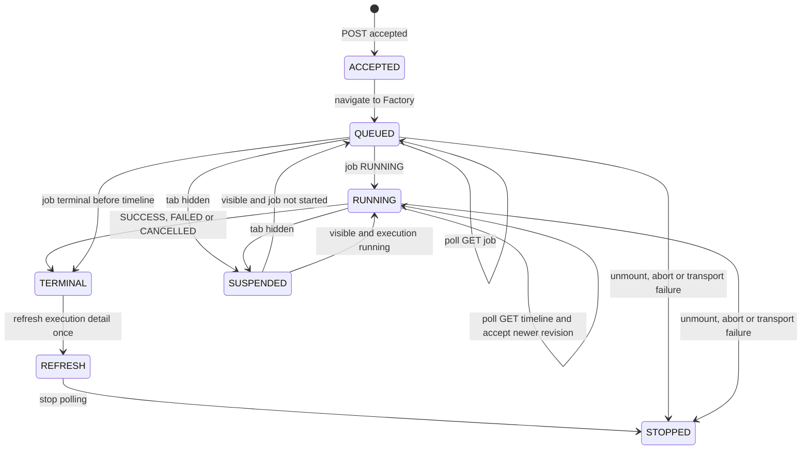
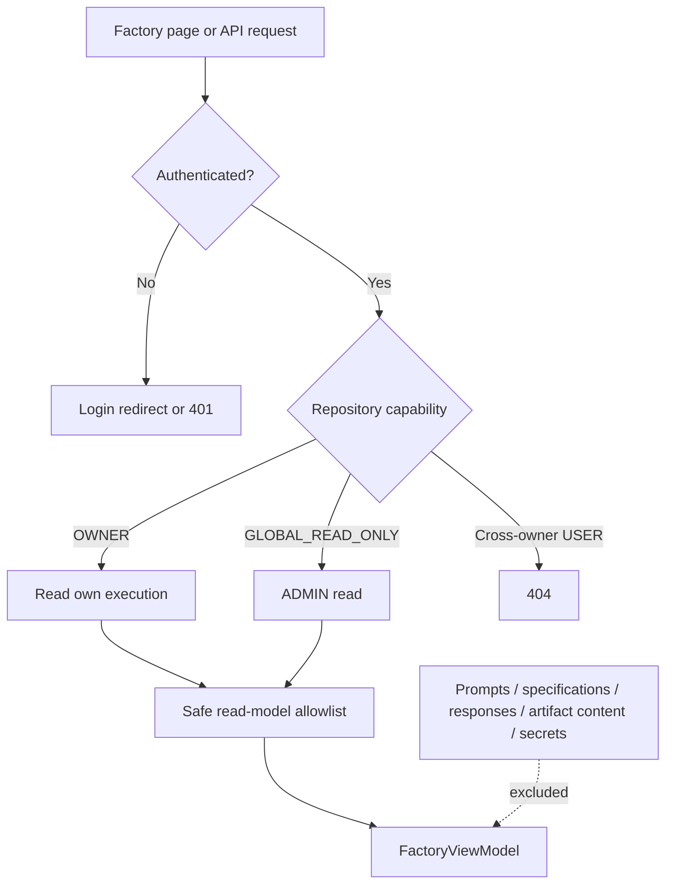
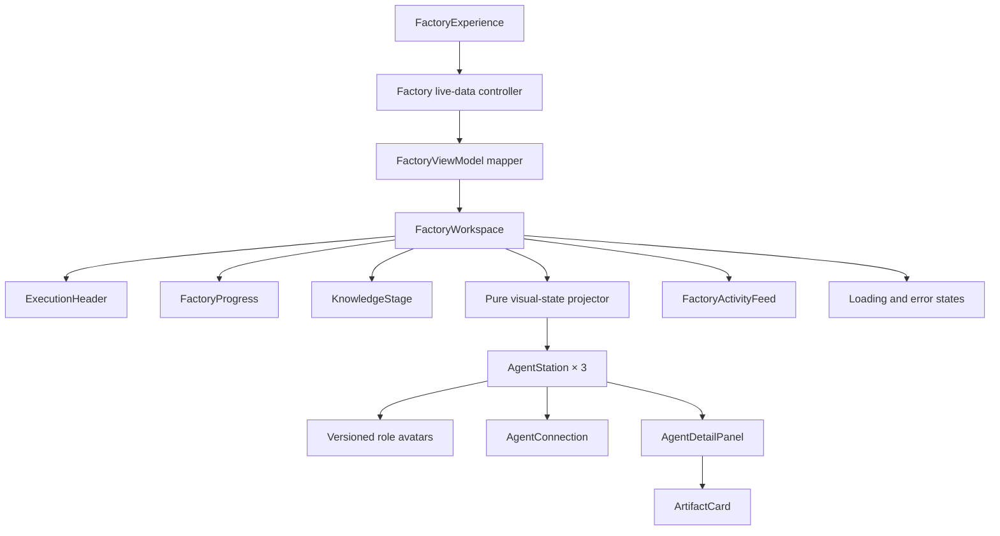

# Live Agent Workspace & Factory Visualization Flow

## Objetivo

Documentar a Factory View da Sprint 21 e a fronteira definida pelo
[ADR-031](ADR/ADR-031-FACTORY-VISUALIZATION-BOUNDARY.md). A rota
`/executions/[id]/factory` transforma read models públicos e sanitizados em uma sala de controle
visual sem executar agentes, inventar atividade ou acessar conteúdo funcional.

## Factory View Architecture

`FactoryViewModel` é a única fronteira da camada de apresentação. O controller e os clients
conhecem DTOs HTTP; os componentes visuais conhecem apenas projeções do view model.

## Execution to FactoryViewModel

O mapper não lê clocks globais, browser storage, internals do servidor ou conteúdo de execução.
Elapsed live é observacional e não participa de hashes nem de decisões do workflow.

## Agent State Mapping

Knowledge usa o mesmo status público, mas é um estágio de sistema. Não existem estados live
`VALIDATING` ou `GENERATING_ARTIFACTS`: os eventos atuais não comprovam essas transições. Métricas
retrospectivas de validação e artifact generation continuam disponíveis quando registradas.

### Visual asset projection

A Factory Floor aplica uma segunda projeção, exclusivamente visual, sobre os estados autoritativos
do `FactoryViewModel`. Ela seleciona um asset versionado por papel sem criar novos eventos, atrasar
transições ou alterar o status técnico exibido:

| Evidência pública                                                      | Estado visual                                | Asset                           |
| ---------------------------------------------------------------------- | -------------------------------------------- | ------------------------------- |
| execução ainda não iniciada                                            | `IDLE`                                       | `01-idle.png`                   |
| estágio futuro durante execução                                        | `WAITING`                                    | `05-waiting.png`                |
| estágio `WORKING`                                                      | `WORKING`                                    | `03-working.png`                |
| source concluído e handoff primário `OBSERVED` para target trabalhando | `HANDOFF`                                    | `04-handoff.png`                |
| estágio `COMPLETED` fora de handoff ativo                              | `SUCCESS`                                    | `06-success.png`                |
| estágio `FAILED`                                                       | `ERROR`                                      | `07-error.png`                  |
| `CANCELLED`, `SKIPPED` ou `NOT_OBSERVED`                               | apresentação específica e texto autoritativo | `07-error.png` ou `01-idle.png` |

`02-analyzing.png` permanece deliberadamente reservado. O contrato observacional atual não oferece
evidência suficiente para distinguir análise de trabalho, e a UI não utiliza timers para simular
essa granularidade. Developer e QA usam PNGs com fundo transparente preparados visualmente; essa
normalização não participa de estados, contratos, hashes ou decisões do workflow.

## Software Factory Line

No desktop, essa é a linha horizontal da fábrica. No mobile, o CSS reorganiza os mesmos elementos
em uma sequência vertical e preserva a ordem semântica.

## Handoff Flow

O handoff suplementar Product Owner → QA aparece no painel do QA, sem criar uma conexão diagonal
na linha principal. Como não existe `handoffAt`, a UI apresenta somente um instante observado,
baseado em `target.startedAt` ou, como fallback, `source.finishedAt`, e identifica essa base.

## Live Activity Flow

Exemplos de textos fixos são “Execution queued”, “Knowledge loading started”, “Knowledge loaded”,
“Developer started” e “Execution failed”. Handoffs e artifacts não ganham entradas cronológicas
porque seus contratos não possuem timestamps próprios.

## Phase-aware Polling

Existe no máximo uma consulta em andamento. O polling apenas lê estado, nunca repete o POST e
nunca representa retry de job, workflow ou agente. Uma Timeline ainda ausente durante a transição
inicial é tratada como estado observacional esperado.

## Security Boundary

O Playground permanece ADMIN-only e isolado. A Factory pode oferecer um link genérico para ele
somente a ADMIN, sem transferir conteúdo, hashes de candidato ou contexto da execução.

## Frontend Component Flow

O painel de detalhes é não modal. No desktop ocupa a lateral da sala de controle; no mobile fica
abaixo da estação selecionada. Status textual, foco visível e ordem de tabulação permanecem
independentes de animação e cor.

## Visual behavior

- a linha PO → Developer → QA ocupa um único piso visual, com personagens como foco principal;
- `WAITING`: personagem atenuado e estação estática em slate;
- `WORKING`: personagem em atividade, energia amber e pulso discreto;
- `HANDOFF`: pose específica no source somente enquanto o handoff `OBSERVED` possui target trabalhando;
- `COMPLETED`: personagem de sucesso e confirmação teal;
- `FAILED`: personagem de erro e destaque vermelho sem flashing;
- `CANCELLED`, `SKIPPED` e `NOT_OBSERVED`: estados textuais distintos;
- handoff `OBSERVED`: movimento unidirecional sutil enquanto houver trabalho real no target;
- `prefers-reduced-motion`: remove pulse, deslocamentos e transições decorativas.

Progresso geral é representado pela situação real das estações, nunca por percentual estimado.

## Limitações explícitas

- não há fase live de validação ou geração de artifacts;
- artifact cards não possuem filename, tipo, media type ou conteúdo;
- handoff não possui timestamp autoritativo;
- polling não oferece atualização push;
- nenhum estado, mensagem, conversa ou atividade é produzido por IA;
- não existe endpoint agregado, novo workspace, dependency visual ou item da Sprint 22.
