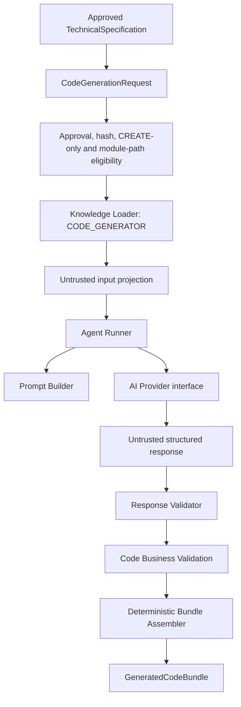
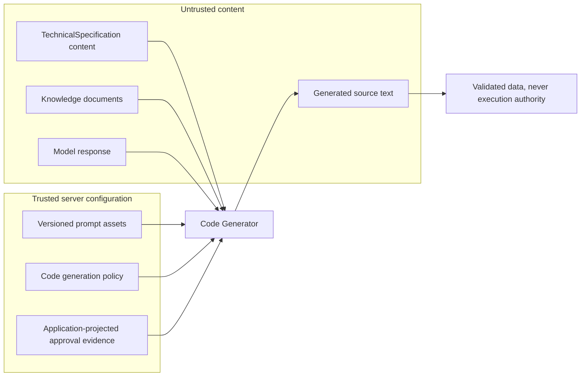
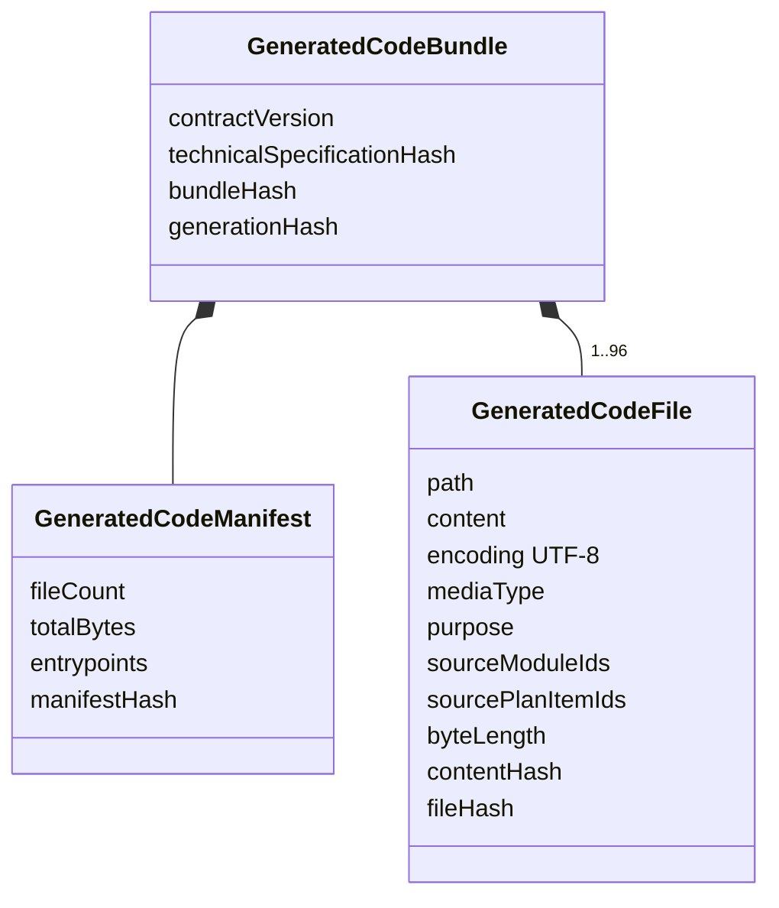
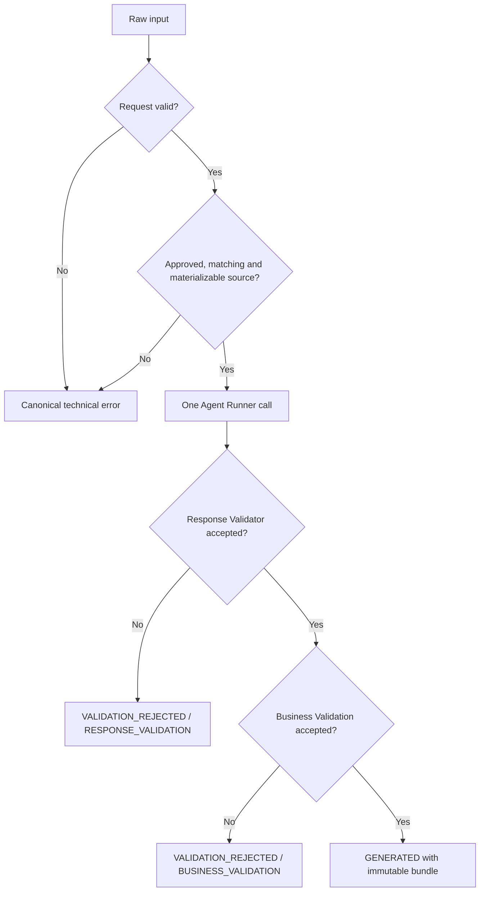
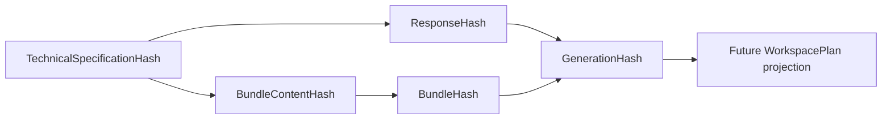
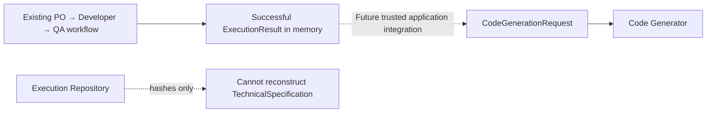

# Code Generation Flow

## Purpose

Sprint 22 introduces a new functional agent that turns a technically approved
`TechnicalSpecification` into an immutable bundle of textual source files. It produces data only;
it cannot write or execute files.

## Generation pipeline

## Trust boundaries

## Generated bundle

## Validation and failure flow

There is no retry, partial bundle, hidden correction or truncation. A rejected result contains no
materializable bundle.

## Hash chain

Hashes verify deterministic integrity and correlation. They are not signatures and do not prove
authenticity.

## Boundary with the workflow

Sprint 22 exposes the capability programmatically but does not add it to the existing workflow,
HTTP API or Factory View.
