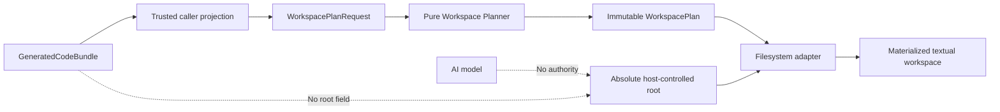
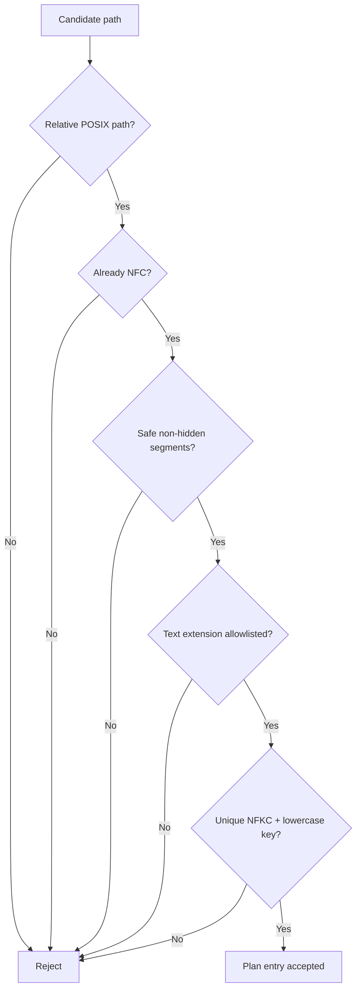
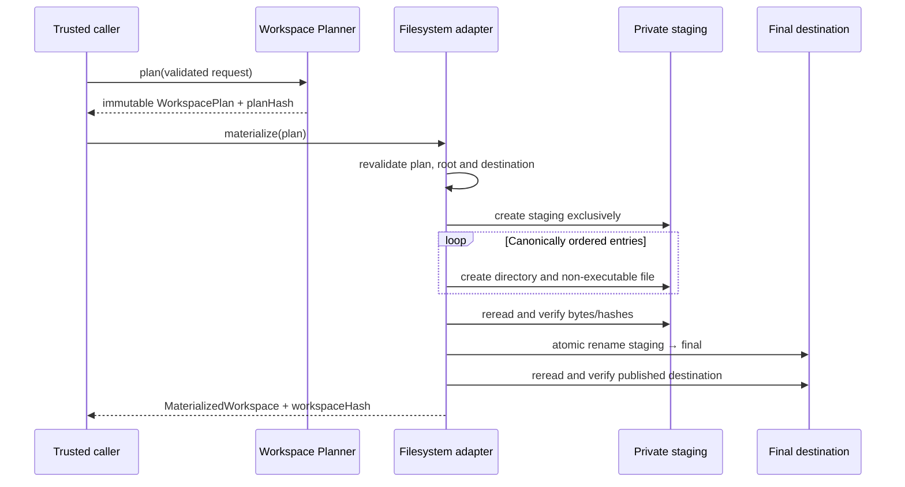
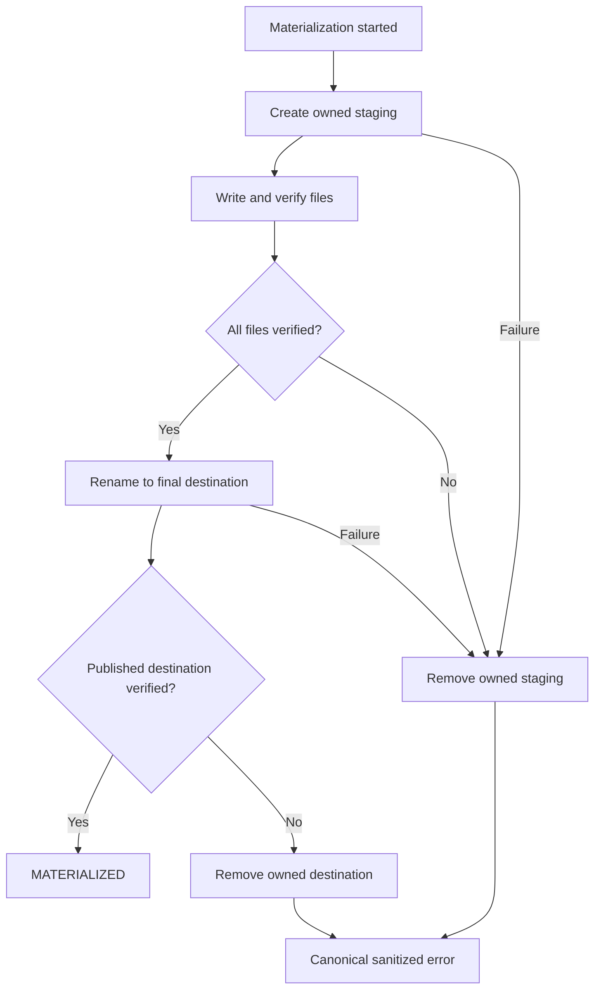
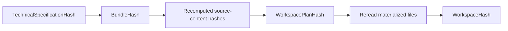
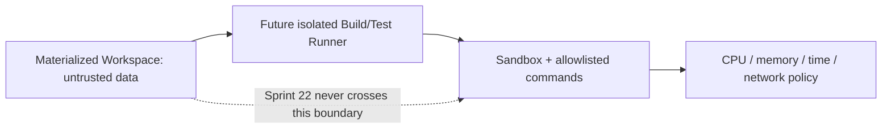

# Controlled Workspace Flow

## Purpose

The Controlled Workspace is the only Sprint 22 component authorized to create generated source
files. It has no AI, prompt, agent or execution dependencies. It treats every input file as
untrusted text even when it came from Code Generator.

## Boundary

The Code Generator and Controlled Workspace do not import each other. Contract projection is an
explicit trust transition and every path, byte count and hash is validated again.

## Path validation

Absolute POSIX paths, Windows drive/UNC paths, backslashes, traversal, null/control characters,
ambiguous normalization, platform-reserved names, hidden/sensitive segments and file/directory
collisions are rejected.

## Atomic materialization

The final destination is never overwritten. All writes happen under staging on the same
filesystem, and only rename publishes the result. A verification failure after rename removes the
owned destination and returns a sanitized failure; a published directory is never reported as a
successful workspace before this final verification completes.

## Failure and cleanup

A caught failure removes the staging tree owned by that operation. A process crash can leave an
unpublished staging directory; automated orphan recovery is outside Sprint 22.

## Hash chain

Physical root, staging name, timestamps and durations do not participate in deterministic hashes.

## Future build boundary

Sprint 22 does not install dependencies, invoke package managers, compile, test, preview or execute
the materialized files.
