# Sandbox Runner Flow

## Purpose

The Sandbox Runner is the Sprint 23 boundary authorized to evaluate a materialized workspace. It
runs only fixed preparation, typecheck, build and test commands inside a disposable container. It
does not generate or materialize code, and it never executes generated code directly on the host.

## Architectural boundary

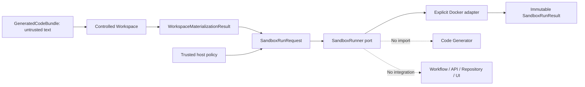

`core/sandbox-runner` owns a provider-neutral contract. Docker is an explicit adapter and does not
leak into the public port. A caller chooses a trusted `policyId`; the request cannot choose image,
commands, environment, mounts or network.

## Complete run sequence

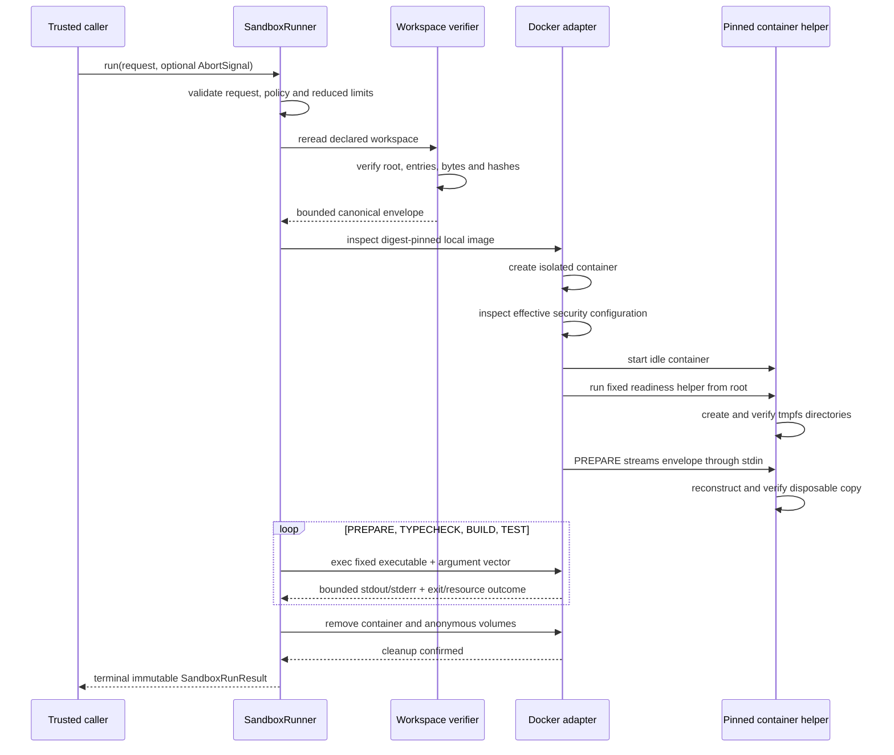

The original workspace is never mounted. The copy transferred through stdin is bounded by the
existing Controlled Workspace limits and verified on both sides of the trust transition.

## Run state machine

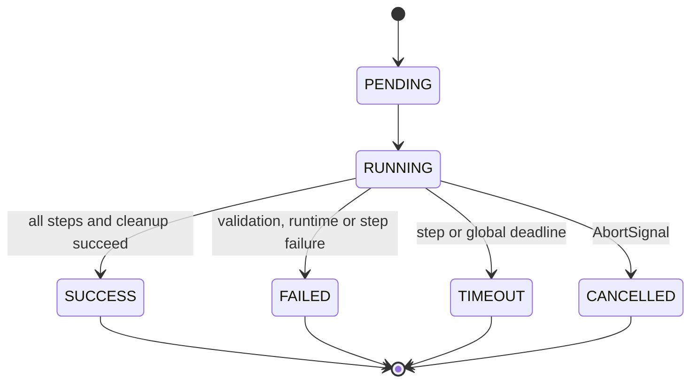

There is no retry, resume or correction transition. A cleanup failure prevents `SUCCESS` and is
represented as a canonical infrastructure failure.

## Fixed step pipeline

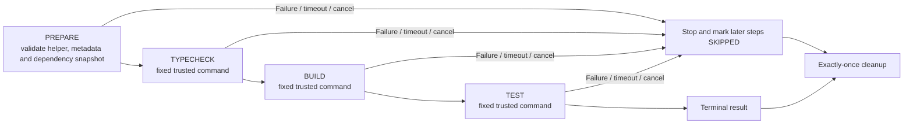

Only one step can be `RUNNING`. Later steps become `SKIPPED` after the first terminal interruption.

## Command authority

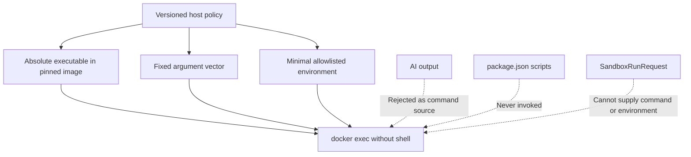

The runner never invokes `npm run`, `npm test`, shell pipelines or dependency lifecycle scripts.
Package metadata is validation input only.

## Container lifecycle

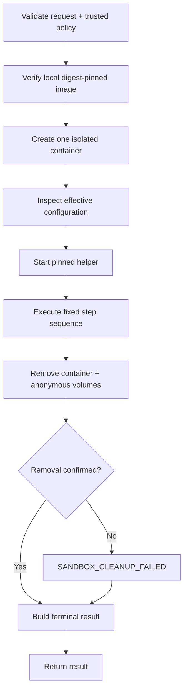

Image pull and image build are never implicit. A missing or mismatched image fails closed before
untrusted code runs.

## Filesystem isolation

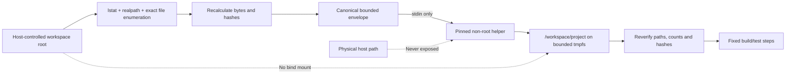

The image root is read-only. `/workspace` and `/tmp` are bounded tmpfs locations and are discarded
with the container. No build output is copied back.

## Isolation controls

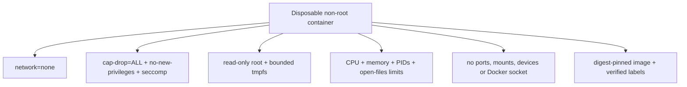

Approved ceilings are 1 vCPU, 2 GiB memory without extra swap, 128 PIDs, 512 MiB workspace tmpfs,
128 MiB temporary tmpfs, 1,024 open files, 32,768 workspace inodes and 16,384 temporary inodes.

## Timeout, cancellation and cleanup

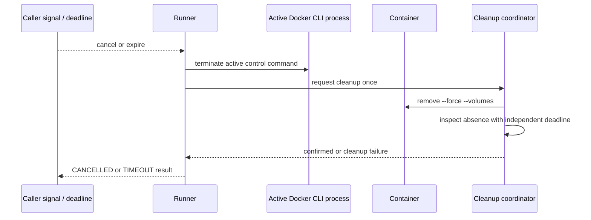

Removing the container, instead of only terminating `docker exec`, ensures descendants cannot
continue after cancellation. Success, failure, timeout and cancellation share the same idempotent
cleanup owner.

The public `timeoutMs` recorded for a step is its deterministic authorized ceiling. When the
remaining global deadline is lower, the Docker adapter applies that smaller operational allowance
without placing the elapsed-time-derived value in deterministic hashes.

## Output pipeline

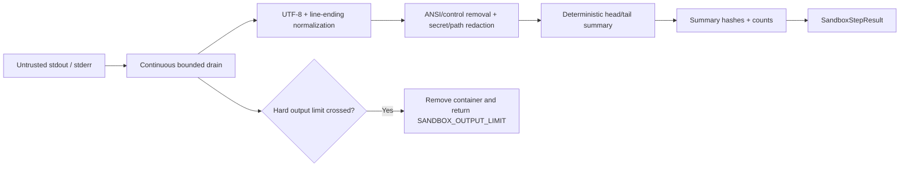

Diagnostic summaries are bounded. Structured lifecycle logs never include the summary text. Each
stream captures at most 256 KiB, 2,000 lines and 8 KiB per line; 4 MiB of combined raw output per
step is the hard termination ceiling.

## Hash and provenance chain

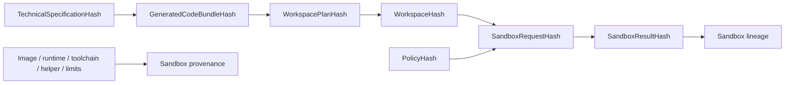

Timestamps, durations, container identity and physical paths are observational and stay outside
deterministic hashes. The policy hash explicitly binds the fixed step order and output sanitizer
version. Lineage and provenance remain separate.

## Test boundary

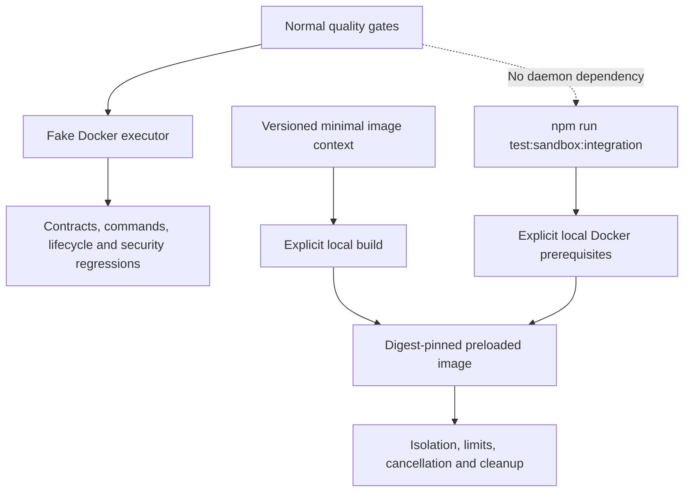

The opt-in suite performs no automatic pull or image build and is not part of `npm run test`,
coverage or the default quality gates. The versioned integration image uses fixed helpers to
validate the envelope, typecheck with the pinned compiler, build without package scripts and run a
fixed assertion; image preparation remains a separate host operation.

## Future integration boundary

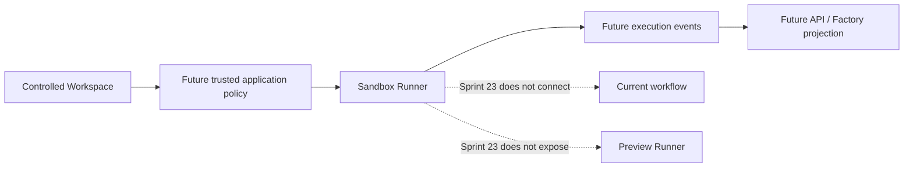

A later Sprint must explicitly define ownership, persistence, events and authorization before the
runner becomes part of an execution. A successful build does not start a server, expose a port,
retain the container, export artifacts or produce a preview.
