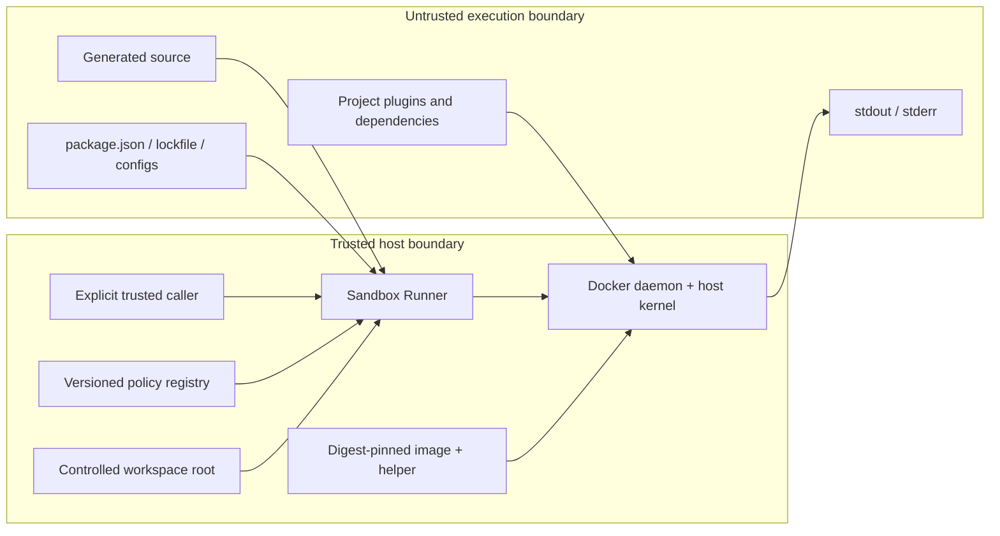
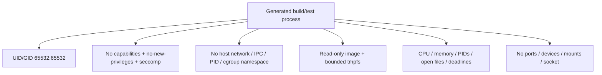
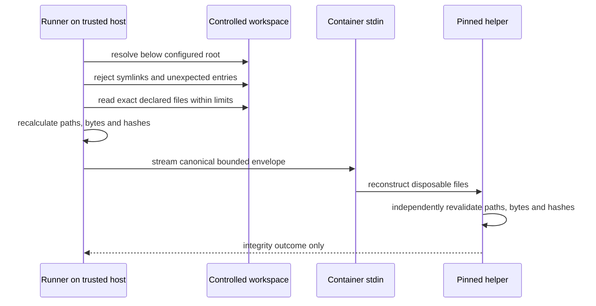
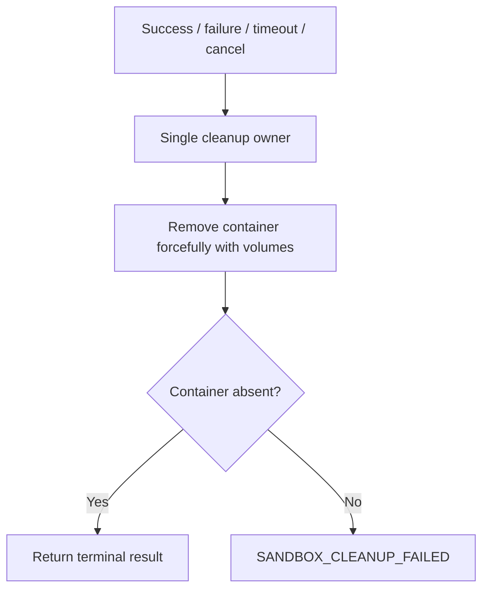

# Sandbox Security Model

## Purpose

This document defines the Sprint 23 threat model and mandatory controls for evaluating generated
code. It complements ADR-033 and does not claim that a Docker container is a perfect security
boundary. The Docker daemon, host kernel, pinned image and runner process remain trusted
infrastructure.

## Security invariants

Every Sandbox Runner implementation must preserve these invariants:

1. generated code never executes directly in the AI Factory process or host shell;
2. the original controlled workspace is never bind-mounted;
3. the container has no network, host namespace, port, device, host volume or Docker socket;
4. the container is never privileged and never gains Linux capabilities;
5. image, commands, arguments, environment and ceilings come only from trusted host policy;
6. model output and `package.json` scripts never become commands;
7. dependencies are never fetched from a network or installed through lifecycle scripts;
8. CPU, memory, PIDs, writable space, open files, output and time are bounded;
9. stdout, stderr and errors are untrusted, bounded and sanitized;
10. cancellation and every terminal outcome remove the owned container exactly once;
11. a workspace or image integrity mismatch fails before untrusted execution;
12. no source, secret, host path or raw diagnostic stream enters structured logs.

## Trust boundaries

Trusted infrastructure is still minimized. The generated project, package metadata, lockfiles,
configuration files, plugins, build hooks loaded by fixed tools and all process output remain
untrusted even after structural validation.

## Threats and controls

| Threat                     | Mandatory controls                                                                       | Residual risk                                                                                    |
| -------------------------- | ---------------------------------------------------------------------------------------- | ------------------------------------------------------------------------------------------------ |
| Host command execution     | Provider-neutral port, fixed Docker CLI argv, `shell: false`, no generated command input | Docker CLI/daemon implementation defect                                                          |
| Container escape           | Non-root, `cap-drop=ALL`, no-new-privileges, seccomp, no devices or host namespaces      | Kernel/runtime zero-day                                                                          |
| Docker daemon takeover     | No socket or Docker host exposed inside container                                        | Trusted runner already controls local daemon                                                     |
| Host filesystem read/write | No bind mounts or host volumes, read-only root, tmpfs workspace                          | Container escape or daemon compromise                                                            |
| Source tampering           | Exact enumeration and re-hashing on host and in pinned helper                            | Concurrent compromise of trusted host root                                                       |
| Network exfiltration       | `network=none`, no proxy variables, no ports                                             | Kernel/runtime bypass; local loopback inside container                                           |
| Secret theft               | Closed environment, no inherited credentials, output redaction                           | Secrets deliberately embedded in source are rejected upstream but pattern detection is not proof |
| Fork bomb                  | PIDs cgroup ceiling and total deadline                                                   | Resource pressure before cgroup enforcement                                                      |
| CPU denial of service      | CPU ceiling and deadlines                                                                | Host-wide daemon contention                                                                      |
| Memory exhaustion          | Memory cgroup, no additional swap, bounded Node heap                                     | Native tooling can fail below project needs                                                      |
| Disk/inode exhaustion      | Read-only root and bounded tmpfs/inodes                                                  | Runtime-specific tmpfs accounting differences                                                    |
| Log flooding               | Continuous drain, capture ceiling, line ceiling and hard output limit                    | Diagnostic loss after deterministic truncation                                                   |
| Supply-chain mutation      | Digest pinning, local-only image, helper ABI and dependency snapshot verification        | Pinned image can contain a pre-existing vulnerability                                            |
| Lifecycle-script execution | No package scripts, no online install, fixed wrappers only                               | Build tools may intentionally load project config code inside sandbox                            |
| Zombie descendants         | Remove the whole container on timeout/cancel; exactly-once cleanup                       | Abrupt daemon/host failure can require later operational cleanup                                 |

## Image supply-chain policy

Only an image reference containing a repository and immutable digest is accepted. The trusted policy
also pins:

- expected image ID;
- platform and architecture;
- Node and toolchain versions;
- helper ABI and version;
- dependency snapshot hash;
- required labels;
- policy and contract versions.

The adapter verifies the local image before container creation. It uses `--pull=never`; missing,
tag-only, mismatched or unexpectedly configured images fail closed. Images declaring implicit
volumes are rejected because they can create writable storage outside the explicit tmpfs policy.

After container start, a fixed readiness helper creates and verifies `/workspace/project` and
`/tmp/home` inside the bounded tmpfs mounts before `PREPARE`. This deterministic handshake removes
a startup scheduling race; it is not a retry, public lifecycle stage or authorization to run
generated commands.

Digest pinning establishes immutable identity, not safety. Image scanning, signature verification,
SBOM enforcement, patch cadence and registry governance remain operational/future concerns.

## Container isolation policy

The policy prohibits:

- `--privileged`;
- capability additions;
- device access;
- host network, PID, IPC, UTS, user or cgroup namespace sharing;
- port publishing;
- bind mounts and host volumes;
- Docker socket or remote Docker credentials;
- restart policies and image healthchecks;
- runtime environment inheritance.

The image root is read-only. `/workspace` and `/tmp` are the only writable locations and are backed
by bounded tmpfs. The environment contains only fixed execution values such as `CI`, `NO_COLOR`,
`HOME`, `TMPDIR` and a bounded Node heap.

## Workspace transfer and integrity

The request and result never expose the host root or physical path. The payload is sent through
stdin, never argv or logs. Any missing, additional, changed, symlinked or hash-inconsistent entry
causes `SANDBOX_INTEGRITY_MISMATCH` before the build/test pipeline.

The original workspace remains untouched. Build output exists only in the container tmpfs and is
discarded during cleanup.

## Commands, package managers and dependencies

The policy owns an absolute executable and fixed argument vector for each step. There is no shell
interpolation and no executable lookup based on project content.

The runner must not invoke:

- `npm run` or `npm test`;
- Yarn or pnpm project scripts;
- `preinstall`, `install`, `postinstall` or `prepare`;
- `prebuild`, `postbuild`, `pretest` or `posttest`;
- an arbitrary command field from a specification, bundle, request or package manifest.

The initial dependency-capable profile requires an approved npm lockfile and exact compatibility
with an offline dependency snapshot already present in the image. Missing dependencies fail. There
is no registry fallback, proxy, temporary egress or install-script exception.

Fixed tools can load untrusted project configuration and plugins. This is acceptable only because
they remain inside the same restricted container; it does not make those files trusted.

## Resource and time budgets

| Resource           | Maximum approved value |
| ------------------ | ---------------------: |
| CPU                |                 1 vCPU |
| Memory             |                  2 GiB |
| Additional swap    |                      0 |
| Node heap          |              1,536 MiB |
| PIDs               |                    128 |
| `/workspace` tmpfs |                512 MiB |
| `/tmp` tmpfs       |                128 MiB |
| Open files         |                  1,024 |
| Workspace inodes   |                 32,768 |
| Temporary inodes   |                 16,384 |
| Total run          |            300 seconds |
| `PREPARE`          |             30 seconds |
| `TYPECHECK`        |             90 seconds |
| `BUILD`            |            120 seconds |
| `TEST`             |             90 seconds |
| Capture per stream |                256 KiB |
| Lines per stream   |                  2,000 |
| Bytes per line     |                  8 KiB |
| Hard output/step   |                  4 MiB |

The global deadline always takes precedence. Request-level values can reduce but never increase the
policy ceilings. Resource-limit evidence is reported as an allowlisted outcome; low-level daemon or
kernel text is not exposed.

`SandboxStepResult.timeoutMs` records the deterministic, authorized ceiling for that step. The
adapter can apply a smaller operational timeout when the remaining global deadline is lower; that
elapsed-time-derived value is observational and therefore does not enter deterministic hashes.

The policy hash binds the canonical `PREPARE`, `TYPECHECK`, `BUILD`, `TEST` order and the output
sanitizer version, so either policy change produces a distinct request and run identity.

## Output and diagnostic safety

stdout and stderr can contain source snippets, secrets, escape sequences, terminal control text,
host-like paths or unbounded data. The collector therefore:

1. drains streams continuously to avoid child-process deadlock;
2. decodes UTF-8 safely across chunk boundaries;
3. removes ANSI and disallowed control characters;
4. normalizes line endings and line length;
5. redacts known credential forms, PEM blocks, URL credentials and trusted host values;
6. redacts physical host paths and Docker connection details;
7. retains a deterministic bounded head/tail diagnostic summary;
8. records observed bytes, lines, truncation and summary hashes;
9. terminates the container when the hard anti-abuse ceiling is crossed.

The collector retains complete output up to the hard ceiling before canonical sanitization, so
redaction spans arbitrary stream chunk boundaries. Crossing that ceiling is terminal; only a
bounded head/tail diagnostic remains and it is sanitized independently. Structured logs contain
only metadata and never contain even the sanitized diagnostic text.

Sanitization reduces accidental disclosure; it is not a proof that arbitrary output contains no
sensitive information. The result must remain restricted to a trusted caller until a separate
public projection is designed.

## Cancellation and cleanup security

Terminating only the Docker CLI process is insufficient because descendants inside the container
could continue. Timeout and cancellation remove the whole container. Cleanup uses an independent,
bounded deadline so a cancelled caller cannot suppress it. The coordinator is idempotent but
invoked exactly once by the run lifecycle; it never retries the code run.

An abrupt process, daemon or host failure cannot be completely handled in process. An orphan
sweeper, durable ownership record and cross-process recovery are deliberately outside Sprint 23.

## Logging allowlist

Allowed:

- correlation and sandbox IDs;
- policy, image, workspace, request and result hashes;
- runner and contract versions;
- step and terminal status;
- durations and exit code;
- byte/line counts and truncation flags;
- resource outcome;
- sanitized canonical error code.

Forbidden:

- generated source or workspace envelope;
- host root or physical workspace path;
- prompt, specification, Knowledge, artifact or AI response;
- raw or sanitized stdout/stderr text;
- environment values;
- cookies, tokens, credentials, registry config or Docker socket details;
- raw daemon errors or container inspect payloads.

## Security verification

Normal tests use a fake Docker executor to prove exact argv and absence of prohibited flags,
mounts, network, shell, retries and package scripts. They also cover image mismatch, workspace
tampering, resource outcomes, chunk-boundary sanitization, output overflow, timeout, cancellation
and exactly-once cleanup without contacting Docker.

Real Docker verification is opt-in and separate from the quality gates. It requires a preloaded,
digest-pinned test image and runs the small happy-path workspace through the adapter's effective
container inspection and confirmed cleanup. Thus a successful result also proves that the inspected
non-root, read-only, network, mount, tmpfs and resource policy matched. Active adversarial probes for
output flooding, cancellation and daemon failure remain in the fake-executor suite; the opt-in test
does not claim to exercise them against a live daemon. The command never pulls or builds an image
automatically. Its minimal image context is versioned separately, pins Node 24.19.0, TypeScript
6.0.3 and every downloaded build input, and contains no shell or package manager in the final
scratch-based image. Building that image is an explicit host preparation step.

## Residual risks and non-goals

The Sprint 23 boundary does not protect against:

- a compromised Docker daemon or host kernel;
- a container escape zero-day;
- malicious content already embedded in a trusted pinned image;
- host-wide denial of service outside the configured container controls;
- a trusted administrator selecting a malicious policy or image;
- perfect secret detection in arbitrary output;
- complete secret reconstruction after hard-output overflow when a credential is adversarially
  split across the omitted head/tail boundary; overflow is terminal and diagnostics remain
  restricted to a trusted caller;
- process/daemon crashes that require future orphan recovery;
- multi-tenant hostile-code isolation guarantees expected from a dedicated microVM service.

It also does not provide build artifact export, preview, deployment, server startup, ports, Git,
workflow integration, API, UI, persistence, retries or autonomous repair. A passing typecheck,
build and test run does not prove functional correctness, production readiness, authorization or
code safety.

## Operational checklist

- [ ] Image reference is digest-pinned and already available locally.
- [ ] Image ID, platform, labels, helper ABI and dependency snapshot match policy.
- [ ] Docker configuration contains no privileged mode, added capability, device, mount or port.
- [ ] Network is `none` and no proxy or credential environment is inherited.
- [ ] Root filesystem is read-only and writable tmpfs ceilings are present.
- [ ] Non-root identity and CPU, memory, swap, PIDs and open-files limits are effective.
- [ ] Workspace files were exactly enumerated and re-hashed before stdin transfer.
- [ ] Commands and arguments match trusted policy and use no shell or package scripts.
- [ ] Total and per-step deadlines are active.
- [ ] Output collector and hard anti-abuse ceiling are active.
- [ ] Structured logs contain only allowlisted metadata.
- [ ] Cleanup was invoked once and container absence was confirmed.
- [ ] No workflow, API, Repository, Factory View or Preview integration was introduced.
