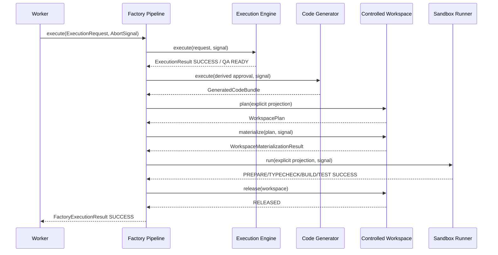
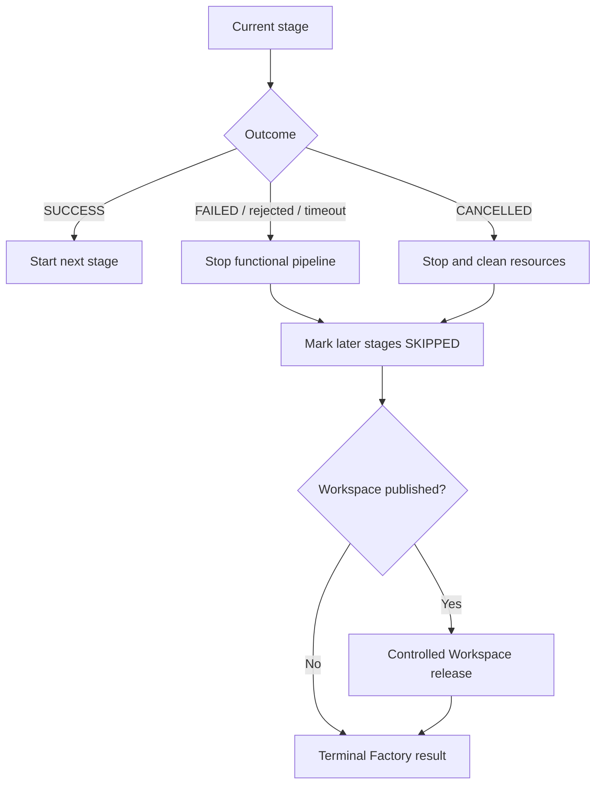
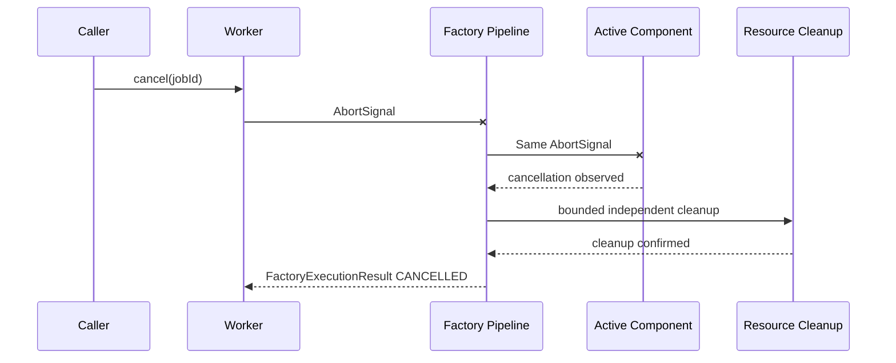
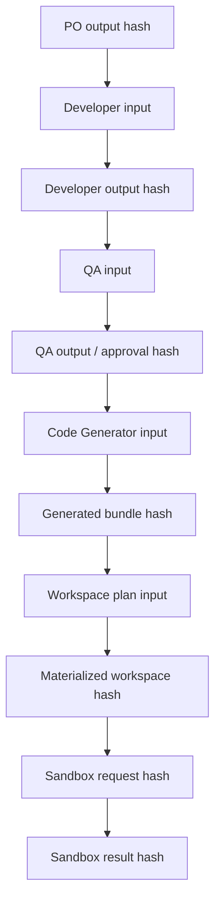
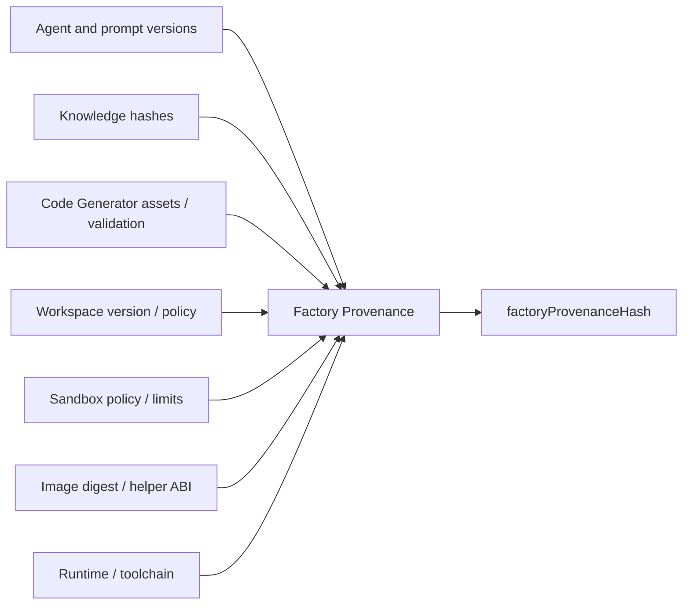
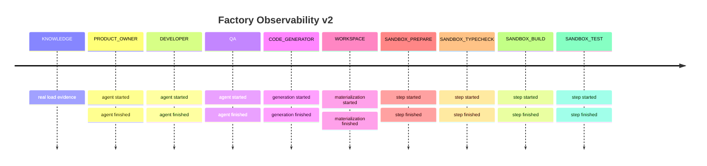
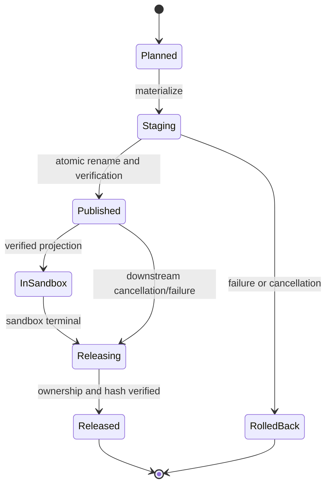

# Factory Pipeline Flow

Sprint 24 connects the existing three-agent workflow to code generation, controlled
materialization, and isolated build/test execution. The integration coordinates public contracts;
it does not merge component authority.

## 1. Full Factory Pipeline

```mermaid
flowchart LR
    Human["Human Request"] --> Worker["Execution Worker"]
    Worker --> Coordinator["Factory Pipeline Coordinator"]
    Coordinator --> Engine["Execution Engine"]
    Engine --> PO["Product Owner"]
    PO --> Dev["Developer"]
    Dev --> QA["QA"]
    Coordinator --> Code["Code Generator"]
    Code --> Plan["Workspace Plan"]
    Plan --> Materialize["Workspace Materialization"]
    Materialize --> Sandbox["Sandbox Runner"]
    Sandbox --> Prepare["PREPARE"]
    Prepare --> Typecheck["TYPECHECK"]
    Typecheck --> Build["BUILD"]
    Build --> Test["TEST"]
    Test --> Release["Workspace Release"]
    Release --> Result["FactoryExecutionResult"]
```

## 2. Success Path

## 3. Failure Propagation

## 4. Cancellation

## 5. Hash Chain

```mermaid
flowchart LR
    PO["ProductOwnerSpecificationHash"] --> TS["TechnicalSpecificationHash"]
    TS --> QA["QA Specification / approval hash"]
    QA --> Generation["generationHash"]
    Generation --> Bundle["bundleHash"]
    Bundle --> Plan["planHash"]
    Plan --> Workspace["workspaceHash"]
    Workspace --> Request["sandboxRequestHash"]
    Request --> Sandbox["sandboxResultHash"]
    Sandbox --> Factory["factoryResultHash"]
```

Historical workflow and execution hashes remain unchanged. Observational time and physical
resource identity do not enter this chain.

## 6. Lineage

## 7. Provenance

## 8. Observability Timeline

No timer creates progress. A stage changes only from correlated runtime evidence.

## 9. Workspace Lifecycle

An abrupt process or daemon crash can leave an orphan. Sprint 24 documents manual inspection and
does not introduce a cleanup daemon or automatic recovery.

## 10. Trust Boundaries

```mermaid
flowchart LR
    User["Untrusted human input"] --> HTTP["HTTP validation"]
    HTTP --> Agents["Validated agent contracts"]
    Agents --> HostApproval["Trusted host approval"]
    HostApproval --> Bundle["Untrusted generated bundle"]
    Bundle --> Workspace["Independent path/content/hash validation"]
    Workspace --> Filesystem["Untrusted materialized filesystem"]
    Filesystem --> Sandbox["Independent reread and sandbox request validation"]
    Sandbox --> Container["Pinned isolated container"]
    Container --> Output["Untrusted bounded output"]
    Output --> Projection["Metadata-only result projection"]
    Projection --> Repository["Safe normalized persistence"]
    Projection --> UI["Factory View"]
```

The host selects policy and image. Generated data never selects commands, network, mounts,
credentials, execution limits, or persistence content.
