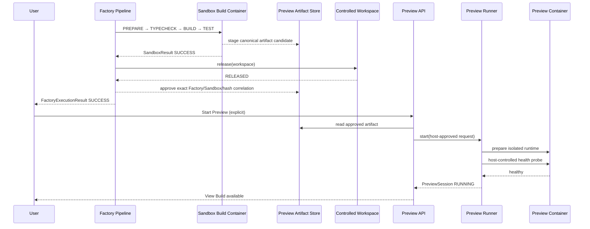
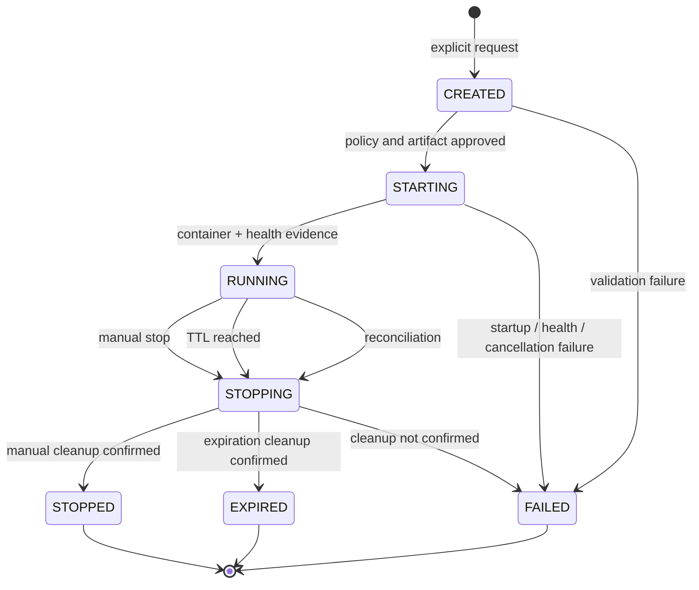
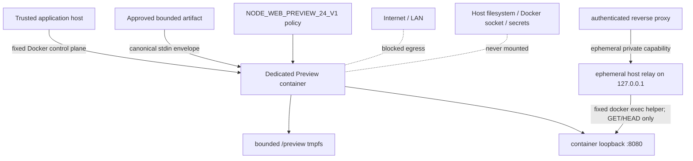
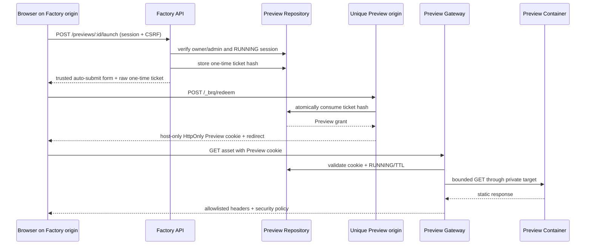
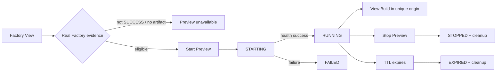
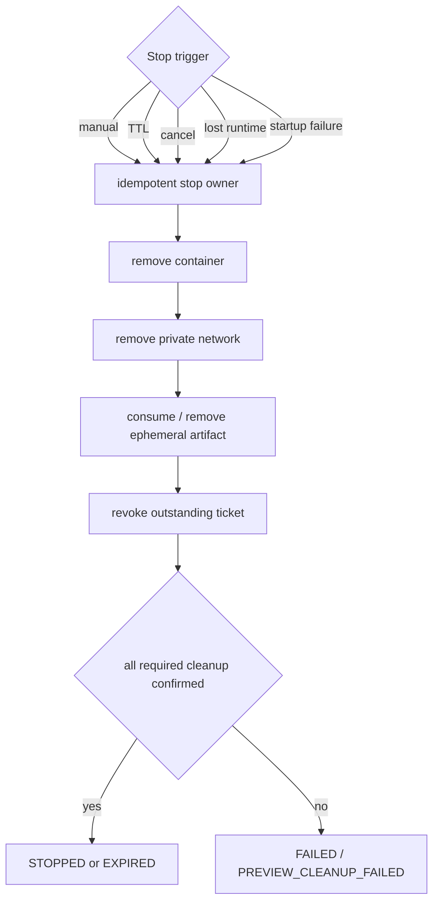
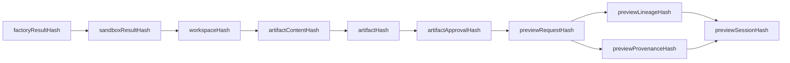
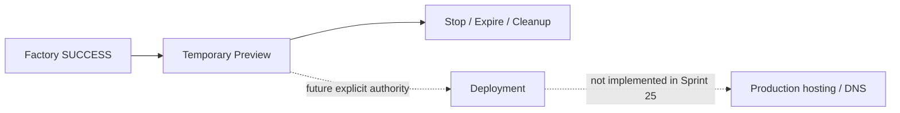

# Preview Runner Flow

Sprint 25 turns an already approved Factory build into a short-lived, explicitly requested Preview.
It exports a safe artifact while preserving normal Sandbox and Controlled Workspace cleanup.

## 1. Factory SUCCESS to Preview

The artifact candidate cannot authorize itself. A failed or mismatched Factory result removes the
candidate. Preview never retains the original workspace or build container.

## 2. Preview lifecycle

There is no retry, restart, resume, self-healing, or implicit alternate runtime.

## 3. Container isolation

The runtime is separate from the build Sandbox, non-root, read-only, capability-free, resource
limited, and attached to an internal no-egress network. Docker publishes no container port. The
trusted host relay is bound only to `127.0.0.1` and can invoke only the fixed relay helper inside the
verified container. Every relay request also requires an unpersisted, in-memory capability token.

## 4. Authenticated unique-origin launch

Factory cookies and storage are not sent to the Preview origin. The ticket is not reusable and is
revoked when the session stops or expires.

## 5. Factory View and View Build

The browser polls only persisted/runtime-backed session state. Preview is never inferred from a
timer and is never auto-started.

## 6. TTL, reconciliation, and cleanup

Process restart does not make a database row live. Reconciliation compares persisted metadata with
runtime evidence and expires stale sessions through the same cleanup owner.

## 7. Hash chain

Timestamps, durations, tickets, cookies, host paths, ports, container identity, and AbortSignal are
observational or private and never enter deterministic hashes.

## 8. Deployment boundary

Preview proves that a bounded approved static artifact can be viewed temporarily. It is not a
deployment or production hosting decision.
