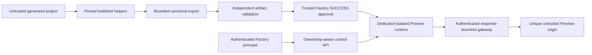
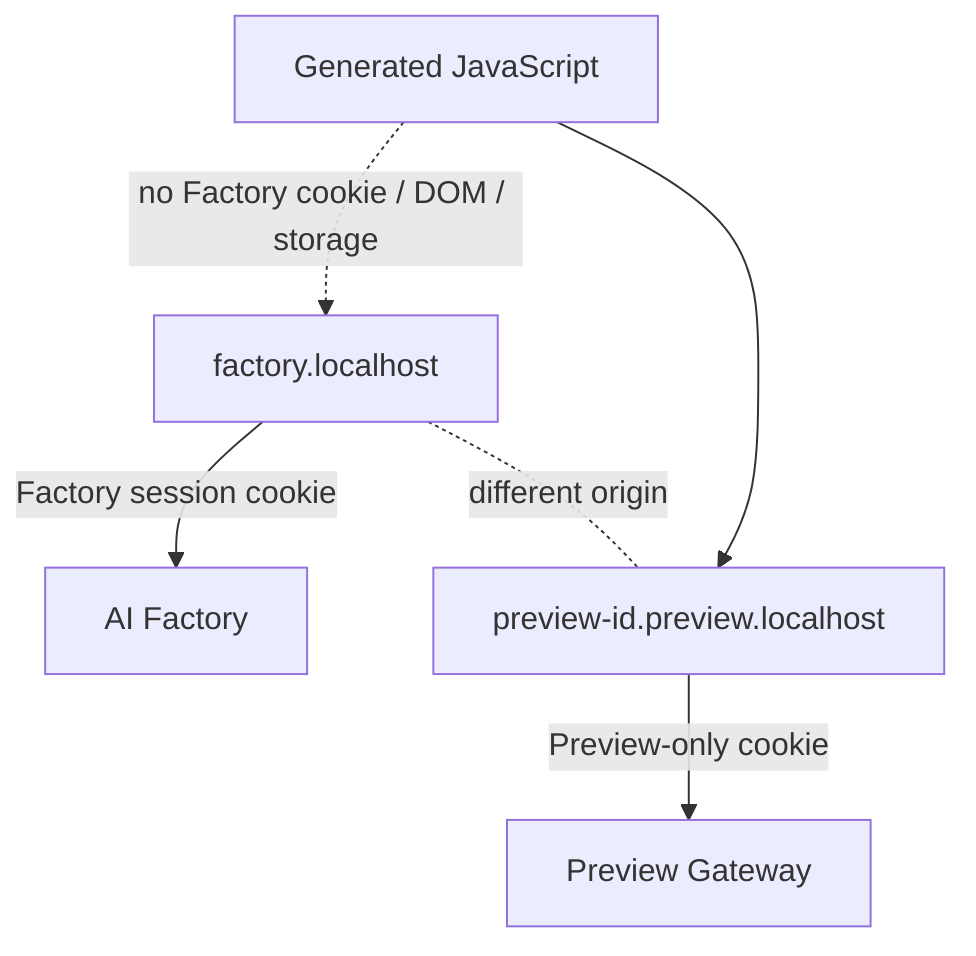
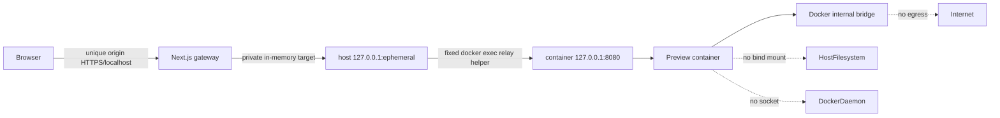

# Preview Security Model

The Preview boundary serves generated content and must treat the artifact, runtime HTTP responses,
browser code, and caller-provided identifiers as untrusted. This document records the Sprint 25
threat model and the controls that fail closed.

## 1. Trust boundaries



No generated value becomes control-plane authority. Policy, image, executable, arguments, network,
port, limits, health check, TTL, and origin template belong to trusted host configuration.

## 2. Threats and controls

| Threat                                 | Boundary control                                                                            | Failure behavior                                |
| -------------------------------------- | ------------------------------------------------------------------------------------------- | ----------------------------------------------- |
| Retaining an untrusted workspace       | Export a separate bounded artifact before normal release                                    | Candidate unavailable; workspace still released |
| Tampered build/artifact                | Recalculate file, content, correlation, approval, and session hashes                        | Reject before runtime start                     |
| Path traversal or symlink              | Canonical relative paths, no hidden/secret segments, no symlinks, atomic store              | Reject artifact or read                         |
| Secret inclusion                       | Strict filenames/media/content policy and no inherited environment                          | Reject artifact; never persist content          |
| Generated command execution            | Fixed helper ABI; no package scripts or request-selected commands                           | Unsupported project fails closed                |
| Mutable/incorrect image                | Preloaded digest, image ID, platform, and labels verified                                   | Runtime unavailable                             |
| Container escape surface               | Non-root, read-only root, dropped capabilities, seccomp, no privilege/devices/socket/mounts | Container creation/inspection rejected          |
| Network exfiltration                   | Internal no-egress network; no host network                                                 | Container inspection rejected                   |
| Predictable public port                | No Docker port publish; loopback-only host relay behind gateway                             | No browser-visible port or target               |
| Local loopback bypass                  | Unpersisted per-runtime relay capability validated before Docker execution                  | Unauthorized local request rejected             |
| Cross-user access                      | Execution ownership on every control action; ADMIN explicit                                 | Return not found/forbidden projection           |
| Shared-origin credential theft         | Unique Preview origin and host-only Preview cookie                                          | Factory credentials never sent                  |
| Ticket replay                          | Short TTL, hash-only persistence, atomic one-time consumption                               | Second redemption denied                        |
| Cookie replay after stop               | Signed claims plus live session/status/expiry verification                                  | Gateway returns unauthorized/gone               |
| Internal API calls from Preview JS     | Separate origin, strict CSP, no Factory cookie, stripped CORS/credentials                   | Browser same-origin policy blocks access        |
| Header smuggling/credential forwarding | Host validation; request/response header allowlists; no hop-by-hop headers                  | Reject malformed host/method/headers            |
| Unbounded output/response              | Byte/time limits in runtime, health, proxy, and export                                      | Abort and cleanup                               |
| WebSocket or arbitrary upload          | Only GET/HEAD content and one fixed form redemption POST                                    | Method rejected                                 |
| Runtime crash or orphan                | Inspect/reconcile runtime evidence; TTL; idempotent stop/cleanup                            | Session fails/expires; never pretend RUNNING    |
| Persistence disclosure                 | Metadata-only normalized rows; no code, paths, ports, container IDs, logs, tickets          | Sensitive data never written                    |

## 3. Browser-origin model



Preview content is opened as a separate top-level page. The Factory does not use
`dangerouslySetInnerHTML`, a same-origin iframe, `allow-same-origin + allow-scripts`, or any DOM
bridge. Each Preview ID maps to a distinct origin, reducing cross-preview storage and cookie scope.

The gateway adds a restrictive content policy appropriate to the initial static profile:

- scripts and styles only from the same Preview origin;
- no object, base, frame, parent-frame, form, worker, media, or external connection capability;
- no referrer, MIME sniffing, or caching of authenticated Preview responses;
- no runtime cookie or CORS header propagation.

## 4. Network model



The host relay target and its unpersisted access token are adapter capabilities, not public session
data. Docker does not publish a container port. Each bounded `GET` or `HEAD` must present that
capability and is relayed by a fixed, shell-free `docker exec` helper that can reach only the
container loopback server. The gateway never accepts an upstream URL, port, token, image, command,
or network from the browser or database.

## 5. Authentication, ownership, and tickets

```mermaid
sequenceDiagram
    participant U as USER or ADMIN
    participant A as Auth boundary
    participant R as Repository
    participant T as Ticket boundary
    participant G as Preview gateway
    U->>A: control request
    A->>R: authenticated principal + scoped repository
    R-->>A: owned record or explicit ADMIN projection
    A->>T: issue random one-time grant; persist hash only
    T-->>U: raw grant over trusted launch response
    U->>G: redeem once on Preview origin
    G->>T: compare hash and atomically consume
    T-->>G: owner/session/expiry metadata
    G-->>U: signed Preview-only cookie
```

Random launch credentials and signed cookie material are observational security tokens, not
deterministic domain identifiers. They are never logged or hashed into lineage.

## 6. Lifecycle and resource abuse

The host policy bounds active sessions, TTL, startup, health, stop, response, and cleanup deadlines;
CPU, memory, PIDs, file descriptors, tmpfs, artifact files/bytes, response bytes, and captured logs
are also bounded. Callers may request only reductions. Duplicate start converges on the same
deterministic Preview identity/session and does not create parallel containers.

Manual stop, expiry, cancellation, or failure is terminal. Cleanup removes the container, private
network, ephemeral artifact, and outstanding ticket through a single idempotent owner. A failure to
confirm required cleanup is visible as a safe failure and never as `STOPPED` or `SUCCESS`.

## 7. Residual risks

- Docker is defense in depth, not a guarantee against a daemon, host kernel, or container escape
  vulnerability.
- The local in-process scheduler and runtime locator are not a distributed production control
  plane; abrupt host loss can require explicit reconciliation.
- A privileged local process can access loopback traffic and the Docker daemon; host compromise is
  outside the application threat model.
- The strict static profile intentionally rejects many real frameworks, dynamic servers, external
  dependencies, API calls, fonts, images, and websocket behavior.
- Production wildcard DNS, certificate issuance, ingress hardening, multi-host routing, and durable
  artifact infrastructure remain future architecture and are not inferred from this MVP.

## 8. Explicit prohibitions

Sprint 25 does not add deploy, public hosting, production DNS, Kubernetes, cloud runtimes,
distributed locks/schedulers, public Preview links, arbitrary commands, network egress, dev server,
hot reload, websocket, retry, self-healing, automatic Preview, source download, or Sprint 26 work.
