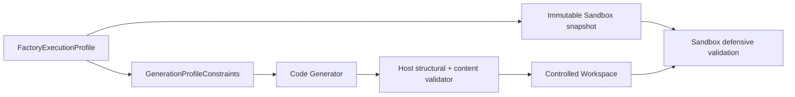

# ADR-036 — Factory Execution Profile Boundary

Status: Accepted  
Date: 2026-08-11

## Context

Generation guidance, host compatibility checks and the pinned web-preview helper previously kept
overlapping rules independently. A generated bundle could therefore pass the paid generation
boundary and fail only after Workspace materialization or as an opaque Sandbox `EXIT_1`.

## Decision

`core/factory-execution-profile` is the provider- and agent-neutral source of truth for Factory
capabilities. It owns a versioned immutable descriptor, canonical profile hash, stable rule IDs and
safe public reason codes. It has no dependency on agents, Pipeline, Workspace, Sandbox adapters,
HTTP, Prisma, Preview or OpenAI.

The generation projection is compact and hash-bound. Prompt text states the generic obligation to
obey all supplied rules but does not duplicate the active profile. The host validator is
authoritative and runs after successful Code Generator validation but before any filesystem plan.
The Sandbox remains independent and enforces its checked-in snapshot again.

Preflight recalculates the profile hash and verifies policy ID, policy version and snapshot hash
before Code Generator execution. Lineage/provenance record `executionProfileHash`,
`generationProjectionHash` and nullable `profileValidationHash` separately from generation hashes.
The generation projection is currently version `1.1.0`: every rule carries a normative requirement
and the projection includes build and preview semantics. These additions do not change the profile
identity or the Sandbox snapshot; see ADR-037.

Sandbox helpers may expose a reason only through the exact terminal marker
`BRQ_<STEP>_FAILED code=<CODE>`. The runner accepts only the last non-empty line, an exact current
step and a bounded code in that step's snapshot allowlist. Anything else becomes `null`.
Operational `sourceCode` such as `EXIT_1` remains inside the Sandbox boundary; presentation receives
only stable failure code plus nullable safe reason.

## Consequences

- Profile-incompatible bundles fail at `CODE_PROFILE_VALIDATION`; Workspace and Sandbox are skipped.
- The standard parity suite proves profile → generation → host → pure Sandbox behavior without
  Docker or OpenAI.
- Snapshot or policy drift fails preflight instead of spending a generation call.
- Historical persisted rows retain nullable profile metadata and `reasonCode = null`.
- PO, Developer, QA, readiness, retry and self-healing contracts are unchanged by this decision.
